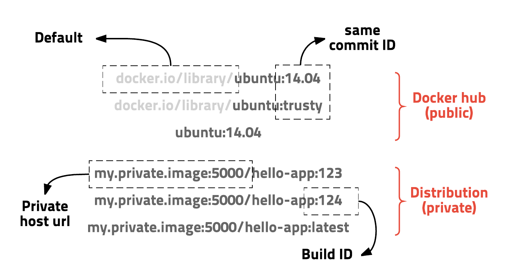
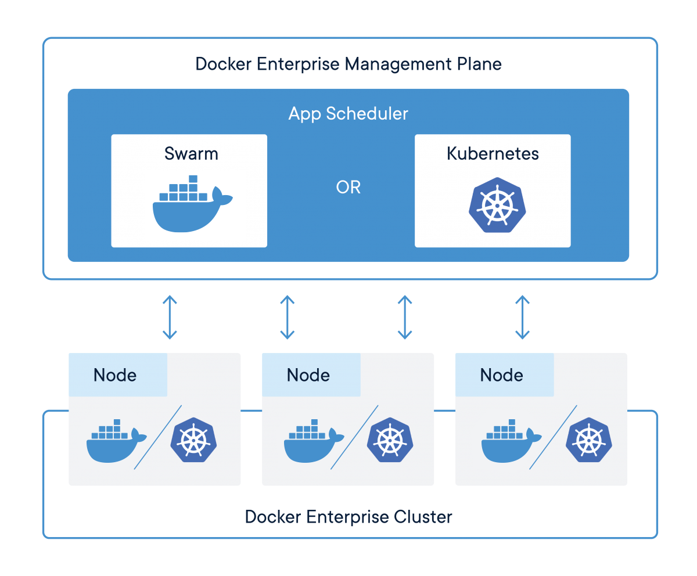

# Docker
   

## Preference
> Ubuntu 16.04   
> Docker CE  
> [Docker Hub](https://hub.docker.com/) 계정   

## 목차
#### 1. [What Is Docker?](##1.-what-is-docker?)  
#### 2. [Docker 주요개념](##2.-docker-주요개념)   
> 2-1. [이미지(Image)](###2-1.-이미지(image))  
> 2-2. [컨테이너(Container)](###2-2.-컨테이너(container))
#### 3. [Docker 실습](##3.-docker-실습)   

----
## 1. What Is Docker?

`
컨테이너 기반의 오픈소스 가상화 플랫폼
`

Docker는 애플리케이션을 신속하게 구축, 테스트 및 배포할 수 있는 소프트웨어 플랫폼이다.   
Docker는 소프트웨어를 `컨테이너`라는 표준화 된 유닛으로 패키징하며, 이 컨테이너에는 라이브러리,   
시스템 도구, 코드, 런타임 등 소프트웨어를 실행하는 데 필요한 모든 것이 포함되어 있다.    
Docker를 사용하면 환경에 구애받지 않고 애플리케이션을 신속하게 배포 및 확장할 수 있으며    
코드가 문제 없이 실행될 것임을 확신할 수 있다.

> * 하드웨어의 발전으로 더 많은 효율성을 내기 위해 가상화 사용    
> * 게스트 OS 사용 - 하드웨어에 의존적인 명령어 사용 : 성능 저하 불러일으킴    
> * Docker는 게스트 OS가 없음    
> * 따라서, 기존의 가상 시스템보다 퍼포먼스가 좋음        
> * 실행환경을 컨테이너로 추상화, 동일한 인터페이스 제공
> * 따라서, 프래그램의 배포 관리 단순화


     

## 2. Docker 주요개념
### 2-1. 이미지(Image)   
   

이미지는 컨테이너 실행에 필요한 파일과 설정 값 등을 포함하고 있는 것으로 상태 값을 가지지 않고 변하지 않음(Immutable). 컨테이너는 이미지를 실행한 상태라고 볼 수 있고 추가되거나 변하는 값은 컨테이너에 저장됨.
같은 이미지에서 여러 개의 컨테이너를 생성할 수 있고 컨테이너의 상태가 바뀌거나 
컨테이너가 삭제되더라도 이미지는 변하지 않고 그대로 존재!

> ubuntu이미지는 ubuntu를 실행하기 위한 모든 파일을 가지고 있고 MySQL이미지는 debian을 기반으로   
> MySQL을 실행하는데 필요한 파일과 실행 명령어, 포트 정보등을 가지고 있다.   
> 좀 더 복잡한 예로 Gitlab 이미지는 centos를 기반으로 ruby, go, database, 
> redis, gitlab source, nginx등을 가지고 있다.  

말 그대로 이미지는 컨테이너를 실행하기 위한 모든 정보를 가지고 있기 때문에 더 이상 
의존성 파일을 컴파일하고 이것저것 설치할 필요가 없음! 
이제 새로운 서버가 추가되면 미리 만들어 놓은 이미지를 다운받고 컨테이너만 생성하면 됨.
한 서버에 여러 개의 컨테이너를 실행할 수 있고, 수십, 수백, 수천 대의 서버도 문제없음!

  - docker 이미지는 레이어의 형태   
  - 변경되는 부분만 따로 이미지 생성   
  - 생성된 이미지는 부모의 이미지 바라봄   
  - 상대적으로 경량화 가능  

Docker 이미지는 [*Docker hub*](https://hub.docker.com/)에 등록하거나 Docker Registry 
저장소를 직접 만들어 관리할 수 있다. 현재 공개된 도커 이미지는 50만개가 넘고 Docker hub의 
이미지 다운로드 수는 80억회에 이른다! 누구나 쉽게 이미지를 만들고 배포할 수 있는 구조이다.

#### 왜 이렇게 핫할까?
> 도커는 완전히 새로운 기술이 아니며 이미 존재하는 기술을 잘 포장했다고 볼 수 있습니다.    
> 컨테이너, 오버레이 네트워크overlay network, 유니온 파일 시스템union file systems등   
> 이미 존재하는 기술을 도커처럼 잘 조합하고 사용하기 쉽게 만든 것은 없었고 사용자들이   
> 원하는 기능을 간단하지만 획기적인 아이디어로 구현했다.

* Overlay Network
  - 네트워크 추상화
  - underlay network (물리적 L2, L4…) - 기존 네트워크 방식
  - underlay위에 존재하게 됨.


### 2-2. 컨테이너(Container)   

  

  - 도커의 이미지가 실행된 상태
  - 격리된 공간에서 프로세스가 동작하는 기술

가상화 기술의 하나지만 기존방식과는 차이가 있음  

기존의 가상화 방식은 주로 **OS를 가상화**함  

> VMware나 VirtualBox같은 가상머신은 호스트 OS위에 게스트 OS 전체를 가상화하여 사용하는 방식.  
> 이 방식은 여러가지 OS를 가상화(리눅스에서 윈도우를 돌린다던가) 할 수 있고 비교적 사용법이   
> 간단하지만 무겁고 느려서 운영환경에선 사용할 수 없었다.  


이러한 상황을 개선하기 위해 CPU의 가상화 기술(HVM)을 이용한 **KVM**(Kernel-based Virtual Machine)과 
반가상화(Paravirtualization)방식의 **Xen**이 등장한다.  
이러한 방식은 게스트 OS가 필요하긴 하지만 전체 OS를 가상화하는 방식이 아니였기 때문에 
호스트형 가상화 방식에 비해 성능이 향상됨  
이러한 기술들은 OpenStack이나 AWS, Rackspace같은 클라우드 서비스에서 가상 컴퓨팅 기술의 기반이 되었다.  

  

전가상화든 반가상화든 추가적인 OS를 설치하여 가상화 하는 방법은 어쨌든 성능문제가 있었고
이를 개선하기 위해 **프로세스를 격리** 하는 방식이 등장한다.  

리눅스에서는 이 방식을 리눅스 컨테이너라고 하고 단순히 프로세스를 격리 시키기 때문에 
가볍고 빠르게 동작한다. CPU나 메모리는 딱 프로세스가 필요한 만큼만 추가로 사용하고 
성능적으로도 거의 손실이 없다.

> 하나의 서버에 여러 개의 컨테이너를 실행하면 서로 영향을 미치지 않고 독립적으로 실행되어   
> 마치 가벼운 VMVirtual Machine을 사용하는 느낌을 준다.   
> 실행중인 컨테이너에 접속하여 명령어를 입력할 수 있고 `apt-get`이나 `yum`으로 패키지를   
> 설치할 수 있으며 사용자도 추가하고 여러개의 프로세스를 백그라운드로 실행할 수도 있다.   
> CPU나 메모리 사용량을 제한할 수 있고 호스트의 특정 포트와 연결하거나 호스트의 특정   
> 디렉토리를 내부 디렉토리인 것처럼 사용할 수도 있다.  


### 2-3. 레이어 저장방식(Layer)   

  

도커 이미지는 컨테이너를 실행하기 위한 모든 정보를 가지고 있기 때문에 보통 용량이 수백메가MB에 이른다.  
처음 이미지를 다운받을 땐 크게 부담이 안되지만 기존 이미지에 파일 하나 추가했다고 수백메가를 다시   
다운받는다면 매우 비효율적일 수 밖에 없다.   

도커는 이런 문제를 해결하기 위해 **레이어(Layer)** 라는 개념을 사용하고 유니온 파일 시스템을 이용하여   
여러개의 레이어를 하나의 파일시스템으로 사용할 수 있게 해준다.   
이미지는 여러 개의 읽기 전용 레이어로 구성되고 파일이 추가되거나 수정되면 새로운 레이어가 생성된다. 
ubuntu 이미지가 `A` + `B` + `C`의 집합이라면, ubuntu 이미지를 베이스로 만든 nginx 이미지는 
`A` + `B` + `C` + `nginx`가 된다. webapp 이미지를 nginx 이미지 기반으로 만들었다면 예상대로 
`A` + `B` + `C` + `nginx` + `source` 레이어로 구성된다. webapp 소스를 수정하면 `A`, `B`, `C`, `nginx` 레이어를 제외한 
새로운 `source(v2)` 레이어만 다운받으면 되기 때문에 굉장히 효율적으로 이미지를 관리할 수 있다.  

컨테이너를 생성할 때도 레이어 방식을 사용하는데 기존의 이미지 레이어 위에 읽기/쓰기 레이어를 추가한다.  
이미지 레이어를 그대로 사용하면서 컨테이너가 실행중에 생성하는 파일이나 변경된 내용은 읽기/쓰기 레이어에   
저장되므로 여러개의 컨테이너를 생성해도 최소한의 용량만 사용한다.   

가상화의 특성상 이미지 용량이 크고 여러대의 서버에 배포하는걸 감안하면 단순하지만 엄청나게 영리한 설계이다.

#### 이미지 경로

  

이미지는 url 방식으로 관리하며 태그를 붙일 수 있다. ubuntu 14.04 이미지는 `docker.io/library/ubuntu:14.04` 
또는 `docker.io/library/ubuntu:trusty` 이고 `docker.io/library`는 생략 가능하여 `ubuntu:14.04` 로 사용할 수 있다.  
이러한 방식은 이해하기 쉽고 편리하게 사용할 수 있으며 태그 기능을 잘 이용하면 테스트나 롤백도 쉽게 할 수 있다!


#### Dockerfile  
```Dockerfile
# vertx/vertx3 debian version
FROM subicura/vertx3:3.3.1
MAINTAINER chungsub.kim@purpleworks.co.kr

ADD build/distributions/app-3.3.1.tar /
ADD config.template.json /app-3.3.1/bin/config.json
ADD docker/script/start.sh /usr/local/bin/
RUN ln -s /usr/local/bin/start.sh /start.sh

EXPOSE 8080
EXPOSE 7000

CMD ["start.sh"]
```

도커는 이미지를 만들기 위해 `Dockerfile`이라는 파일에 자체 DSLDomain-specific language언어를 이용하여
이미지 생성 과정을 적는다. 추후에 문법에 대해 자세히 다루겠지만 위 샘플을 보면 그렇게 복잡하지 않다는 걸 알 수 있다.  

이것은 굉장히 간단하지만 유용한 아이디어인데, 서버에 어떤 프로그램을 설치하려고 이것 저것 
의존성 패키지를 설치하고 설정파일을 만들었던 경험이 있다면 더 이상 그 과정을 블로깅 하거나 
메모장에 적지 말고 `Dockerfile`로 관리하면 된다. 이 파일은 소스와 함께 버전 관리 되고 
원한다면 누구나 이미지 생성과정을 보고 수정할 수 있다.


#### Docker Hub

   

도커 이미지의 용량은 보통 수백메가로 수기가가 넘는 경우도 흔하다. 
이렇게 큰 용량의 이미지를 서버에 저장하고 관리하는 것은 쉽지 않은데 
도커는 Docker hub를 통해 공개 이미지를 무료로 관리해 준다. 
하루에도 엄청난 용량의 이미지가 전세계에서 다운로드 되고 트래픽 비용만 해도 
어마어마 할 것 같은데 다 무료다!

#### Command와 API
도커 클라이언트의 커맨드 명령어는 정말 잘 만들어져 있다.
대부분의 명령어는 직관적이고 사용하기 쉬우며 컨테이너의 복잡한 시스템 구성을 
이해하지 못하더라도 편하게 사용할 수 있다. 
또한 http기반의 Rest API도 지원하여 확장성이 굉장히 좋고 훌륭한 3rd party 툴이 나오기 좋은 환경이다!  


#### Container Orchestration  

   

도커 호스트들을 관리하기 위한 툴들.
애플리케이션을 지원하기 위해 컨테이너를 배포하고 구성하는 것을 컨테이너 오케스트레이션이라고 하며,
컨테이너 오케스트레이션 도구(docker SWAR, 쿠버네티스 등)를 통해 수행된다.

## Reference  

초보를 위한 도커 안내서 - 도커란 무엇인가?   
https://subicura.com/2017/01/19/docker-guide-for-beginners-1.html

Docker 공식 문서   
https://docs.docker.com/engine/docker-overview/

AWSKRUG Container Hands-On #1 - 모두의 Docker   
https://gwonsungjun.github.io/articles/2018-06/awsDocker
