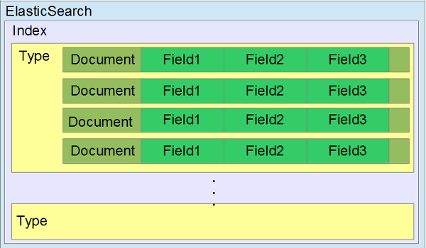

# ElasticSearch Windows10 설치 및 기본 동작 이해

  

ElasticSearch는 오픈 소스이고 RESTful 기반의 실시간 검색 및 분석 엔진이다.

Java로 작성되어졌으며 아파치 `루신(Lucene)`을 기반으로 검색 기능 및 REST-Based API (JSON Over HTTP Protocol)를 지원한다.

|RESTful|RDB|
|:---:|:---:|
|**GET**|조회|
|**POST**|저장|
|**PUT**|수정|
|**DELETE**|삭제|


> 시간이 갈수록 증가하는 문제를 처리하는 분산형 RESTful 검색 및 분석 엔진  
> 데이터를 중앙에 저장해 빠른 검색, 정확도, 분석이 쉽고 확장성이 보장

출처 : [공식홈페이지 설명](https://www.elastic.co/kr/products/elasticsearch)

---

## 1. ElasticSearch 다운로드

- [다운로드 링크](https://www.elastic.co/kr/downloads/elasticsearch)  
- `windows10 zip` 파일 다운로드  
- 압출 풀기 → `bin` 폴더로 이동 → `elasticsearch.bat` 실행  
- 설치 끝!  

---

## 2. ElasticSearch 접속하기

실행하면 Port가 자동으로 바인딩된다.

- `9200`, `9300` 포트가 오픈됨
- `9200` 포트 → **HTTP 바인딩**
- `9300` 포트 → **TCP 바인딩**

### 접속해보자

- [http://localhost:9200](http://localhost:9200/)
- 클러스터 이름과 버전 정보를 확인할 수 있음.

```json
{
  "name" : "DESKTOP-75DDGMG",
  "cluster_name" : "elasticsearch",
  "cluster_uuid" : "lAkR2KUbRnycAI9mnmSIeg",
  "version" : {
    "number" : "7.9.0",
    "build_flavor" : "default",
    "build_type" : "zip",
    "build_hash" : "a479a2a7fce0389512d6a9361301708b92dff667",
    "build_date" : "2020-08-11T21:36:48.204330Z",
    "build_snapshot" : false,
    "lucene_version" : "8.6.0",
    "minimum_wire_compatibility_version" : "6.8.0",
    "minimum_index_compatibility_version" : "6.0.0-beta1"
  },
  "tagline" : "You Know, for Search"
}
```

---

## 3. ElasticSearch 구조

- ElasticSearch는 데이터를 `저장`, `조회`, `수정`, `삭제`할 수 있다.
- 그 전에 ElasticSearch 저장 구조에 대해 먼저 이해해보자.

간단히 표로 정리해 `RDB`와 비교하면 이렇게 된다.

---

|ElasticSearch|RDB|
|:---:|:---:|
|**Index**|Database|
|**Type**|Table|
|**Document**|Row|
|**Field**|Column|
|**Mapping**|Schema|

▲ 저장 구조

---

|ElasticSearch|RDB|CRUD|
|:---:|:---:|:---:|
|**GET**|Select|Read|
|**POST**|Insert|Create|
|**PUT**|Update|Update|
|**DELETE**|Delete|Delete|

▲ Query

---

ElasticSearch 저장 구조인 `Index`, `Type`, `Document`, `Field`, `Mapping`를 자세히 설명하면

### Index란?

RDB의 데이터베이스와 유사하다.

### Type이란?

RDB의 테이블과 유사하다.

### Document란?

테이블의 Row와 유사하다.  
`JSON` 문서로 되어 있다. `(key, value)`

### Field란?

ElasticSearch의 문서는 `JSON`이다. 

`JSON`의 `property`를 `ElasticSearch`에서는 `Field`라고 부른다.

RDB 테이블의 컬럼과 유사하다.

### Mapping이란?

RDB의 스키마와 유사하다.  

---

저장 구조에 대해서 그림으로 표현하면 다음과 같다.

  
▲ [ES 저장 구조 출처](http://dev.classmethod.jp/cloud/aws/use-elasticsearch-4-data-structure/)

---

## 4. ElasticSearch RESTful API 포맷

ElasticSearch REST API URL 포멧은 다음과 같다.

`http://{Node:PortNumber}/{Index}/{Type}`

`Index`는 소문자여야 한다.

`Type`도 `Index`와 마찬가지로 소문자를 추천한다.

> ex) http://localhost:9200/yjpark/phone  

다음 포스팅에서 기본 동작을 이해하기 위한 테스트를 진행하겠다.

---

> 본 포스팅은 `Inflearn`의 [ELK 스택 (ElasticSearch, Logstash, Kibana) 으로 데이터 분석](https://www.inflearn.com/course/elk-%EC%8A%A4%ED%83%9D-%EB%8D%B0%EC%9D%B4%ED%84%B0-%EB%B6%84%EC%84%9D) 강의를 참고하여 작성되었습니다.