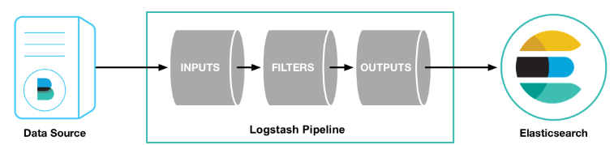

# Logstash 설치

  

---

### 실습 환경

- 💡 [Elasticsearch](https://www.elastic.co/guide/en/elasticsearch/reference/7.9/index.html) 7.9.0
- 💡 [Logstash](https://www.elastic.co/guide/en/logstash/current/introduction.html) 7.9
- 💡 [MySQL](https://dev.mysql.com/) 8.0
- 💡 [Java](https://www.oracle.com/java/technologies/javase-jdk11-downloads.html) 11.0.8 LTS
- 💡 [Git Bash](https://gitforwindows.org/) 2.27.0
- 💡 Windows 10

---

## 1. Logstash란?

Logstash는 Input을 담당한다.

Input으로 들어온 data가 logstash `Filter`를 통과해 `ElasticSearch`로 Output을 출력한다.

  
▲ 데이터 흐름 파이프라인


DB에 존재하는 파일들을 Logstash를 통해 `전처리`하여 ElasticSearch에 전달하는 과정의

파이프라인을 진행하고, 최종적으로 DB의 데이터를 Kibana를 통해 시각화할 수 있다.

---

## 2. Logstash 설치하기

Elastic 홈페이지에 [Logstash 다운로드](https://www.elastic.co/kr/downloads/logstash) 페이지에서 다운로드 할 수 있다.

현재(20.08.25) 최신버전인 7.9.0를 다운로드 받겠다.

---

## 3. 간단한 파이프라인 실습하기

키보드로 input을 받고 모니터에 출력하는 이벤트를 만들어보자.

[Logstash Reference(7.9)](https://www.elastic.co/guide/en/logstash/current/first-event.html) Getting Started with Logstash에 있는 실습 예제이다.

다운로드 받은 경로에서 (ex `/d/development/logstash-7.9.0`)

```bash
$ bin/logstash -e 'input { stdin { } } output { stdout {} }'
```

명령어를 실행하고 `Hello wolrd`를 input으로 입력해보자.


```bash
Hello world
{
          "host" => "DESKTOP-75DDGMG",
    "@timestamp" => 2020-08-26T01:29:39.383Z,
       "message" => "Hello world",
      "@version" => "1"
}
```

다음과 같이 테스트를 완료할 수 있다.

`Ctrl+C`를 통해 Logstash 를 종료시킬 수 있다.

---