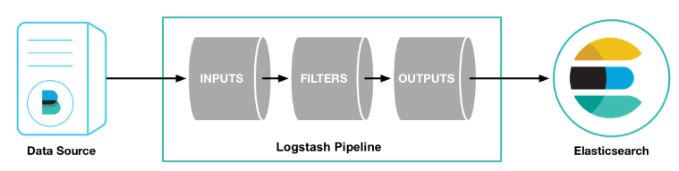

# Logstash MySQL 연동하기

  

---

# [MySQL ELK] Logstash과 MySQL DB 연동하기

[Filebeat+ELK] 첫번째 로그 모니터링 서버 구축기

03. MySQL DB와 연동하기

  

▲ 데이터 흐름 파이프라인

- DB에 존재하는 파일들을 Logstash를 통해 전처리하여 엘라스틱서치에 전달하는 과정의 파이프라인을 진행
- 최종적으로 DB의 데이터를 키바나를 통해 시각화

## 1. DB-connector 다운로드 (MySQL)

DB와 연결하기 위해서는 연결하기 위한 connector가 필요

### 1️⃣ Connector 다운

- 아래 링크를 타고 들어가면 최신 버전을 확인 할 수 있으니 확인 후 다운

```bash
$ wget 'https://dev.mysql.com/get/Downloads/Connector-J/mysql-connector-java-8.0.18.tar.gz'
```

[https://dev.mysql.com/downloads/connector/j/](https://dev.mysql.com/downloads/connector/j/) 

### 2️⃣ 압축풀기

- 다운 받은 압축 파일을 풀어준다.

```bash
tar -xvf ./mysql-connector-java-8.0.18.tar.gz
```

### 3️⃣ 필요한 파일 위치 변경 후 남은 파일 삭제

- 압축해제 후 필요한 파일만 원하는 위치로 이동 후 남은 파일은 삭제한다

```bash
$ mv ./mysql-connector-java-8.0.18/mysql-connector-java-8.0.18.jar ./lib/mysql-connector
-java-8.0.18.jar

$ rm -rf ./mysql-connector-java-8.0.18*
```

## 2. Logstash input plugin 설치

### 1️⃣ Plugin 설치

MySQL을 Logstash의 input으로 사용하기 위한 플러그인을 설치

- deb으로 logstash 설치 시 bin 폴더의 위치는 **/usr/share/logstash**에 존재한다

```bash
bin/logstash-plugin install logstash-input-jdbc
```

### 2️⃣ Logstash input conf 설정

- Input으로 jdbc를 사용
- Input 설정에 관한 자세한 사항은 [공식 문서](https://www.elastic.co/guide/en/logstash/current/plugins-inputs-jdbc.html)를 통해 확인 가능함

```bash
input {
    jdbc {
      jdbc_driver_library => "위에서 설치한 connector의 위치"
      jdbc_driver_class => "com.mysql.jdbc.Driver"
      jdbc_connection_string => "jdbc:mysql:[MySQL_접속경로]/[데이터베이스_이름]"
      jdbc_user => "유저이름"
      jdbc_password => "비밀번호"
      statement => "쿼리문"
      schedule => "* * * * *" # Query주기 설정
    }
}

# 필터가 필요하다면 아래 설정
filter {

}

# Elasticsearch로 output 설정
output {
    elasticsearch {
      host
    }
}
```

### Reference

- [https://soyoung-new-challenge.tistory.com/58?category=870484](https://soyoung-new-challenge.tistory.com/58?category=870484)