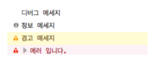
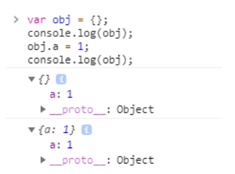
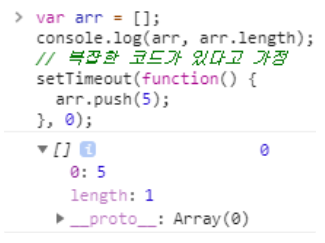
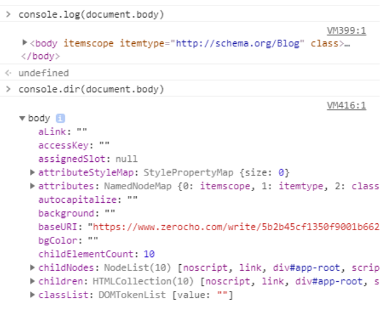

# [Javascript] Console log에 대해

## 1. Javascript에서 log를 확인하는 방법

백엔드 개발을 해도 간단한 Javascript 코드 수정은 할 수 있어야한다. 웹 페이지에서 form을 통해 데이터를 전달받거나 구현한 API를 연동할 때 Front 단에서 log를 확인하는 일도 발생한다.

log 확인을 위해 가장 많이 사용하는 방법이 console 객체의 log 메소드를 호출하는 방법이다.

console 객체에는 log 메서드 말고도 dir, count, time, timeEnd 등이 있다.

## 2. consel.log

간단한 사용 방법

```jsx
var a = 1995;
var b = 'hello';
var c = true;
console.log(a);                  // a 값 로그 출력
console.log(a, b, c);            // 여러 값 로그 출력
console.log("My number " + a);   // String + 변수 값
```

 `console.log(`${a}는 숫자 ${b}는 문자열`)` 와 같은 형식으로 사용할 수 도 있다.

백엔드에서 log를 남길 때와 같이 console 또한 logging level이 있다.

```jsx
console.debug('디버그 메세지');
console.info('정보 메세지');
console.warn('경고 메세지');
console.error('에러 입니다.');
```



## 3. 객체 Logging 주의할 점

객체를 선언해서 log를 추적하다 값이 내 마음처럼 나오지 않아 검색하다가 정리를 잘해두신 블로그의 글을 참고했다.

[(JavaScript) 입문자가 겪기 쉬운 console.log 실수](https://www.zerocho.com/category/JavaScript/post/5b2b45cf1350f9001b662ba6)

```jsx
var obj = {};
console.log(obj);
obj.a = 1;
console.log(obj);
```

처음 console 출력은 `{}`가 되고 두 번째는 `{a: 1}`이 될 줄 알았는데 실제 값은 다음과 같이 출력된다.



이유는 `console.log` 가 **참조를 logging**하기 때문에, 객체의 값은 실시간으로 바뀐다.

코드가 길어지면 더 헷갈린다.

```jsx
var arr = [];
console.log(arr, arr.length);
// 복잡한 코드가 있다고 가정
setTimeout(function() { // 비동기 가정
  arr.push(5);
}, 0);
```



log에는 `[]`와 `0`이 출력됐는데 `[]`을 확인해보면 length가 1이다.

> **객체를 logging 할 때는 객체의 내용 변경사항이 실시간으로 업데이트 된다!**

이러한 문제를 겪지 않으려면 객체를 깊은 복사해서 logging하거나 객체가 아닌 값을 logging 하자.

- 깊은 복사를 하게 되면 메모리 낭비가 크기 때문에 권장하지 않음
- 객체가 아닌 값을 logging
    - arr 배열 logging → arr.length logging

## 4. consel 객체의 다른 메소드

### 4-1. **dir**

- log랑 함께 쓰면 편하다.
- 객체는 dir, 나머지는 log로 logging 하자.

**DOM 객체 logging 예시**

```jsx
console.log(document.body); // <body>...</body>
```

DOM 객체의 메소드가 뭐가 있는지 보고싶은데 태그만 보인다.

이럴 때 dir을 쓰면 된다!



### 4-2. **count**

- 몇 번 호출되었나를 Logging 하고 싶을 때
- 인자는 카운터의 이름

```jsx
console.count('카운터1'); // 카운터1: 1
console.count('카운터1'); // 카운터1: 2
console.count('카운터2'); // 카운터2: 1
console.count('카운터2'); // 카운터2: 2
console.count('카운터1'); // 카운터1: 3
```

### 4-3. **time, timeEnd**

- 코드 수행 시간을 확인할 때 유용
- 인자는 타이머의 이름
- time과 timeEnd에 같은 타이머 이름을 주어야 정상적으로 작동한다.

```jsx
console.time('타이머');
for (var i = 0; i < 1000000; i++) z = 5;
console.timeEnd('타이머'); // 타이머: 6.76611328125ms
```
