# GCP Essentials - Cloud Shell 및 gcloud 시작하기

<blockquote style="font-size: 1.12em;" data-ke-style="style3"><b>Qwiklabs GCP Essentials 실습 목차</b> <a href="https://dev-youngjun.tistory.com/37?category=891632">(1) 2020/04/11 - [GCP] - GCP Essentials - Qwiklabs 실습 개요</a> <a href="https://dev-youngjun.tistory.com/38?category=891632" target="_blank" rel="noopener">(2) 2020/04/12 - [GCP] - GCP Essentials - 가상 머신 만들기 실습</a> (3) 2020/04/13 - [GCP] - GCP Essentials - Cloud Shell 및 gcloud 시작하기</blockquote>

Qwiklabs의 GCP Essentials Quest를 수강하며 작성한 포스팅이다.  

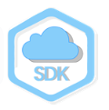

세 번째 실습인 <b>[Cloud Shell 및 gcloud 시작하기]</b> Quest를 실습해보자.

<h2 data-ke-size="size26">개요</h2>

<b>Google Cloud Shell</b>에서는?

<ul style="list-style-type: disc;" data-ke-list-type="disc">
<li>gcloud&nbsp;명령줄을 사용하여 Google Cloud Platform에 호스팅된 컴퓨팅 리소스에 액세스할 수 있다.</li>
<li>Cloud Shell은 <b>Debian 기반 가상 머신</b>으로, 영구적인 5GB 홈 디렉터리를 제공하여 GCP 프로젝트와 리소스를 원활하게 관리할 수 있도록 한다.</li>
<li>Cloud SDK&nbsp;gcloud와 필요한 기타 유틸리티는 Cloud Shell에 사전 설치되어 있으므로 간단하게 시작하고 실행할 수 있다.</li>
</ul>
<h4 data-ke-size="size20"><b>실습할 내용</b></h4>
<ul>
<li>gcloud&nbsp;명령어 사용 연습</li>
<li><b>Google Cloud Platform에 호스팅된 컴퓨팅 서비스에 연결</b></li>
</ul>
<h4 data-ke-size="size20"><b>기본 요건</b></h4>

vim,&nbsp;emacs,&nbsp;nano&nbsp;등 표준 Linux 텍스트 편집기에 관한 기본 지식

&nbsp;

<h2 data-ke-size="size26">설정</h2>

<b>실습 시작 버튼을 클릭하기 전에</b>

&nbsp;

다음 안내를 확인하자!

<ul>
<li>실습에는 시간 제한이 있으며 일시 중지할 수 없다.</li>
<li>실습 시작을 클릭하면 타이머가 시작되고 Cloud 리소스를 사용할 수 있는 시간이 얼마나 남았는지 표시된다.</li>
</ul>

Qwiklabs 실습을 통해 시뮬레이션이나 데모 환경이 아닌&nbsp;<b>실제 클라우드 환경에서 직접 실습 활동을 진행</b>할 수 있다. 실습 시간 동안 Google Cloud Platform에 로그인하고 액세스 하는 데 사용할 수 있는&nbsp;<b>새로운 임시 사용자 인증 정보가 제공된다</b>.

&nbsp;

<b>준비할 사항</b>

&nbsp;

이 실습을 완료하려면 다음을 준비해야 한다.

<ul>
<li>표준 인터넷 브라우저(Chrome 브라우저 권장)</li>
<li>실습을 완료할 시간</li>
</ul>
<blockquote data-ke-style="style2"><b>참고:</b>&nbsp;이미 개인용 GCP 계정이나 프로젝트가 있어도 이 실습에서는 사용하지 마세요!</blockquote>

 <b>실습을 시작하고 콘솔에 로그인하는 방법</b>

<a href="https://dev-youngjun.tistory.com/38" target="_blank" rel="noopener">2020/04/12 - [GCP] - GCP Essentials - 가상 머신 만들기 실습</a>

이전 글에서 자세하게 설명했다! 콘솔에 로그인 하는 방법은 이전 글에서 확인하자.

&nbsp;

<h2>Cloud Shell 시작</h2>

(1) GCP Console의 오른쪽 상단에 있는 아이콘을 클릭하여 Cloud Shell 세션을 열자.

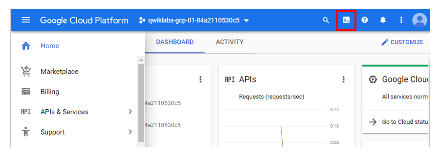

(2) <b>Continue</b>를 클릭하자.

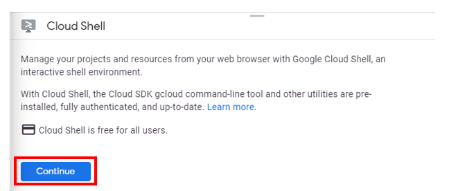

Cloud Shell이 활성화되면 명령줄을 사용하여 Cloud SDK&nbsp;gcloud&nbsp;명령어나 가상 머신 인스턴스에서 사용할 수 있는 다른 도구를 호출할 수 있다. 

이 실습의 뒷부분에서는 여러 프로젝트와 Cloud Shell 세션 간에 파일을 저장하기 위해 영구 디스크 저장소에서 사용되는&nbsp;$HOME&nbsp;디렉터리를 사용하게 됩니다.&nbsp;$HOME&nbsp;디렉터리는 본인에게만 공개되며 다른 사용자는 액세스할 수 없습니다.

&nbsp;

<h2 data-ke-size="size26">리전 및 영역의 이해</h2>
<blockquote data-ke-style="style3">앞부분은 지난 Quest와 겹치는 내용이지만 알아두어야 이해가 되기 때문에 다시 한번 정리했다.&nbsp;</blockquote>

일부 Compute Engine 리소스는 리전이나 영역(zone)에 있다.

&nbsp;

<b>리전이란?</b>

리소스를 실행할 수 있는 특정 지리적 위치이다. 각 리전에는&nbsp;<b>하나 이상의 영역</b>이 있다.

<blockquote data-ke-style="style2">예를 들어 us-central1 리전은&nbsp;us-central1-a,&nbsp;us-central1-b,&nbsp;us-central1-c&nbsp;및&nbsp;us-central1-f&nbsp;영역이 있는 미국 중부의 리전을 나타낸다.</blockquote>

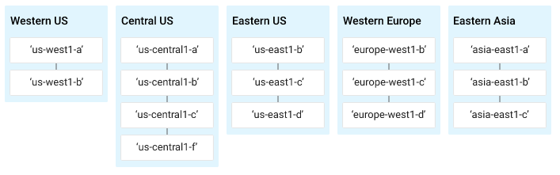

영역 내에 상주하는 리소스를&nbsp;<b>영역별 리소스</b>라고 한다.

<ul>
<li>가상 머신 인스턴스와 영구 디스크는 영역에 상주한다.</li>
<li>영구 디스크를 가상 머신 인스턴스에 연결하려면&nbsp;두 리소스가 모두 같은 영역에 있어야 한다.</li>
<li>마찬가지로 인스턴스에 정적 IP 주소를 할당하려는 경우&nbsp;인스턴스가 정적 IP와 같은 리전에 있어야 합니다.</li>
</ul>
<blockquote data-ke-style="style3"><a href="https://cloud.google.com/compute/docs/regions-zones/">리전 및 영역 문서</a>에서 리전과 영역에 관해 자세히 알아보고 전체 목록을 확인하자.</blockquote>

&nbsp;

<b>기본 리전과 영역 설정 명령어</b>

&nbsp;

다음 값을 사용하여 기본 리전과 영역이 설정된다.

<pre id="code_1586631577672" class="go" data-ke-language="go" data-ke-type="codeblock"><code>google-compute-default-zone google-compute-default-region</code></pre>

&nbsp;

<b>설정 확인 명령어</b>

&nbsp;

기본 리전 및 영역 설정을 확인하려면 다음&nbsp;gcloud&nbsp;명령어를 실행하자.

<pre id="code_1586631710459" class="go" data-ke-language="go" data-ke-type="codeblock"><code>gcloud compute project-info describe --project &lt;your_project_ID&gt;</code></pre>

&lt;your_project_id&gt;를 대체할 값은 Console의 홈페이지에서 확인하거나 이 실습을 시작한 Qwiklabs 탭에서 프로젝트 ID를 사용하여 찾을 수 있다.

&nbsp;

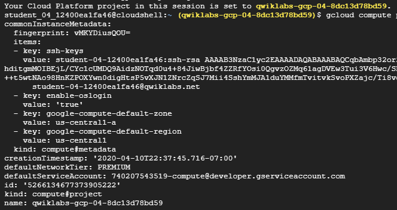

<blockquote data-ke-style="style2">뒤에 나오는 실습은 지금 설정된 영역(google-compute-default-zone)을 사용한다. 설정 확인 출력에서 기본 영역 및 리전 메타데이터 값을 찾아서 기억하자! google-compute-default-region&nbsp;및&nbsp;google-compute-default-zone&nbsp;키와 값이 누락되면 기본 영역이나 리전이 설정되지 않은 것이다.</blockquote>

&nbsp;

&nbsp;

<h2>Cloud SDK 초기화</h2>

<b>gcloud&nbsp;CLI는 Google Cloud SDK에 포함되어 있다. </b>

<ol style="list-style-type: decimal;" data-ke-list-type="decimal">
<li>시스템에 SDK를 다운로드하고 설치</li>
<li>gcloud init을 실행하여 SDK를 초기화</li>
<li>gcloud&nbsp;명령줄 도구를 사용할 수 있다.</li>
</ol>
<blockquote data-ke-style="style2">gcloud&nbsp;CLI는 Cloud Shell에서 자동으로 제공된다. 이 실습에서는 Cloud Shell을 사용하고 있으므로&nbsp;gcloud를 수동으로 설치할 필요가 없다.</blockquote>
<h2 id="step7" data-ke-size="size26">환경 변수 설정</h2>

<b>환경 변수란? </b>

말 그대로 환경을 정의하는 변수.

API 또는 실행파일을 포함하는 스크립트를 작성할 때 <b>원하는 변수를 정의하면 시간을 절약</b>할 수 있다.

&nbsp;

다음 명령어로 몇 가지 환경 변수를 만들어보자.

<pre id="code_1586632210264" class="go" data-ke-language="go" data-ke-type="codeblock"><code>export PROJECT_ID=&lt;your_project_ID&gt;</code></pre>

<b>ZONE 환경 변수를 설정</b>(이전 명령어의 영역 값 사용).

<pre id="code_1586632228928" class="go" data-ke-language="go" data-ke-type="codeblock"><code>export ZONE=&lt;your_zone&gt;</code></pre>

<b>변수가 제대로 설정되어 있는지 확인</b>

<pre id="code_1586632243051" class="go" data-ke-language="go" data-ke-type="codeblock"><code>echo $PROJECT_ID 
echo $ZONE</code></pre>

&nbsp;

&nbsp;

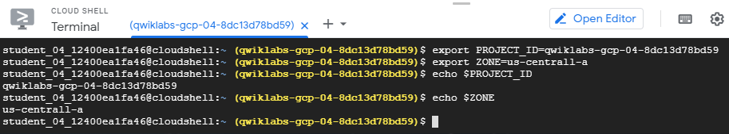

<h2 id="step7">gcloud를 사용하여 가상 머신 만들기</h2>

gcloud를 사용하여 <b>새로운 가상 머신 인스턴스</b>를 만들자. 다음과 같은 명령어를 사용하면 된다.

<ul>
<li><b>gcloud compute</b>를 사용하면 Compute Engine API를 사용할 때보다 익숙한 형식으로 Google Compute Engine 리소스를 쉽게 관리할 수 있다.</li>
<li><b>instances create</b>는 새 인스턴스를 만든다.</li>
</ul>

<b>가상 머신 생성하기</b>

다음을 실행하여 가상 머신을 만들어보자.

<pre id="code_1586632561580" class="go" data-ke-language="go" data-ke-type="codeblock"><code>gcloud compute instances create gcelab2 --machine-type n1-standard-2 --zone $ZONE</code></pre>
<ul>
<li>가상 머신의 이름은 <b>'gcelab2'</b>이며</li>
<li>--machine-type&nbsp;플래그를 사용하여 머신 유형을<b> 'n1-standard-2'</b>로 지정합니다.</li>
<li>--zone&nbsp;플래그를 사용하여 <b>환경 변수와 함께 정의한 영역에서 생성</b>되게끔 지정합니다.</li>
</ul>

&nbsp;

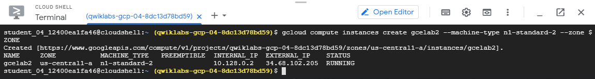

&nbsp;

<blockquote data-ke-style="style2">--zone&nbsp;플래그를 생략하면&nbsp;gcloud가 <b>기본 속성을 기준</b>으로 원하는 영역을 추론할 수 있다.&nbsp; <b>머신 유형&nbsp;및&nbsp;이미지와 같은 기타 필수 인스턴스 설정</b>은 create 명령어에 지정되지 않은 경우 <b>기본값으로 설정</b>된다.</blockquote>

&nbsp;

create&nbsp;명령어의 도움말을 표시하면 기본값을 볼 수 있다.

<pre id="code_1586634209754" class="go" style="margin: 20px auto 0px; display: block; overflow: auto; padding: 15px; color: #383a42; background: #f6f7f8; font-size: 14px; border-radius: 3px; font-family: Menlo, Consolas, Monaco, monospace; border: 1px solid #dddddd; cursor: default; z-index: 1;" data-ke-language="go" data-ke-type="codeblock"><code>gcloud compute instances create --help</code></pre>

&nbsp;

<b>완료된 작업 테스트하기</b>

<b>진행 상황 확인</b>을 클릭하여 실행한 작업을 확인해보자.

&nbsp;

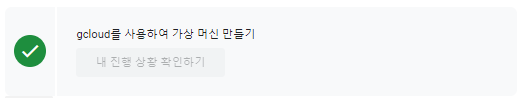

<h2 id="step7">gcloud 명령어 사용</h2>

&nbsp;

<b>gcloud 명령어 사용 안내(도움말)</b>

 gcloud&nbsp;호출 명령어의 끝에&nbsp;-h&nbsp;플래그를 추가하면 참고할 수 있는 간단한 사용 안내가 표시된다.

Cloud Shell에서 다음 명령어를 실행해보자.

<pre id="code_1586634289046" class="go" data-ke-language="go" data-ke-type="codeblock"><code>gcloud -h</code></pre>

gcloud -h

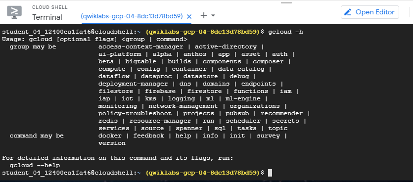

&nbsp;

<b>더 상세한 도움말</b>을 확인하려면&nbsp;--help&nbsp;플래그를 추가하거나&nbsp;gcloud help&nbsp;명령어를 실행하면 된다.

Cloud Shell에서 다음 명령어를 실행해 보자.

<pre id="code_1586634312217" class="go" data-ke-language="go" data-ke-type="codeblock"><code>gcloud config --help</code></pre>
<blockquote data-ke-style="style2">도움말 콘텐츠를 스크롤하려면&nbsp;<b>Enter</b>&nbsp;키나&nbsp;<b>스페이스바</b>를 누르면 된다. 표시된 콘텐츠에서 나가려면&nbsp;q를 입력하자.</blockquote>

이제 다음 명령어를 실행해 보자.

<pre id="code_1586634465521" class="go" data-ke-language="go" data-ke-type="codeblock"><code>gcloud help config</code></pre>

gcloud config --help&nbsp;및&nbsp;gcloud help config&nbsp;명령어의 <b>기능이 같다</b>는 것을 알 수 있다.

두 명령어 모두 상세한 도움말을 표시한다.

&nbsp;

&nbsp;

<a href="https://cloud.google.com/sdk/gcloud/reference/">gcloud&nbsp;전역 플래그</a>는 호출 레벨에 따른 명령어 동작을 제어한다.

플래그는 SDK 속성에서 설정된 모든 값을 재정의한다.

&nbsp;

<b>환경에서 구성 목록을 확인</b>

<pre id="code_1586634621580" class="go" data-ke-language="go" data-ke-type="codeblock"><code>gcloud config list</code></pre>

&nbsp;

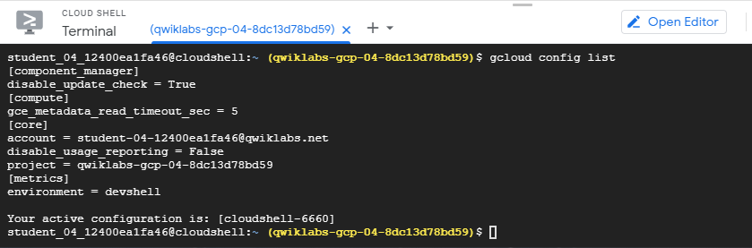

설정된 다른 속성을 확인하려면 다음을 호출하여 모든 속성을 표시할 수 있다.

<pre id="code_1586634668091" class="go" data-ke-language="go" data-ke-type="codeblock"><code>gcloud config list --all</code></pre>

다음을 통해&nbsp;components를 나열합니다.

<pre id="code_1586634688437" class="go" data-ke-language="go" data-ke-type="codeblock"><code>gcloud components list</code></pre>

이 명령어로 실습에서 사용할 수 있는 구성요소가 표시된다.

&nbsp;

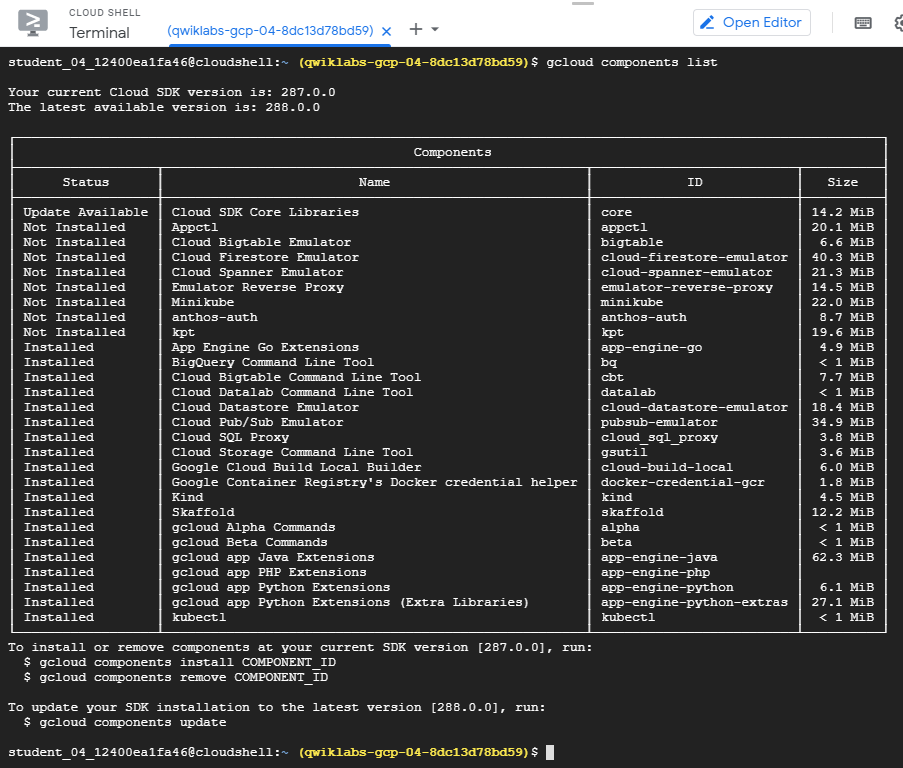

&nbsp;

<b>새로운 구성요소(components)를 설치해 보자!&nbsp;</b>

&nbsp;

<h2 id="step10" data-ke-size="size26">자동 완성</h2>

<b>gcloud interactive</b>

<ul style="list-style-type: disc;" data-ke-list-type="disc">
<li>명령어 및 플래그를 자동으로 추천하고 명령어 입력 시 하단에 인라인 도움말 스니펫을 표시한다.</li>
<li>드롭다운 메뉴를 사용해서 명령어 및 하위 명령어 이름과 같은 정적 정보와 플래그 이름 및 열거형 플래그 값을 자동으로 완성할 수 있다!</li>
</ul>

다음을 통해 베타 구성요소를 설치하자.

<pre id="code_1586634818418" class="go" data-ke-language="go" data-ke-type="codeblock"><code>gcloud components install beta</code></pre>

&nbsp;

<b>gcloud interactive</b><b>&nbsp;모드</b>로 전환해보자.

<pre id="code_1586634833343" class="go" data-ke-language="go" data-ke-type="codeblock"><code>gcloud beta interactive</code></pre>

&nbsp;

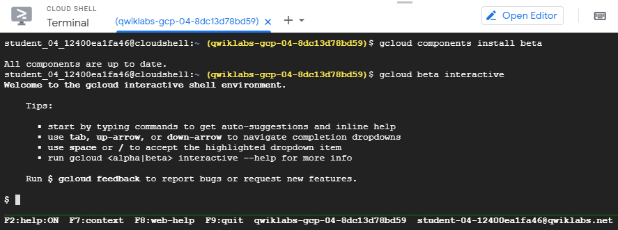

&nbsp;

<ul style="list-style-type: disc;" data-ke-list-type="disc">
<li> <b>Tab</b>&nbsp;키를 클릭하여 파일 경로 및 리소스 인수를 입력한다.</li>
<li>드롭다운 메뉴가 나타나면&nbsp;<b>Tab</b>&nbsp;키를 사용하여 목록을 이동할 수 있다.</li>
<li><b>스페이스바</b>를 사용하여 원하는 항목을 선택한다.</li>
</ul>

&nbsp;

<b>테스트</b>

먼저 다음 명령어를 입력한 후 자동 완성을 사용하여 명령어를 완성해보자.

<pre id="code_1586634846650" class="go" data-ke-language="go" data-ke-type="codeblock"><code>gcloud compute instances describe &lt;your_vm&gt;</code></pre>

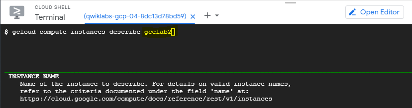

<b>F2 토글 key 사용</b>

Cloud Shell 하단에 이 기능을 설정하는 단축키가 표시된다. 여기에서 F2 토글을 사용할 수 있다.

F2:help:STATE를 통해 활성 도움말 섹션(ON: 사용, OFF: 사용 중지)을 전환한다.

&nbsp;

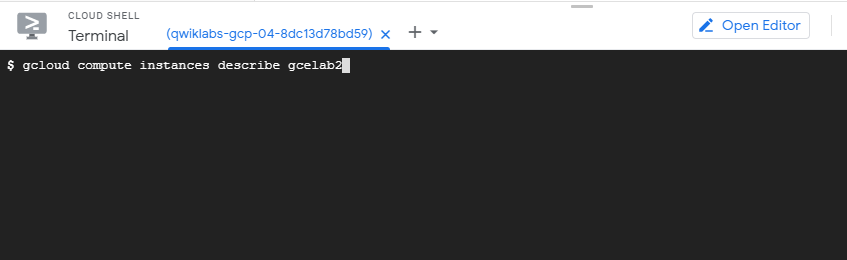

&nbsp;

<h2 id="step11" data-ke-size="size26">VM 인스턴스에 SSH 사용</h2>

<b>gcloud compute</b>

gcloud compute를 사용하면 인스턴스에 쉽게 연결할 수 있다.&nbsp;gcloud compute ssh&nbsp;명령어는 SSH에 래퍼 기능을 제공하여 인증 및 <b>인스턴스 이름과 IP 주소의 매핑을 처리</b>하게 한다!

&nbsp;

gcloud compute ssh를 사용하여 가상 머신에 SSH를 사용해보자.

<pre id="code_1586634886642" class="go" data-ke-language="go" data-ke-type="codeblock"><code>gcloud compute ssh gcelab2 --zone $ZONE</code></pre>

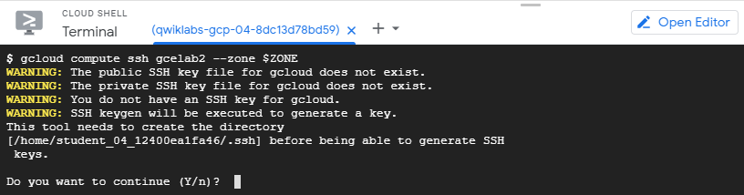

<b>계속하려면 'Y'를 입력하자.</b>

&nbsp;

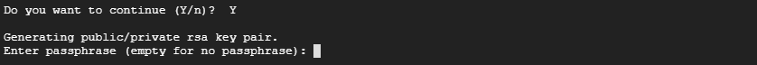

<b>암호 섹션에서는&nbsp;Enter&nbsp;키를 눌러 암호를 공백으로 두자!</b>

&nbsp;

변경할 내용이 없는 경우 'exit'를 입력하면 원격 셸이 종료되어 SSH 연결을 끊으면 된다.

&nbsp;

&nbsp;

<h2 id="step12" data-ke-size="size26">홈 디렉터리 사용</h2>

<b>HOME 디렉터리</b>

이제 홈 디렉터리를 사용해보자. Cloud Shell 홈 디렉터리의 콘텐츠는 <b>가상 머신을 종료했다가 다시 시작해도 모든 Cloud Shell 세션의 프로젝트에서 유지</b>된다.

&nbsp;

다음과 같이 현재 작업 디렉터리를 변경한다.

<pre id="code_1586634973661" class="go" data-ke-language="go" data-ke-type="codeblock"><code>cd $HOME</code></pre>

vi&nbsp;텍스트 편집기를 사용하여&nbsp;.bashrc&nbsp;구성 파일을 열어보자.

<pre id="code_1586634989962" class="go" data-ke-language="go" data-ke-type="codeblock"><code>vi ./.bashrc</code></pre>

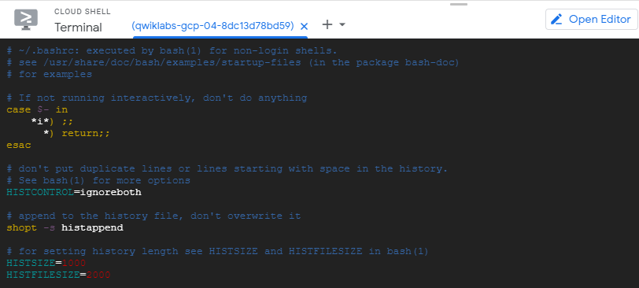

&nbsp;

편집기가 열리면서 파일 콘텐츠가 표시된다.&nbsp;

ESC&nbsp;키를 누른 후&nbsp;:wq를 입력하여 편집기를 종료할 수 있다!

&nbsp;

&nbsp;

<h2 id="step13" data-ke-size="size26">배운 내용 테스트하기</h2>

아래는 이 실습에서 배운 내용을 복습하기 위한 객관식 문제이다.

해석하면 다음과 같다.

<blockquote data-ke-style="style3">GCP 서비스 및 리소스와 상호 작용하는 세 가지 기본적인 방법은 다음과 같습니다.</blockquote>

&nbsp;

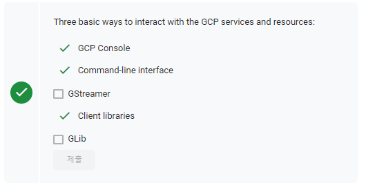

&nbsp;

&nbsp;

<h2 id="step13">끝났다!</h2>

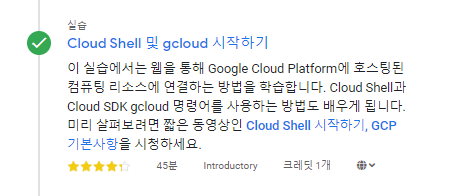

&nbsp;

