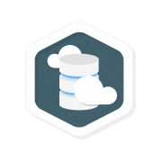

# Qwiklabs - Cloud Architecture

<blockquote data-ke-size="size26" data-ke-style="style3">본 과정은 2020 Cloud Study Jam - Professional Cloud Architect 자격증반 퀵랩에 관한 내용이다.</blockquote>

🔺Cloud Architecture

<h2 data-ke-size="size26">Cloud Architecture</h2>

Fundamental&nbsp;6단계&nbsp;1일&nbsp;크레딧 50개

&nbsp;

이 기본적인 수준의 퀘스트는 다른 Qwiklabs 제품들 중에서 unique하다. 

이 labs는 <a href="https://cloud.google.com/certification/cloud-architect">Google Cloud Certified Professional Cloud Architect</a>&nbsp;Certification에 등장하는 주제와 서비스에 대해 IT 전문가에게 직접 실습할 수 있도록 큐레이션되었다. 

&nbsp;

IAM, 네트워킹, Kubernetes 엔진 구축에 이르기까지, 이 퀘스트는 GCP 지식을 테스트할 수 있는 특정 labs로 구성되어 있다! 이러한 실습에서 연습하면 기술과 능력이 향상되지만 시험 가이드 및 기타 사용 가능한 준비 리소스도 검토할 것을 권장한다.

&nbsp;

기본 요건:

본 Quest는 GCP 서비스, 특히 컴퓨팅과 네트워킹에 대한 친숙함을 기대한다. 학생이 &nbsp;<a href="https://google.qwiklabs.com/quests/33">Baseline: Infrastructure</a> 이나 &nbsp;<a href="https://google.qwiklabs.com/quests/23">GCP Essentials</a> hands-on labs를 완료하여 배지를 획득할 것을 권장한다. <a href="https://google.qwiklabs.com/quests/40">Security and Identity Fundamentals</a> lab과 <a href="https://google.qwiklabs.com/quests/29">Kubernetes In the Google Cloud</a>&nbsp;Quests에 대한 추가 랩 경험이 유용할 것이다.

&nbsp;

&nbsp;

<h2>Quest Outline</h2>
<blockquote data-ke-style="style3"><b>6개의 lab으로 구성</b> [1] Kubernetes를 통한 클라우드 조정 [2] 배포 관리자 - 전체 프로덕션 [3] Continuous Delivery Pipelines with Spinnaker and Kubernetes Engine [4] 다중 VPC 네트워크 [5] Stackdriver APM으로 사이트 안정성 문제해결 [6] Cloud Architecture: Challenge Lab</blockquote>
<h3><a href="https://google.qwiklabs.com/focuses/557?parent=catalog&amp;qlcampaign=6s-Certi-24">Kubernetes를 통한 클라우드 조정</a></h3>

이 실습에서는 Google Container Engine을 사용하여 완전한 Kubernetes 클러스터를 프로비저닝하고, kubectl을 사용하여 Docker 컨테이너를 배포 및 관리하며, Kubernetes의 배포 및 서비스를 사용하여 애플리케이션을 마이크로서비스로 분할하는 방법을 알아봅니다.

1시간 15분 Expert 크레딧 9개

<h3><a href="https://google.qwiklabs.com/focuses/981?parent=catalog&amp;qlcampaign=6s-Certi-24">배포 관리자 - 전체 프로덕션</a></h3>

이 실습에서는 배포 관리자를 사용하여 서비스를 시작하고 Stackdriver를 사용하여 서비스를 모니터링합니다. Stackdriver 대시보드로 기본 블랙박스 모니터링을 설정하고 업타임 체크 경고 알림을 설정하여 이슈 응답을 트리거할 수 있습니다.

1시간 30분 Expert&nbsp;크레딧 9개

<h3><a href="https://google.qwiklabs.com/focuses/552?parent=catalog&amp;qlcampaign=6s-Certi-24">Continuous Delivery Pipelines with Spinnaker and Kubernetes Engine</a></h3>

Create a Kubernetes Engine cluster, deploy an application, and use Spinnaker to continuously deploy the application when changes are made to the application.

1시간 30분 Expert 크레딧 9개

<h3><a href="https://google.qwiklabs.com/focuses/1230?parent=catalog&amp;qlcampaign=6s-Certi-24">다중 VPC 네트워크</a></h3>

이 실습에서는 다수의 VPC 네트워크 및 VM 인스턴스를 만들어 보고 네트워크 간의 연결성을 테스트합니다.

1시간 10분 Advanced 크레딧 7개

<h3><a href="https://google.qwiklabs.com/focuses/4186?parent=catalog&amp;qlcampaign=6s-Certi-24">Stackdriver APM으로 사이트 안정성 문제해결</a></h3>

이 실습의 목표는 GKE 클러스터 인프라, Istio, 이 인프라에 배포되는 애플리케이션 등을 모니터링할 수 있도록 Stackdriver의 구체적인 기능을 익히는 것입니다.

1시간 30분 Advanced 크레딧 7개

&nbsp;

<h3><a href="https://google.qwiklabs.com/focuses/10417?parent=catalog&amp;qlcampaign=6s-Certi-24">Cloud Architecture: Challenge Lab</a></h3>

This challenge lab tests your skills and knowledge from the labs in the Cloud Architecture quest. You should be familiar with the content of labs before attempting this lab.

1시간 Expert 크레딧 9개

