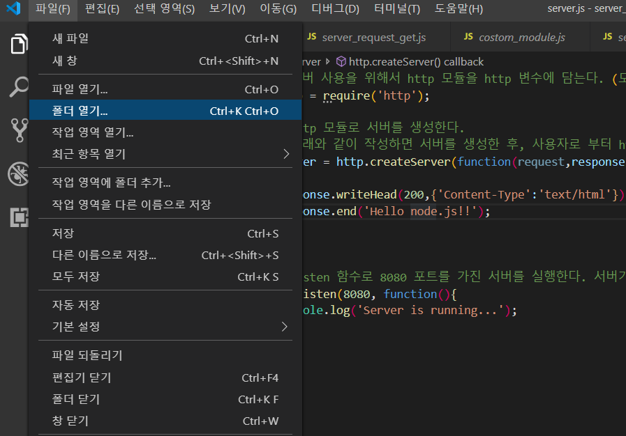
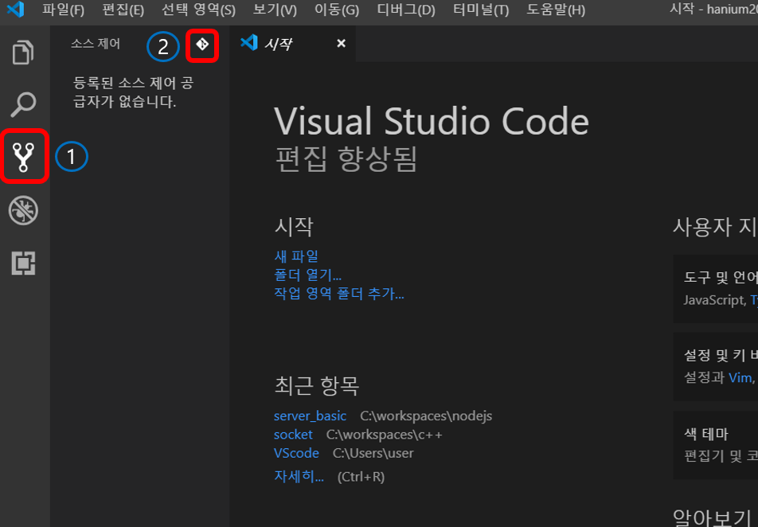
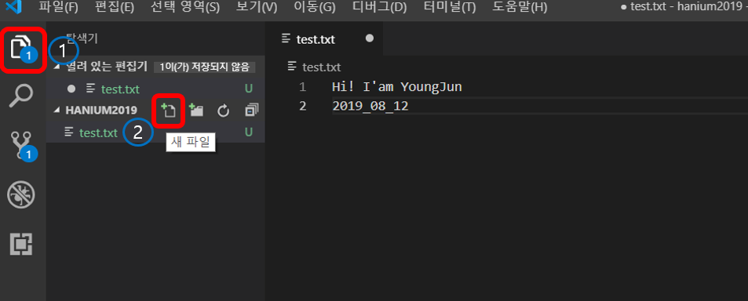
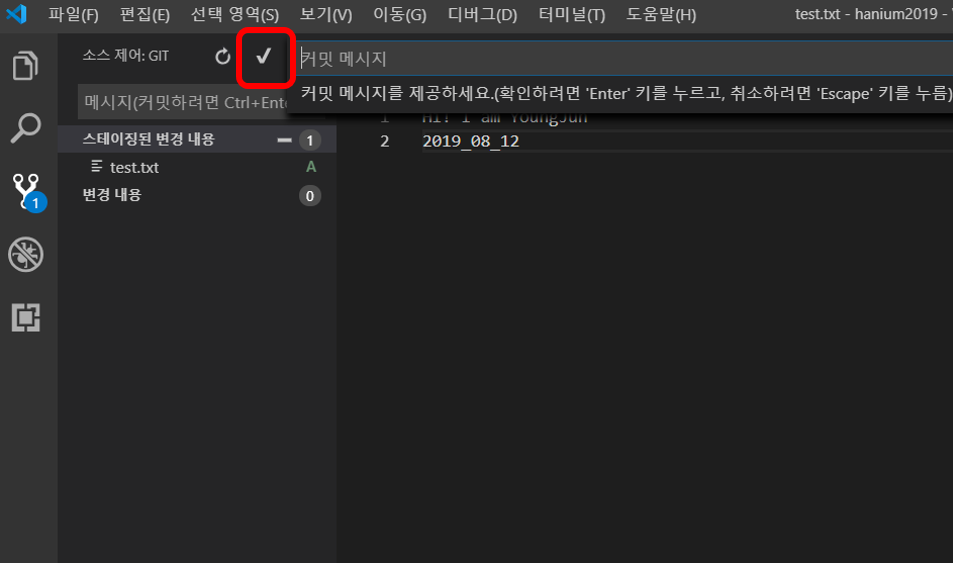

# Visual Studio Code에 Github 연동

<h2>1. Visual Studio Code(VSCode)란?</h2>

<blockquote>

Visual Studio Code(이하 VSCode)는 MicroSoft(MS)에서 제공하는 크로스 플랫폼 에디터로 다양한 언어를 지원하며 IntelliSense, Debugging, Built-in Git, Extensions 등의 기능을 제공합니다.

</blockquote>
<ul>
<li><a href="https://code.visualstudio.com/">다운로드</a> 본인의 OS 버전에 맞게 다운로드 받아 설치하시면 됩니다.</li>
</ul>

VSCode는 Git 연동을 지원할 뿐 Git 자체를 지원하는 것은 아니기 때문에 Git 설치가 선행되어야 합니다. Window Git 설치 및 기본 설정은 아래 포스팅을 참고하시면 됩니다.

<ul>
<li><a href="https://jun108059.github.io/devlog/2019/07/15/git%EA%B8%B0%EC%B4%88-git%EC%9D%B4%EB%9E%80/">&gt;&gt; 1. Git기초-Git이란?</a></li>
<li><a href="https://jun108059.github.io/devlog/2019/07/15/git%EA%B8%B0%EC%B4%88-git%EC%9D%B4%EB%9E%80/">&gt;&gt; 2. Git 시작하기</a></li>
</ul>
<h2>2. Git 연동하는 방법</h2>
<h4>Git을 연동하는 방법은 크게 두가지로 나뉩니다.</h4>
<ul>
<li>로컬에서 프로젝트를 생성하고 원격으로 Git에 연결하는 방법</li>
<li>Git에 생성된 프로젝트를 로컬로 Clone 하는 방법</li>
</ul>

두번째 방법을 사용하실 경우 아래 포스팅을 참고하시면 됩니다.

<ul>
<li><a href="https://youngjunstudy.wordpress.com/2019/07/15/4-git-%ec%9b%90%ea%b2%a9-%ec%a0%80%ec%9e%a5%ec%86%8c/">&gt;&gt; 4. GIT 원격 저장소</a></li>
</ul>
<h3>① Local Folder 지정</h3>

VSCode에서 프로젝트로 사용할 특정 폴더를 선택합니다.

<h3>② Git 초기화</h3>

VSCode 메뉴에서 소스제어 메뉴를 선택한 후 Repository 초기화를 선택합니다.

&nbsp;

초기화 버튼을 선택하면 아래와 같은 화면이 표시되고 원하는 폴더를 선택하면 됩니다.

자신의 Window 폴더 경로로 이동하면 .git 폴더가 생성된 것을 확인 할 수 있습니다.

VSCode 소스 제어 메뉴도 아래와 같이 변경된 것을 확인할 수 있습니다.

<h3>③ Git Stage 관리</h3>

간단하게 파일을 하나 생성해 보도록 하겠습니다. test.txt 파일을 생성하고 아래 그림처럼 좌측 메뉴의 탐색기 버틀을 누른 후 파일을 추가하면 소스제어 아이콘에 1 이 표시되는 것을 확인할 수 있습니다.

소스제어 메뉴를 선택한 후 파일에 마우스를 위치시키면 + (변경 내용 스테이징) 아이콘이 보입니다. 해당 아이콘을 선택하면 Stage 처리 됩니다.

변경된 내용 확인

... 버튼을 클릭하면 git과 관련된 여러가지 작업을 수행할 수 있습니다.

<h3>④ Git Commit</h3>

Stage에 올라간 내용은 Commit 명령어를 통해 GitHub에 반영하면 됩니다. VSCode 소스 제어에서 아래의 메뉴를 선택하면 됩니다.

<blockquote>

명령어 git commit -m "test commit"을 터미널에 입력한 것과 같은 결과  

</blockquote>

<h3>⑤ Remote 원격 Repository</h3>

GitHub에 원격 Repository를 미리 생성해둔 경우 remote repositoy에 연결합니다.

<pre class="dockerfile"><code>git remote add origin "Repositoy URL"</code></pre>

터미널에 아래와 같이 입력하면 접속할 수 있는 유저Name과 비밀번호를 입력하면 VSCode와 GitHub는 정상적으로 연결됩니다.

&nbsp;

&nbsp;

