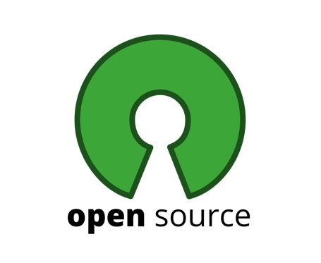
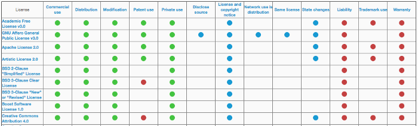

# 오픈소스 라이선스(Open Source License) 정리

  

오픈소스를 사용하다 보면 흔히 볼수있는 저작권이 있다.

보통은 MIT License, Apache License2.0( Apach License V2 )를 가장 많이 볼 수 있다.

다른 라이선스는 이후에 정리할 예정이다!

## 1️⃣ **MIT License**

1. 이 소프트웨어를 누구라도 무상으로 제한없이 취급해도 좋다. 단, 저작권 표시 및 이 허가 표시를 소프트웨어의 모든 복제물 또는 중요한 부분에 기재해야 한다.
2. 저자 또는 저작권자는 소프트웨어에 관해서 아무런 책임을 지지 않는다.

*위 내용은 위키백과에서 가져온 MIT License에 대한 내용입니다.*

> 상업적으로도 이용이 가능하지만 사용하면서 발생한 문제점은 전부 사용자에게 책임이 있다.

## 2️⃣ **Apache License2.0( Apach License V2 )**

1. 별도의 허가가 필요하지 않다.
2. 2차 저작물에 대해서는 소스를 공개하지 않아도 무방하지만 수정된 부분을 표시를 해야한다.
3. 2차 저적물은 동일한 License를 사용하지 않아도 된다.
4. 저자 또는 저작권자는 소프트웨어에 관해서 아무런 책임을 지지 않는다

> .*Apache에 의해 개발되었음에 대한 저작권 표시, 보증 책임이 없음 등에 대한 표시를 의무적으로 해야한다.*

두 라이선스를 비교한 표는 다음과 같다.

다양한 라이선스를 비교한 표이다.

  

▲ 출처 : [Why Add a License to your Open Source Project?](https://medium.com/glitch/why-add-a-license-to-your-open-source-project-6f07941f9288)

자세한 내용은 [오픈소스 SW 라이선스 종합정보시스템](https://olis.or.kr/license/compareGuide.do)에 잘 명시되어있다.

### Reference

- [https://medium.com/@yeongpal/오픈소스-라이센스-open-source-license-저작권이란-5343c7b8cca1](https://medium.com/@yeongpal/%EC%98%A4%ED%94%88%EC%86%8C%EC%8A%A4-%EB%9D%BC%EC%9D%B4%EC%84%BC%EC%8A%A4-open-source-license-%EC%A0%80%EC%9E%91%EA%B6%8C%EC%9D%B4%EB%9E%80-5343c7b8cca1)