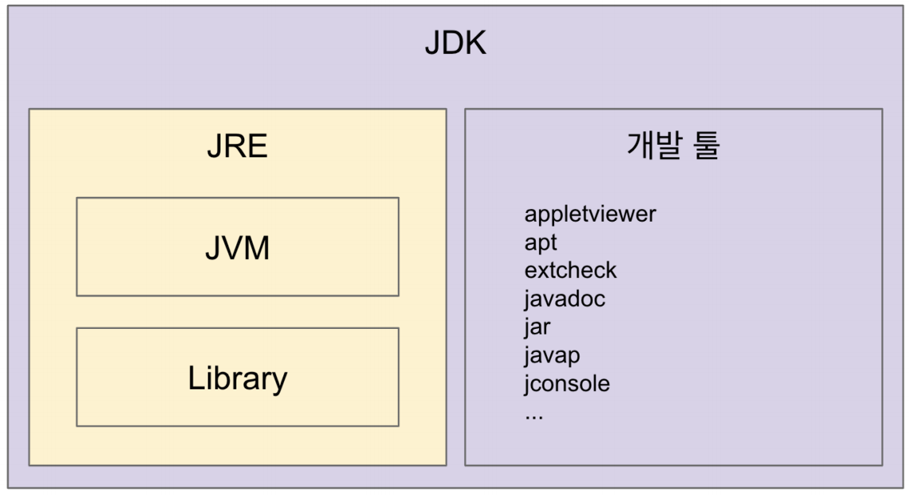
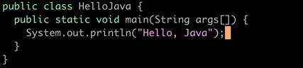
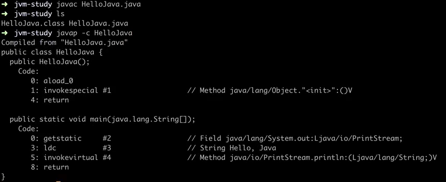

# Java, JVM, JDK, JRE의 차이점

운영체제에 독립적으로 동작할 수 있는 Java의 내부구조와 개발환경에 대해 공부하다가 정확한 차이를 정리해두려고한다.

(▲ 출처 : 백기선 - 더 자바, 코드를 조작하는 다양한 방법)

## 1. JVM

> Java Virtural Machine(자바 가상 머신)  
- Java를 운영체제에 독립적으로 실행할 수 있도록 함!

Java의 가장 큰 장점 중 하나는 운영체제에 독립적으로 실행시킬 수 있는데 이를 가능하게 해주는 것이 **JVM**이다.

그런데 JVM 자체는 플랫폼(OS)에 의존적이다. 무슨말일까?

JVM은 다음과 같은 역할을 수행한다.

1. Binary 코드를 읽는다.
2. Binary 코드를 검증한다.
3. Binary 코드를 실행한다.
4. 실행환경(Runtime Environment)의 규격을 제공한다.

내부적으로는 Byte Code(.class 파일)를 인터프리터 & JIT 컴파일러가 OS 환경에 맞는 Machine code(Binary Code)로 변환한 후 실행한다!

### 💡 Binary 파일(.class) 살펴보기

[인프런 - 백기선 - 더 자바, 코드를 조작하는 다양한 방법](https://www.inflearn.com/course/the-java-code-manipulation) 강의 내용을 정리했다.

다음 코드는 간단히 Hello, Java를 출력하는 Java 코드이다.

이걸 javac 로 컴파일하면 다음과 같은 **.class** 파일을 만들 수 있다.

내부를 보면 아래와 같다.

JVM에서 Byte Code를 읽어 각 OS에 맞는 Binary Code(Machine code = 0101..)로 변환해 실행하기 때문에 Java는 운영체제에 독립적으로 실행될 수 있는 것이다.

> JVM 구현은?  
JVM의 표준 스팩은 [Oracle 공식 문서](https://docs.oracle.com/javase/specs/jvms/se11/html/)에서 확인할 수 있으며 실제 구현체는 여러 벤더(오라클, 아마존, Azul 등)에서 제공한다.

---

## 2. JRE

> Java Runtime Environment(자바 실행 환경)  
Java 애플리케이션을 실행할 수 있는 배포판

- JRE = JVM + 핵심 Library
- 최소 배포단위는 JRE이기 때문에 JVM만 따로 제공하지 않는다.
- JRE 목적은 Java 애플리케이션 실행

~~개발 관련 도구 X~~

---

## 3. JDK

> Java Development Kit (자바 개발도구)  
JRE + 개발을 위해 필요한 도구(javac, java 등)을 포함

- 자바 11부터는 JDK 단위로 배포(JRE를 모듈로 직접 만들 수도 있음)
- **JRE (Java Runtime Environment)**
    - JVM + 핵심 라이브러리
    - 개발 관련 x. 실행 관련 o
    - java 는 보통 JRE 단위로 배포됨
- **JDK (Java Development Kit)**
    - JRE + 개발 툴(java c)
    - 자바 11부터는 JDK 단위로 배포됨.
- **Java**
    - 소스 코드(java 언어) 자체는 플랫폼에 독립적
    - javac 에 의해 `.class` 로 만들어 짐.
    - JVM 자체 연관이 타이트하지 않음. (JVM 은 `.class` 만 다루므로...)
        - ex. Kotlin 과 kotlinc 로 `.class` 파일을 만들 수 있음.

> **.java 가 프로세스가 되기까지의 과정**  
.java -> (javac) -> .class -> (jvm) -> process  
**Byte 코드와 Binary 코드의 차이**  
Byte 코드는 JVM 같은 가상 머신이 이해할 수 있는 코드( = .class )  
Binary 코드는 CPU 가 이해할 수 있는 코드

**컴파일 이후**

JVM(Java Virtual Machine)은 자바 가상 머신의 줄임말로 자바프로그램 등을 컴파일하여 만들어진 바이트 코드를 실행해주는 가상머신이다.

JAVA 언어를 작성된 프로그램을 실행하기 위해선 JRE(Java SE Runtime Environment)가 필요하다. JAVA언어를 사용하는 개발자가 아니라 JAVA언어로 만들어진 프로그램을 실행하는 사용자라면 JRE만 컴퓨터에 설치하면 된다.

JAVA 언어 개발자는 JAVA언어로 작성된 소스를 컴파일하고 관리한다. 이때 사용되는 도구를 JDK(Java SE Development Kit)라고 한다. JDK안에는 JRE도 포함된다. 컴파일한 결과를 실행하기 위해서는 JRE가 필요하기 때문이다.

따라서 JDK를 설치할 때 환경설정을 해줘야 정상적으로 작동이 된다. 운영체제 마다 환경 설정 방법은 다르지만, 설치해야할 환경 변수의 이름은 동일하다.

정리해보면,

- JDK: Java SE Development Kit, 자바 개발 키트, JRE+컴파일러, 디버거 등의 개발도구
- JRE: Java SE Runtime Environment, 자바 구동 환경, JVM+시스템 라이브러리
- JVM: Java Virtual Machine, 자바 가상 머신, 운영체제 독립적으로 동작하기 위해 필요
- IDE: Integrated Development Environment, 통합 개발 환경
- API: Application Programming Interface, JAVA에서 기본으로 제공하는 클래스들의 모음

### Reference

[Medium - juyeon park - [JAVA] JDK, JRE, JVM 차이](https://medium.com/@pjuyeon25/java-jdk-jre-jvm-%EC%B0%A8%EC%9D%B4-b5a60fe4653)

[인프런 - 백기선 - 더 자바, 코드를 조작하는 다양한 방법](https://www.inflearn.com/course/the-java-code-manipulation)

[Tistory - dailyheumsi - [더 자바] JVM 이해하기](https://dailyheumsi.tistory.com/196)

[Wikidocs - 점프 투 자바 - JVM, JRE, JDK의 차이](https://wikidocs.net/257)