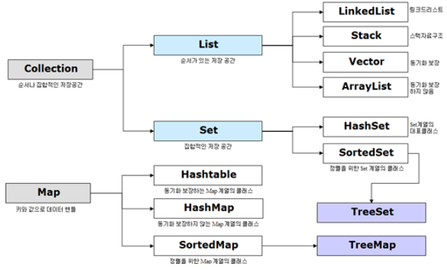
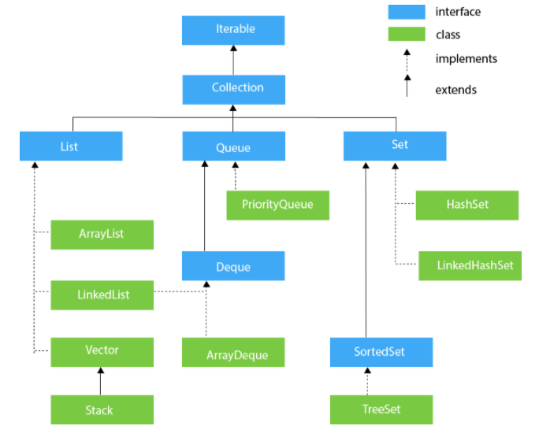
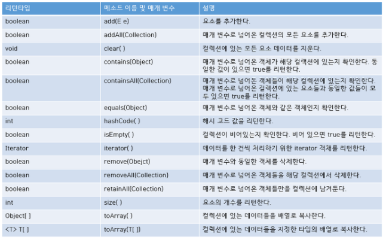

# Java 컬렉션(Collection) 정리

## Java Collections Framework(JCF)

Java에서 컬렉션(Collection)이란 데이터의 집합, 그룹을 의미하며

`JCF(Java Collections Framework)`는 이러한 데이터, 자료구조인 컬렌션과 이를 구현하는 클래스를 정의하는 인터페이스를 제공한다.

다음은 Java 컬렌션 프레임워크의 상속구조를 나타낸다.



Collection 인터페이스는 List, Set, Queue로 크게 3가지 상위 인터페이스로 분류할 수 있다.

그리고 여기에 Map의 경우 Collection 인터페이스를 상속받고 있지 않지만 Collection으로 분류된다.

- Collection **객체는 여러 원소들을 담을 수 있는 자료구조**를 뜻한다.
- 배열이 가장 기본적인 자료구조이며, DTO 또한 자료를 담는 하나의 방식이라고 볼 수 있다.

자바에서의 자료구조 유형은 다음과 같다.
- 순서가 있는 목록인 **List형**
- 순서가 중요하지 않은 목록인 **Set형**
- 먼저 들어온 것이 먼저 나가는 **Queue형**
- KEY-VALUE의 형태로 저장되는 **Map형**

배열과의 차이점은 정적 메모리 할당이 아닌 동적 메모리 할당을 하게 된다.

즉, new int[4]을 하면 4개 공간밖에 못쓰고 미리 선언을 통해 4개의 공간을 만들어야 하지만. collection은 공간이 계속 필요한 만큼 추가될 수 있다.

## Collection 인터페이스의 특징

| 인터페이스 | 구현클래스 | 특징 |
|---|---|---|
| `Set` | HashSet TreeSet | 순서를 유지하지 않는 데이터의 집합으로 데이터의 중복을 허용하지 않는다. |
| `List` | LinkedList Vector ArrayList | 순서가 있는 데이터의 집합으로 데이터의 중복을 허용한다. |
| `Queue` | LinkedList PriorityQueue | List와 유사 |
| `Map` | Hashtable HashMap TreeMap | 키(Key), 값(Value)의 쌍으로 이루어진 데이터 집합으로, 순서는 유지되지 않으며 키(Key)의 중복을 허용하지 않으나 값(Value)의 중복은 허용한다. |



위의 그림을 보면 알 수 있듯이, 컬렉션은 결국 인터페이스이고 아래에서 구현부들이 받아 구현하고 있음을 알 수 있다.

### 1️⃣Set 인터페이스

순서를 유지하지 않는 데이터의 집합으로 데이터의 중복을 허용하지 않는다.

- **HashSet**가장빠른 임의 접근 속도순서를 예측할 수 없음
- **TreeSet**정렬방법을 지정할 수 있음

### 2️⃣List 인터페이스

순서가 있는 데이터의 집합으로 데이터의 중복을 허용한다.

List 인터페이스는 Collection의 다른 인터페이스들과 가장 큰 차이는 **배열처럼 순서가 있다는 것**이다.

위의 그림에서 **ArrayList, LinkedList, Vector, Stack**가 순서 있는 Collection으로 가장 많이 사용된다.

이때 ArrayList와 Vector 클래스는 거의 동일하지만,  **ArrayList는 Thread safe하지 않고, Vector는 Thread safe하다.** (Thread safe하지 않다는 것은 객체에 여러 명이 달려들어 값을 변경하려고 하면 문제가 발생할 수 있다는 것)

- **LinkedList**양방향 포인터 구조로 데이터의 삽입, 삭제가 빈번할 경우 데이터의 위치정보만 수정하면 되기에 유용스택, 큐, 양방향 큐 등을 만들기 위한 용도로 쓰임
- **Vector**과거에 대용량 처리를 위해 사용했으며, 내부에서 자동으로 동기화처리가 일어나 비교적 성능이 좋지 않고 무거워 잘 쓰이지 않음
- **ArrayList**단방향 포인터 구조로 각 데이터에 대한 인덱스를 가지고 있어 조회 기능에 성능이 뛰어남

### 3️⃣Map 인터페이스

키(Key), 값(Value)의 쌍으로 이루어진 데이터으 집합으로,

순서는 유지되지 않으며 키(Key)의 중복을 허용하지 않으나 값(Value)의 중복은 허용한다.

- **Hashtable**HashMap보다는 느리지만 동기화 지원null불가
- **HashMap**중복과 순서가 허용되지 않으며 null값이 올 수 있다.
- **TreeMap**정렬된 순서대로 키(Key)와 값(Value)을 저장하여 검색이 빠름

#### 1. HashMap**

대부분 HashMap 객체를 생성할 때에는 매개 변수가 없는 생성자를 사용한다.하지만 HashMap에 담을 데이터의 개수가 많은 경우에는 초기 크기를 지정해주는 것을 권장한다.

```java
HashMap<String,String> map=new HashMap<String,String>();
```

#### 2. TreeMap

TreeMap 클래스는 키와 값을 저장하는 동시에 키를 정렬한다.

- 정렬되는 순서는 숫자 > 알파벳 대문자 > 알파벳 소문자 > 한글 순이다.
- 정렬을 해야 할 필요가 있다면 HashMap 보다는 TreeMap을 사용하는 것이 더 유리하다.

```java
TreeMap<String, String> treeMap = new TreeMap<String, String>();
```

### Collection 인터페이스에 선언된 주요 메소드



---

#### Reference

- [https://www.crocus.co.kr/1553](https://www.crocus.co.kr/1553)
