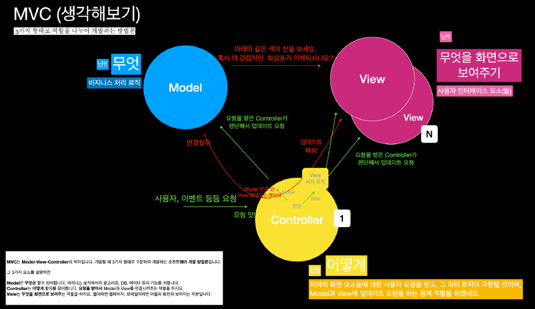
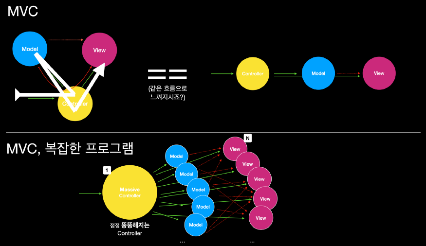
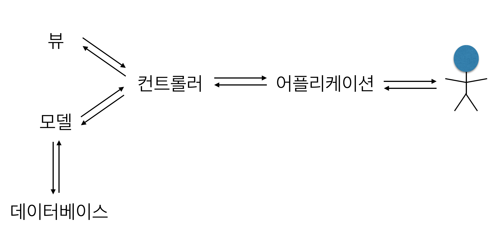
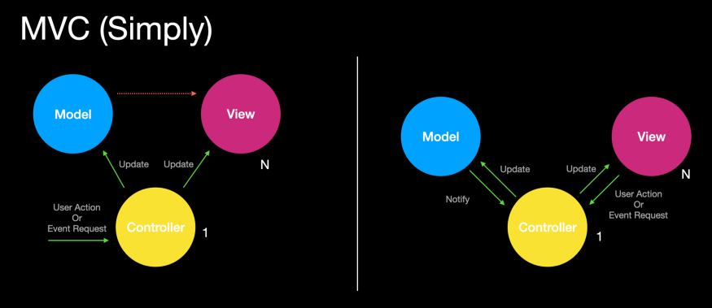

# MVC Pattern

## 1. MVC란?

MVC는 Model-View-Controller 의 약자입니다.

개발 할 때, 3가지 형태로 역할을 나누어 개발하는 방법론입니다.

비지니스 처리 로직과 사용자 인터페이스 요소를 분리시켜 서로 영향없이 개발 하기 수월하다는 장점이 있습니다.

---

### ⏹ Model

`Model`은 어플리케이션이 “무엇”을 할 것인지를 정의 합니다. 내부 비지니스 로직을 처리하기 위한 역할을 할 것입니다.

- 처리되는 알고리즘, DB와 상호작용(CRUD), 데이터 등등 ..

### ⏹ Controller

`Controller`는 모델이 “**어떻게**” 처리할 지를 알려주는 역할을 할 것이고, 모바일에서는 **화면의 로직처리** 부분입니다. 화면에서 사용자의 요청을 받아서 처리되는 부분을 구현하게 되며, 요청 내용을 분석해 Model과 View에 업데이트 요청을 하게 됩니다.

### ⏹ View

`View`는 화면에 "**무엇**"인가를 "**보여주기 위한 역할**"을 합니다. 컨트롤러 하위에 종속되어, 모델이나 컨트롤러가 보여주려고 하는 모든 필요한 것들을 보여줄 것입니다.

- 최종 사용자게에 "**무엇**"을 화면(UI)으로 보여줌

그리고 Controller는 Model과 View가 각각 무엇을 해야 할 지를 알고 통제합니다. 비지니스 로직을 처리하는 Model과 완전히 UI에 의존적인 View가 서로 직접 이야기 할 수 없게 합니다.



(▲ 출처 : [Clint Jang](https://medium.com/@jang.wangsu/%EB%94%94%EC%9E%90%EC%9D%B8%ED%8C%A8%ED%84%B4-mvc-%ED%8C%A8%ED%84%B4%EC%9D%B4%EB%9E%80-1d74fac6e256) MVC 구조)  

---

## 2. MVC의 한계

MVC에서 `View`는 Controller에 연결되어 화면을 구성하는 단위요소이므로 `다수의 View`들을 가질 수 있습니다.

그리고 `Model`은 Controller를 통해서 View와 연결되지만, 이렇게 Controller를 통해서 하나의 View에 연결될 수 있는 `Model`도 여러 개가 될 수 있습니다.

> 💡 뷰와 모델이 서로 의존성을 띄게 됩니다.

즉, 화면에 복잡한 화면과 데이터의 구성 필요한 구성이라면, Controller에 **다수의 Model과 View가 복잡하게 연결되어 있는 상황**이 생길 수 있습니다.



(▲ 출처 : [Clint Jang](https://medium.com/@jang.wangsu/%EB%94%94%EC%9E%90%EC%9D%B8%ED%8C%A8%ED%84%B4-mvc-%ED%8C%A8%ED%84%B4%EC%9D%B4%EB%9E%80-1d74fac6e256) MVC 한계)  

MVC가 너무 복잡하고 비대해져서, 새 기능을 추가할때마다 크고 작은 문제점을 가지고 소드 분석이나 테스트도 어렵죠.

> 💡 이런 형태의 MVC를  
> **Massive ViewController (대규모 MVC 어플리케이션)**  
> 라고 부릅니다.

MVC의 한계를 표현한 용어 인 것 같습니다.

대부분의 사람들(당연히 저도 포함)은 MVC를 구성할 때, View와 Model을 중재하는 Controller를 작성하면 Controller의 비중이 크지 않을 것으로 생각했지만, 복잡한 화면을 구현하게 되면 대규모 MVC 어플리케이션 형태로 구현하게 되었습니다.

Controller는 View와 라이프 사이클과 강하게 연결되어 있어서 분리할 수도 없고, 코드 분석/수정과 테스트가 모두 힘들어지죠. 그리고 복잡하게 엮어있는 Model과 View는 여러 Side-Effect를 불러와서 프로그램 운영을 힘들게 하지요.

그래서 위의 문제점을 보완한 여러 다양한!! 패턴을 파생되었습니다.

> 💡 MVP, MVVM, Viper, Clean Architecture, Flux, Redux, RxMVVM…

파생된 패턴들은 시간이 되는 데로 다시 공부하고 정리하면 글을 작성하겠습니다.

---

## 3. MVC의 자세한 개념

### ⏹ MVC 용어 분석

### Model

> Model represents an object or JAVA POJO carrying data. It can also have logic to update controller if its data changes.

모델은 데이터를 가지고 있는 객체 또는 JAVA POJO입니다. 데이터가 바뀌었을 때 컨트롤러의 데이터를 업데이트 하는 로직도 포함합니다.

예를들어 '학생'이라는 데이터 set에 대해 모델을 만든다면 Student 클래스의 멤버 변수와 멤버 함수는 이정도 되겠네요

- 멤버 변수 : rollNo(학번), name(학생 이름)  
- 멤버 함수 : getRollNo, setRollNo, getName, setName

보통 학번, 학생 이름과 같이 모델에서 다룰만한 데이터 들은 데이터베이스에 저장하죠!

그럴 경우 데이터베이스와 상호작용 하며 `CRUD` 작업을 하는 것도 모델의 멤버함수(getter, setter 등)들이 처리 합니다.

---

### View

> View represents the visualization of the data that model contains.

모델에 포함된 데이터의 시각화를 담당합니다.

여기서 '모델에 포함된 데이터'란 학번과 학생 이름입니다! 즉 View는 학번과 학생 이름이라는 데이터가 어플리케이션상에서 UI에 어떻게 나타날지에 관련된 코드 덩어리 입니다. 

웹 어플리케이션이라면 HTML, Android 앱이라면 xml이 이 부분의 표현을 담당하는 언어죠. 즉 프로젝트의 View 폴더에는 웹 앱이라면 주로 html, 안드로이드 앱이라면 주로 xml 파일들이 들어 있을 거에요.

---

### Controller

> Controller acts on both model and view. It controls the data flow into model object and updates the view whenever data changes. It keeps view and model separate.

컨트롤러는 모델과 뷰에 전부 영향을 미칩니다. 모델 객체로의 데이터 흐름을 제어하고 데이터가 update 되었을 때 뷰를 갱신합니다. 컨트롤러는 뷰와 모델의 역할을 분리합니다.

---

> 💡 모델과 뷰를 사용하는 건 컨트롤러, 컨트롤러를 사용하는 건 어플리케이션!

컨트롤러는 모델과 뷰 객체를 활용해서 멤버 함수를 만듭니다. 컨트롤러의 역할은 어플리케이션에서 사용할 interface 함수들을 제공하는 것이죠.

어플리케이션의 역할은 컨트롤러 객체의 함수들을 잘 사용해서 적절한 데이터를 적절한 UI에 보여주는 프로그램이 되는 것이겠죠. 

그리고 컨트롤러를 사용하는 게 어플리케이션이라는 말의 의미는, 어플리케이션에서 데이터와 관련된 작업을 하고 싶다면 모델, 뷰 객체는 건드릴 필요 없이 **컨트롤러 객체**만 가지고 놀면 된다는 의미입니다.

이 관점에서 계속 본다면, 컨트롤러를 기준으로 추상화가 한단계 생기네요. 컨트롤러 윗 레벨에서는 데이터베이스는 물론이고 모델과 뷰에 대해서도 알 필요가 없고 '컨트롤러 객체의 조작법'만 알면 되는거죠.



(▲ 출처 : [hanee24](https://medium.com/@jang.wangsu/%EB%94%94%EC%9E%90%EC%9D%B8%ED%8C%A8%ED%84%B4-mvc-%ED%8C%A8%ED%84%B4%EC%9D%B4%EB%9E%80-1d74fac6e256) MVC 도식화)  

---

## 5. 예제

코드 출처 : [hanee](https://hanee24.github.io/2018/02/14/what-is-mvc-pattern/)

### (1) Model

`Student.java`

```java
public class Student {
   private String rollNo;
   private String name;
   
   public String getRollNo() {
      return rollNo;
   }
   
   public void setRollNo(String rollNo) {
      this.rollNo = rollNo;
   }
   
   public String getName() {
      return name;
   }
   
   public void setName(String name) {
      this.name = name;
   }
}
```

### (2) View

`StudentView.java`

```java
public class StudentView {
   public void printStudentDetails(String studentName, String studentRollNo){
      System.out.println("Student: ");
      System.out.println("Name: " + studentName);
      System.out.println("Roll No: " + studentRollNo);
   }
}
```

### (3) Controller

`StudentController.java`

```java
public class StudentController {
   private Student model;
   private StudentView view;

   public StudentController(Student model, StudentView view){
      this.model = model;
      this.view = view;
   }

   public void setStudentName(String name){
      model.setName(name);    
   }

   public String getStudentName(){
      return model.getName();    
   }

   public void setStudentRollNo(String rollNo){
      model.setRollNo(rollNo);      
   }

   public String getStudentRollNo(){
      return model.getRollNo();     
   }

   public void updateView(){           
      view.printStudentDetails(model.getName(), model.getRollNo());
   }  
}
```


### 4. 어플리케이션 : 컨트롤러 사용

`MVCPatternDemo.java`

```java
public class MVCPatternDemo {
   public static void main(String[] args) {

      //fetch student record based on his roll no from the database
      Student model  = retriveStudentFromDatabase();

      //Create a view : to write student details on console
      StudentView view = new StudentView();

      StudentController controller = new StudentController(model, view);

      controller.updateView();

      //update model data
      controller.setStudentName("John");

      controller.updateView();
   }

   private static Student retriveStudentFromDatabase(){
      Student student = new Student();
      student.setName("Robert");
      student.setRollNo("10");
      return student;
   }
}
```

### (5) Output

```bash
Student: 
Name: Robert
Roll No: 10
Student: 
Name: John
Roll No: 10
```

## 6. 결론

`MVC`는 `Model-View-Controller`의 약자입니다. 개발할 때 3가지 형태로 구분하여 개발하는 **소프트웨어 개발 방법론**입니다.

그 3가지 요소를 설명하면

**Model**은 **무엇**을 할지 정의합니다. 비지니스 로직에서의 알고리즘, 데이터 등의 기능을 처리합니다.

**Controller**는 **어떻게** 할지를 정의합니다. 클라이언트의 요청을 받아서 화면 처리기능과 `Model`과 `View`를 연결시켜주는 역할을 합니다.

**View**는 **무엇을 화면을 보여주는** 역할을 하지요. 웹이라면 웹페이지, 모바일이라면 어플의 화면의 보여지는 부분입니다.

---

`MVC`는 **복잡한 대규모 프로그램을 개발을 하게 되면서 문제점이 확인**되었습니다.

다수의 View와 Model이 Controller를 통해 복잡하게 연결될 수 있기 때문에 Controller가 뚱뚱해지게 되는 **Massive ViewController(대규모 MVC 어플리케이션)**가 되어버립니다.

View와 Controller가 라이브사이클에 강하게 연결되어있고, 더불어 Controller를 통해 View와 Model간에도 관계가 복잡하게 연결되어있어서 수정시 테스트가 힘들고, 파악이 어렵기 때문에 여러 Side-Effect를 불러오게 되는 문제점이 있습니다.

그래서 MVC는 위 문제점을 해결하기 위해 여러 페러다임을 수용한 다양한 패턴을 파생시켰습니다.

간단히 이미지로 표현하면



(▲ 출처 : [Clint Jang](https://medium.com/@jang.wangsu/%EB%94%94%EC%9E%90%EC%9D%B8%ED%8C%A8%ED%84%B4-mvc-%ED%8C%A8%ED%84%B4%EC%9D%B4%EB%9E%80-1d74fac6e256) MVC 도식화)  

왼쪽은 핵심만, 오른쪽은 다른 해석으로 표현한 그림입니다.

---

### Reference

- [MVC Pattern 이란? - 개념 및 자바 예제](https://hanee24.github.io/2018/02/14/what-is-mvc-pattern/)  
- [[디자인패턴] MVC 패턴이란?](https://medium.com/@jang.wangsu/%EB%94%94%EC%9E%90%EC%9D%B8%ED%8C%A8%ED%84%B4-mvc-%ED%8C%A8%ED%84%B4%EC%9D%B4%EB%9E%80-1d74fac6e256)
