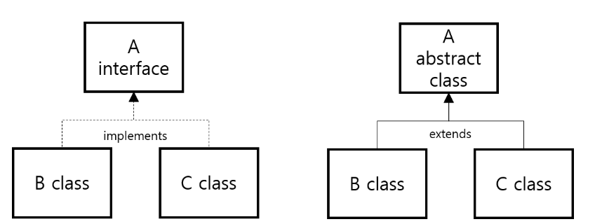

# Interface & Abstract

공부하고 정리하는 중입니다!

## 공통점과 차이점

### 공통점

- 객체를 생성할 수 없다.
- 선언부만 있는 멤버는 하위 클래스에서 반드시 구현해야 한다.

### 차이점

|  |  
추상(abstract) 클래스
 |  
인터페이스(Interface)
 |
|:--------|:--------:|--------:|
|**구현된 Method** | 
 포함 가능 
 | 
 포함 불가 
 |
|**상속(extends)** | 
 상속 가능 
 | 
 상속 불가 
 |
|**구현(implements)** | 
 구현 불가 
 | 
 (다중) 구현 가능 
 |
|**멤버 변수** | 
 멤버 변수 가질 수 있음 
 | 
 멤버 필드 가질 수 없음 
 |

### 정리해보면

메소드 구현을 강제할 수 있다!

**1. 추상 클래스**
- 일반 클래스에서 추상함수만 추가된 형태
- abstract 키워드가 필수
- 멤버 변수를 가질 있음
- 단일 상속만 가능

**2. 인터페이스**
- 모든 멤버가 추상적(선언만 가능)
- 멤버 앞 접근제어자 사용 불가능 (defalt로 public 적용)
- 다중 구현 가능!

---

(▲ 출처 : [oemilk brunch](https://brunch.co.kr/@oemilk/134) 클래스와 인터페이스)  

### Reference

[인터페이스(interface)와 추상 클래스(abstract class)](https://loustler.io/languages/oop_interface_and_abstract_class/)  
[자바 인터페이스와 추상클래스](https://medium.com/webeveloper/%EC%9E%90%EB%B0%94-%EC%9D%B8%ED%84%B0%ED%8E%98%EC%9D%B4%EC%8A%A4%EC%99%80-%EC%B6%94%EC%83%81%ED%81%B4%EB%9E%98%EC%8A%A4-6eecbe5d6350)  
[Effective Java - 클래스와 인터페이스](https://brunch.co.kr/@oemilk/134)
