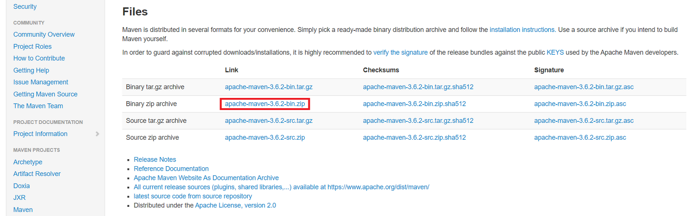
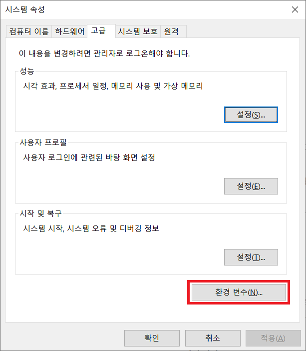
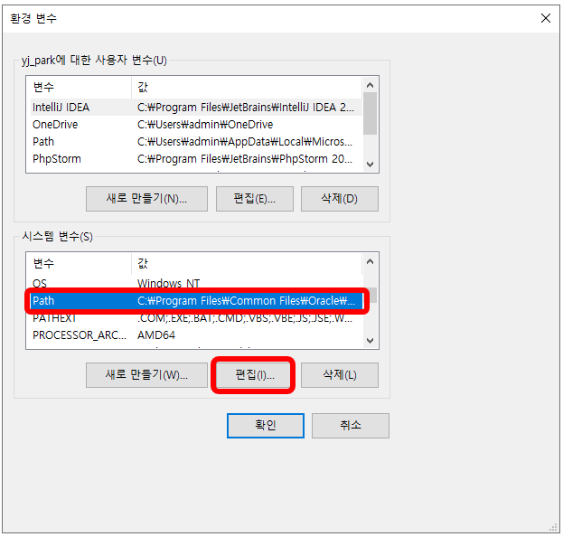
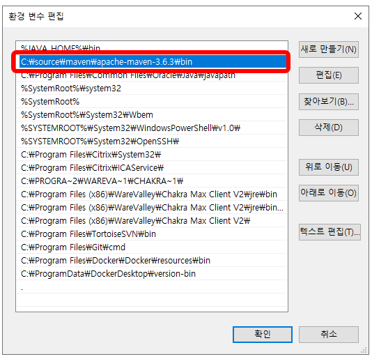
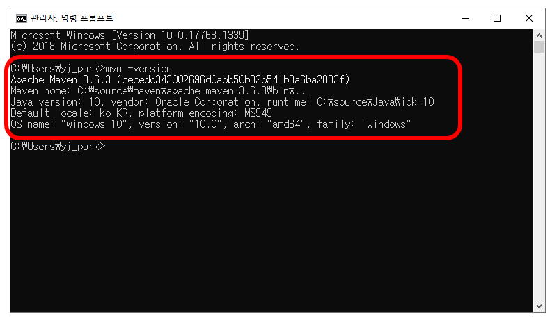
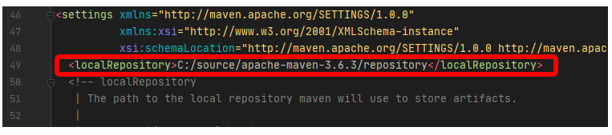
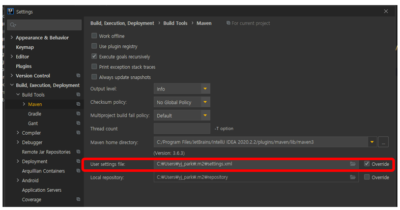

# Maven

  

## 1. Maven 이란?

---

Java 프로젝트의 빌드를 자동화 해주는 Build Tool

```shell script
💡 **Build 란?**
- 소스코드 파일을 컴퓨터에서 실행할 수 있는 독립 소프트웨어 가공물로 변환하는 과정 또는 그에 대한 결과물 이다.
 - 이를 좀더 쉽게 풀어 말하자면 우리가 작성한 소스코드(java), 프로젝트에서 쓰인 각각의 파일 및 자원 등(.xml, .jpg, .jar, .properties)을 JVM이나 톰캣같은 WAS가 인식할 수 있는 구조로 패키징 하는 과정 및 결과물이라고 할 수 있다.
```

```shell script
💡 **Build Tool(빌드 도구)**
- 빌드 도구란 프로젝트 생성, 테스트 빌드, 배포 등의 작업을 위한 전용 프로그램.
 - 빠른기간동안 계속해서 늘어나는 라이브러리 추가, 프로젝트를 진행하며 라이브러리의 버전 동기화의 어려움을 해소하고자 등장.
 - 초기의 java 빌드도구로 Ant를 많이 사용하였으나 최근 많은 빌드도구들이 생겨나 Maven이 많이 쓰였고, 현재는 Gradle이 많이 쓰인다.
(Ant는 스크립트 작성도 많고, 라이브러리 의존관리가 되지 않아 불편함)
```

### 1️⃣ **메이븐 활용 패턴**

1. **Build**

- 소스 코드를 컴파일 한다.
- 테스트 코드를 컴파일 한다.
- 기타 패키지 생성을 위한 바이너리를 생성한다.

2. **Package**

- 배포 가능한 jar, war, exe 파일 등을 생성한다.

3. **Test**

- 단위 테스트(Unit Test) 등을 실행한다.
- 빌드 결과가 정상적인지 점검한다.

4. **Report**

- 빌드/패키지/테스트 결과를 정리하고, 빌드 수행 리포트를 생성한다.

5. **Release**

- 빌드 후 생성된 아티팩트(artifact)를 로컬 혹은 원격 저장소에 저장(배포)한다.

### 2️⃣ **Key Concept**

1. **Plugin**

- 플러그인 실행 프레임워크
- 플러그인 메커니즘에 의해 기능이 확장(모든 작업은 플러그인이 수행된다)
- 모든 작업은 플러그인이 수행된다
- 플러그인은 다른 산출물(artifacts)와 같이 저장소에서 관리된다.
- 플러그인은 골(goal)의 집합이다.

2. **Lifecycle**

- 일련의 단계를 골(goal)
- 논리적인 작업 흐름인 단계의 집합이 라이프사이클(Lifecycle)

3. **Dependency**

- 라이브러리 다운로드 자동화
- maven은 선언적
- maven이 관리

4. **Profile**

- 서로 다른 대상 환경(target environment)를 위한 다른 빌드 설정
- 다른 운영체제
- 다른 배포 환경

5. **POM**

- Project Object Model
- Project 당 하나의 pom.xml 파일을 하나씩 가진다.
- 자원 식별 기준(group id, artifact id, version)

### 3️⃣ **설정 파일**

1. **Setting 파일**
    - Maven 툴과 관련된 설정을 담당
    - `MAVEN_HOME/settings.xml` : 모든 사용자에 적용되는 `전역적인` maven 설정 정보
    - `USER_HOME/.m2/setting.xml` : `특정 사용자`에 적용되는 maven 설정 정보

```shell script
주의할 점은 복수의 s의 유무이다.
전역적인 **settings.xml** `vs` 특정 사용자에게 적용되는 **setting.xml**
```

2. **pom.xml**

- Project Object Model
- 프로젝트 내 빌드설정을 담당.
- 프로젝트 최상위에 존재
- dependency 관리도 한다.

`Example pom.xml`

```xml
<?xml version="1.0" encoding="UTF-8"?>
<project xmlns="http://maven.apache.org/POM/4.0.0"
         xmlns:xsi="http://www.w3.org/2001/XMLSchema-instance"
         xsi:schemaLocation="http://maven.apache.org/POM/4.0.0   http://maven.apache.org/xsd/maven-4.0.0.xsd">
    <modelVersion>4.0.0</modelVersion>

    <groupId>com.youngjun</groupId> <!-- 프로젝트를 생성하는 조직의 고유 아이디-->
    <artifactId>demo-maven</artifactId> <!-- 프로젝트를 식별하는 유일한 아이디-->
    <version>1.0-SNAPSHOT</version> <!-- 프로젝트 현재 버젼을 의미-->

    <packaging>war</packaging> <!-- 프로젝트를 어떤 형태로 패키징할지 결정한다. jav, war, ear, pom등이 해당된다.-->

    <!-- 프로젝트와 의존관계에 있는 라이브러리를 관리 -->
    <dependencies>
    <dependency>
        <groupId>javax.servlet</groupId>
        <artifactId>jstl</artifactId>
        <version>1.2</version>
    </dependency>
    </dependencies>
</project>
```

### 4️⃣ **의존 라이브러리 추가하기**

- 중앙 원격 저장소에서 라이브러리를 쉽게 받을 수 있다.
- Maven Repository : [https://mvnrepository.com/](https://mvnrepository.com/)

- pom.xml에 dependencies Tag 안에 쓰고 저장하기

```xml
<!-- 프로젝트와 의존관계에 있는 라이브러리를 관리 -->
<dependencies>
  <dependency>
      <groupId>javax.servlet</groupId>
      <artifactId>jstl</artifactId>
      <version>1.2</version>
  </dependency>
</dependencies>
```

- External Libraries에서 확인할 수 있다.

### 5️⃣ **LifeCycle**

Maven은 미리 정의하고 있는 빌드 순서를 라이프사이클 이라고 한다.

1. **기본 라이프 사이클**

- compile : 소스 코드를 컴파일
- test : 단위 테스트 실행 (기본설정은 단위 테스트가 실패하면 빌드 실패로 간주함)
- package : 컴파일된 클래스 파일과 리소스 파일들을 war 혹은 jar와 같은 파일로 패키징
- install : 패키징한 파일을 로컬 저장소에 배포 (USER_HOEM/.m2/)
- deploy : 패키징한 파일을 원격 저장소에 배포 (nexus 혹은 maven central 저장소)

2. **clean 라이프 사이클**

- clean : maven  빌드를 통하여 생성된 모든 산출물을 삭제

3. **site 라이프 사이클**

- site : maven 설정파일 정보를 활용하여 프로젝트에 대한 문서 사이트를 생성
- site-deploy : 생성한 문서 사이트를 설정되어 있는 서버에 배포

## 2. Maven 설치

---

Maven 공식 홈페이지 [http://maven.apache.org/download.cgi](http://maven.apache.org/download.cgi) 에서 **Binary zip archive** 다운로드

  

## 3. Maven 설치 후 기본 설정

---

### 1️⃣ 환경변수 설정

```shell script
"Window키 + R" → "sysdm.cpl" 입력 → "고급 탭" 클릭 → "환경 변수" 클릭
```

  

아래와 같이 'Path'를 선택한 후 '편집' 버튼을 클릭한다. 

Path 변수는 운영체제가 파일의 디렉터리를 파악하는 데 사용하는 경로이다. Path 변수에 디렉터리를 등록하면, 해당 디렉터리에 포함된 파일을 파일 경로 없이 파일 이름만으로도 사용할 수 있게 된다.

  

Maven이 설치된 경로를 Path에 추가하기 위해 '새로 만들기'를 클릭하여 `C:\source\apache-maven-3.6.3\bin` 을 입력하고 'Enter' 키를 누른다. Path 변수에 주소가 추가된 것을 확인하고 '확인' 버튼을 누른다.

  

이제 Path 변수에 제대로 등록되었는지 확인하자. 

cmd에서 `mvn -version` 을 입력하면 버전 정보가 출력된다.

  


### 2️⃣ Maven Repository 변경하기 (선택)

기본 경로가 아닌 다른 경로에 Maven Repository를 관리하고 싶으면 설정하면 된다.

기본 Maven Repository는 **`${user.home}/.m2/repository`** 폴더이다.

1. 변경하고자 하는 경로 `C:\source\apache-maven-3.6.3` 에 `reposiory` 폴더 생성
2. `C:\source\apache-maven-3.6.3\conf` 에서 `settings.xml`파일 열기
3. `setting.xml` 파일에서 **<localRepository>** 주석 처리 부분에 로컬 저장소를 등록한다.

```xml
<localRepository>C:/source/apache-maven-3.6.3/repository</localRepository>
```

  


### 3️⃣ IntelliJ maven 연동

1. Setting 열기 (`ctrl + Alt + s`)
2. `Build, Execution, Deployment` → `Build tools` → `Maven`
3. `user settings file` → `override` 체크 박스 선택

  

만약 Repository를 변경했다면 settings.xml 파일 경로도 변경해주어야한다.
`C:\source\apache-maven-3.6.3\conf\settings.xml`

### Reference

---

[https://devpad.tistory.com/19](https://devpad.tistory.com/19)

[https://nesoy.github.io/articles/2017-01/Maven](https://nesoy.github.io/articles/2017-01/Maven)

[https://blog.rufer.be/blog/knowledge-base/Project-specific-maven-settings-in-IntelliJ.html](https://blog.rufer.be/blog/knowledge-base/Project-specific-maven-settings-in-IntelliJ.html)

[https://goddaehee.tistory.com/199](https://goddaehee.tistory.com/199)