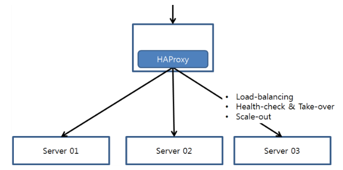
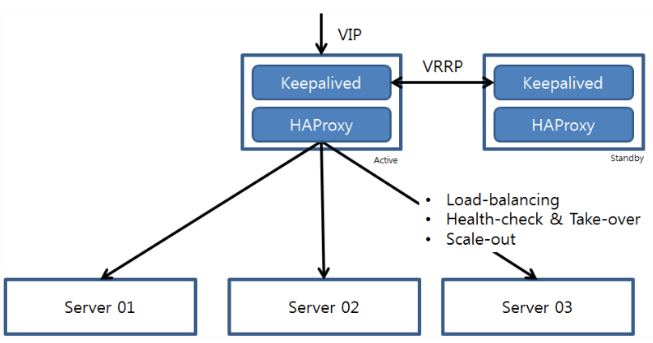
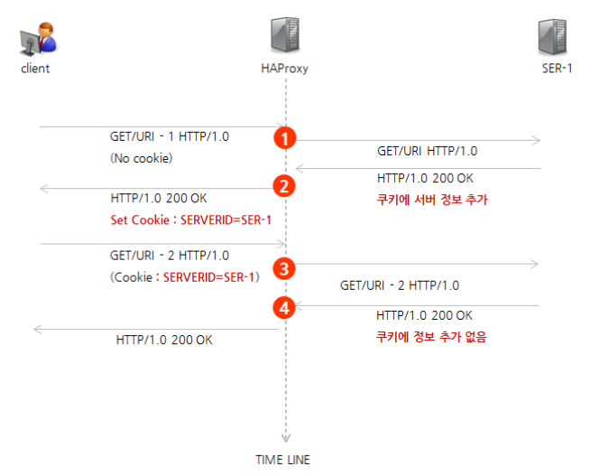
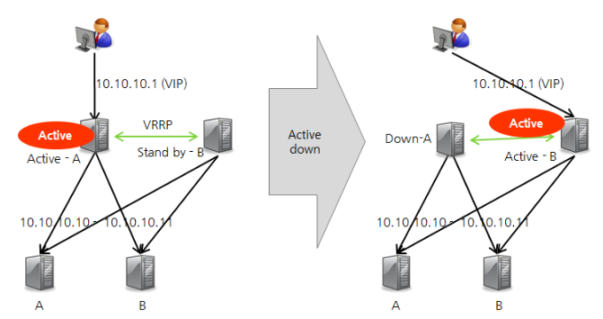
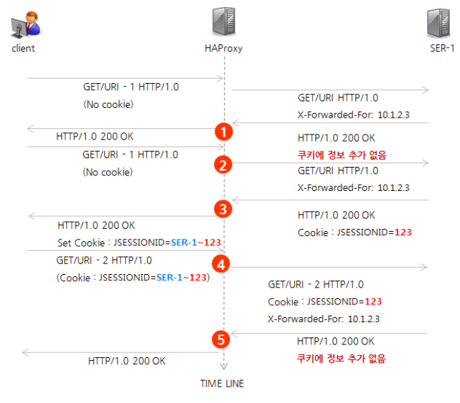
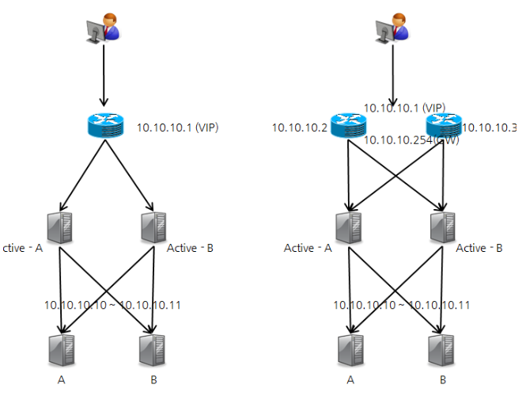
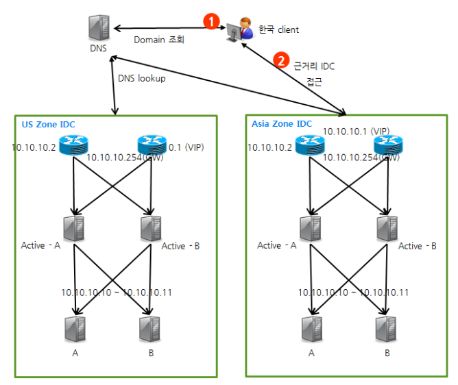
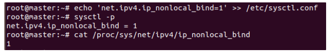
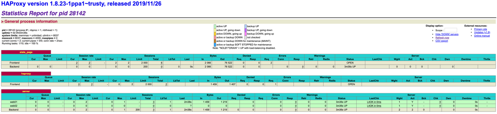

# HAProxy

  

L4, L7와 같은 Hardware LoadBalancer를 대체하기 위한 Open Source로 Reverse Proxy를 기반으로 한 L4, L7 Software LoadBalancer이다.

Nginx에 비해 Active Heath Check가 가능하므로 좀 더 안정적으로 사용할 수 있으며 HAProxy 설정 추가를 통해 Scale-Out도 할 수 있다.

HTTP 통신의 경우 Web-Server (Nginx, Apache 등)를 이중화 시켜줄수 있으며 HTTP와 같은 표준 프로토콜이 아닌 TCP Socket 통신에 대해서도 이중화처리가 가능하다.

HAProxy의 경우 HA를 구성하기위해 Keepalived를 많이 사용한다. Keepalived를 사용하여 HAProxy를 이중화하면 아래와 같은 그림이다.

  

## HAProxy 동작방식

HAProxy는 기본적으로 Reverse Proxy 형태로 동작한다. (즉, 실제 서버 앞단에 존재하며 서버로 오는 요청을 대신 받아 뒷단의 서버에 전달하고 결과를 리턴받아 요청한 곳에 다시 전달하는 역할을 한다.)

HAProxy의 동작 흐름은 다음과 같다.

  

1. 최초 접근시 서버에 요청 전달
2. 응답시 쿠키 (Cookie) 에 서버 정보 추가 후 반환
3. 재 요청시 Proxy에서 쿠키 정보 확인 후 최초 요청 서버로 전달
4. 다시 접근 시 쿠키를 추가할 필요없이 서버에 전달 (클라이언트에 쿠키 정보가 계속 존재하여 재사용)

## HAProxy HA

HAProxy는 기본적으로 VRRP (Virtual Router Redundancy Protocol) 를 지원한다.

  

위 그림과 같이 HAProxy를 이중화하여 Master 장애 발생시 Slave가 Master의 VIP를 가져와 Master로 승격된다. 무중단 서비스이지만 1초정도의 순단 현상은 발생할 수 있다.

## HAProxy HA 동작방식

HA로 설정된 HAProxy의 동작흐름이 단일 HAProxy와 다른점은 최초 접근시 쿠키에 바로 서버 정보를 입력하지 않고 서버에서 Jsessionid가 전달될 때 서버 정보를 합쳐서 전달한다는 것이다.

  

1. 쿠키에 정보가 없고 X-Forwarded-For에 정보 추가
2. 쿠키에 추가 없음
3. Jsessionid 추가
4. 서버 정보와 Jsessionid를 쿠키에 추가
5. 쿠키에서 서버 판별 후 Jsessionid만 전달

## HAProxy 환경 예제

### 1. L4 Switch + HAProxy


  

- L4 스위치 이중화와 HAProxy 이중화로 구성하는 방법으로 해당 구성이 보통 FM 구성이다.

### 2. GSLB (Global Service Load Balancing) + HAProxy


  

- Global 서비스의 경우 IDC간 이중화 및 Global 환경에서 무정지 서비스를 위한 DR (Disaster Recovery, 재해복구) 시스템 구축이 필요하다.
- GSLB L4 스위치를 사용할수도 있지만 GSLB 구성용 L4 스위치의 경우 고가이기에 위의 그림은 DNS (BIND) 를 이용한 구축형태이다.
- 클라이언트가 DNS로 도메인 조회시 근거리 IDC 정보를 전달하는 방법이다.

## HAProxy 구성하기

테스트 환경

- OS : Ubuntu 18.04
- HAProxy Server 2EA : 192.168.219.125 / 192.168.219.126
- Web Node 2EA :

### 1. Kernel Paramater 수정

```bash
# echo 'net.ipv4.ip_nonlocal_bind=1' >> /etc/sysctl.conf
# echo 'net.ipv4.ip_forward = 1' >> /etc/sysctl.conf
# sysctl -p 또는 Reboot
# cat /proc/sys/net/ipv4/ip_nonlocal_bind
```

  

net.ipv4.ip_nonlocal_bind 옵션은 프로그램이 시스템 상의 장치에 없는 주소로 Binding 할 수 있도록 할 수 있게하는 커널 파라미터이다. 

즉 Network Interface에 등록되지 않은 동적 IP (VIP와 같은) 를 연결할 때 사용한다.

### 2. HAProxy 설치

```bash
# apt install -y haproxy
```

→ Ubuntu 18.04에서 기본 Repo로 설치시 1.8.8 버전이 설치된다.

현재 (2020-10) 2.1.4버전이 최신버전이며 1.5버전부터 SSL을 지원하기 때문에 기본설치방법으로도 SSL 사용이 가능하지만 최신 버전을 사용하고 싶다면 wget을 사용하여 다운로드 후 컴파일하거나 별도 Repo를 추가시켜준다.

```bash
# apt-add-repository ppa:vbernat/haproxy-2.1
# apt update
# apt install -y haproxy 또는 apt install -y haproxy=2.1
```

→ 위와 같은 방법으로 Repo 추가 후 설치하면 2.1.4 버전이 설치된다.

### 3. HAProxy 설정

**(1) HAProxy Config 섹션**

global, defaults, listen, frontend, backend의 영역으로 구분된다.

- global : 전체 영역에 걸쳐 적용되는 기본 설정을 담당
- defaults : 이후 오는 영역(frontend, backend, listen)에 적용되는 설정
- frontend : 클라이언트 연결을 받아들이는 소켓에 대한 설정
- backend : 앞에서 들어온 연결에 할당될 프록시 서버들에 대한 설정
- listen : frontend와 backend로 사용되는 포트를 한번에 설정하는 영역으로 TCP 프록시에서만 이용

Option Manual : [https://cbonte.github.io/haproxy-dconv/1.8/configuration.html](https://cbonte.github.io/haproxy-dconv/1.8/configuration.html)

**(2) Balance Option**

Roundrobin : 순차적으로 분배

static-rr : 서버에 부여된 가중치에 따라서 분배

leastconn : 접속수가 가장 적은 서버로 분배

source : 운영중인 서버의 가중치를 나눠서 접속자 IP 해싱(hashing)해서 분배

uri : 접속하는 URI를 해싱해서 운영중인 서버의 가중치를 나눠서 분배 (URI의 길이 또는 depth로 해싱)

url_param : HTTP GET 요청에 대해서 특정 패턴이 있는지 여부 확인 후 조건에 맞는 서버로 분배 (조건 없는 경우 round_robin으로 처리)

hdr : HTTP 헤더에서 hdr(<name>)으로 지정된 조건이 있는 경우에 대해서만 분배 (조건없는 경우 round robin 으로 처리)

rdp-cookie : TCP 요청에 대한 RDP 쿠키에 따른 분배

**(3) HAProxy 설정**

```bash
# vim /etc/haproxy/haproxy.cfg
```

- global # 전역 섹션 프로세스 전체에 영향을 주는 내용
- log 127.0.0.1 local1 notice # 지정한 ip (127.0.0.1) 또는 소켓 (/dev/log)에 로그를 보냄
- local1 뒤에는 로그 레벨을 지정할 수 있는데 notice를 붙이면 emerg-notice 레벨을 보내고
- local1 notice notice 로 설정하면 notice 레벨만 syslog로 보냄 (notice는 최소레벨을 의미)
- rsyslog에서 "local1.notice /var/log/haproxy.log" 형식으로 설정필요 (# echo "local1.notice /var/log/haproxy.log" → /etc/rsyslog.d/50-default.conf)
- chroot /var/lib/haproxy # 서비스 Jail 경로, 슈퍼유저로 실행 시 모든 동작은 이 안에서만 수행 (보안 상승)
- stats socket /run/haproxy/admin.sock mode 660 level admin expose-fd listeners # stats page를 사용하기 위한 Unix 소켓 바인딩
- stats timeout 30s # stats에 timeout 시간 설정 (stats_page timeout)
- user haproxy # 프로세스 사용자
- group haproxy # 프로세스 그룹
- daemon # 백그라운드로 동작
- maxconn 4000 # 프로세스당 최대 연결 개수

```bash
ca-base /etc/ssl/certs
crt-base /etc/ssl/private

ssl-default-bind-ciphers ECDH+AESGCM:DH+AESGCM:ECDH+AES256:DH+AES256:ECDH+AES128:DH+AES:RSA+AESGCM:RSA+AES:!aNULL:!MD5:!DSS
ssl-default-bind-options no-sslv3
```

- defaults # front, back, listen에 관련된 전역 섹션
- log global # 로그는 기본적으로 global 설정을 따르겠다는 옵션
- mode http # http 프로토콜을 사용하는 로드밸런싱 모드
- option httplog # 기본 Log는 SIP, DIP와 Name만 표기하므로 이 옵션을 사용해 좀 더 자세하게 출력
- option dontlognull # 로그 비대화 방지를 위해 Probe(정찰, 스캔)과 같은 잡다한 기록을 HAProxy Log화 하지않는 옵션
- option forwardfor # 클라이언트 정보 전달 (X-Forwarded-For 헤더를 넣어서 전달)
- option httpclose # keep-alive 문제 발생시 off 옵션
- timeout http-request 10s # Request시의 헤더에만 적용, DDos 방어를 위해 HTTP 요청 타임아웃시간 설정 (클라이언트의 연결 타임아웃과는 무관한 HAProxy 서버의 옵션임)
- timeout http-keep-alive 10s # 클라이언트 요청에 따른 응답 전송 후 다음 요청 대기시간 설정 (http-request가 선행함)
- timeout connect 10s # TCP 패킷 손실을 막기위한 Real 서버로의 연결 최대 지연시간 설정 (Backend에 적용되나 전역으로 설정 가능)
- timeout client 1m # 외부 클라이언트 요청이나 데이터와의 연결 최대 시간 (Request와 같이 사용하여 서버 안정성을 구현)
- timeout server 1m # 서버가 데이터를 승인하거나 전송해야할 때의 연결 최대 시간
- timeout queue 1m # 서버의 maxconn 도달시 무한정 보류상태로 두지 않고 HTTP 503 응답을 보내면서 연결을 버리는 시간 설정 (Surge Queue Time)

```bash
# 에러 파일 설정
errorfile 400 /etc/haproxy/errors/400.http
errorfile 403 /etc/haproxy/errors/403.http
errorfile 408 /etc/haproxy/errors/408.http
errorfile 500 /etc/haproxy/errors/500.http
errorfile 502 /etc/haproxy/errors/502.http
errorfile 503 /etc/haproxy/errors/503.http
errorfile 504 /etc/haproxy/errors/504.http
```

listen stats_page # Listen은 Front / Back의 연결 포트 / 옵션들을 정의함 (TCP 제어나 Proxy에 주로 사용)

- bind *:8080 # 접속 포트 지정
- stats enable # 상태 페이지 활성화
- stats realm HAProxy Statistics # 브라우저 타이틀
- stats uri / # 접근할 URI 경로
- stats auth admin:admin # 인증 추가 (auth [User]:[Password])

frontend haproxy # 클라이언트 연결을 받아들이는 소켓에 대한 설정 (WAF 기능에 가까움)

- bind *:80 # 접속 포트 지정
- mode http # 프로토콜 유형 설정
- default_backend server # Front서버에서 전달할 기본 backend

backend server # Front에서 들어온 연결에 할당될 프록시 서버들에 대한 설정

- mode http # 프로토콜 유형 설정
- balance roundrobin # LoadBalancer 유형 설정
- cookie SVID insert indirect nocache maxlife 10m # Sticky Session 설정 (maxlife는 유지기간 설정)
- option httpchk GET / # healthcheck uri로 GET 뒤의 경로에 curl 명령으로 http header 값 [200 OK] 확인 (server 옵션에서 inter값으로 주기 설정)
- http-check expect status 200 # http check시 header 값이 200이면 정상을 의미
- server web01 192.168.50.11:80 cookie web01 check inter 3000 rise 2 fall 5 # real server
- server web02 192.168.50.12:80 cookie web02 check inter 3000 rise 2 fall 5 # real server
- #server [host명] [ip]:[port] cookie [서버쿠키명] check inter [주기(m/s)] rise [서버구동여부점검횟수] fall [서비스중단]
- #inter는 ms단위이며 값이 2000이면 2초
- #rise는 서버 정상 동작 체크로 2로 설정시 2번 정상 체크되면 정상으로 간주
- #fall은 서버 실패 동작 체크로 5로 설정시 5번 정상 체크에 실패하면 서버를 비정상으로 간주

## HAProxy 서비스 시작

```bash
# /etc/init.d/haproxy start -f /etc/haproxy/haproxy.cfg
```

### HAProxy Stats Page

브라우저에 설정한 stats uri를 입력하여 접근하면 web ui로 확인할 수 있다.

https://(haproxy server ip 또는 vip):8080

  

### Reference

- [https://lascrea.tistory.com/212](https://lascrea.tistory.com/212)
- [http://dveamer.github.io/architecture/HAProxyAndKeepalived.html](http://dveamer.github.io/architecture/HAProxyAndKeepalived.html)
- [http://coffeenix.net/board_print.php?bd_code=1771](http://coffeenix.net/board_print.php?bd_code=1771)
- [https://findstar.pe.kr/2018/07/27/install-haproxy/](https://findstar.pe.kr/2018/07/27/install-haproxy/)
- [https://d2.naver.com/helloworld/284659](https://d2.naver.com/helloworld/284659)
- [https://livegs.tistory.com/43](https://livegs.tistory.com/43)
- [https://www.joinc.co.kr/w/Site/cloud/ClusterLBWithOpenSource](https://www.joinc.co.kr/w/Site/cloud/ClusterLBWithOpenSource)
- [https://myungin.tistory.com/entry/haproxycfg-%EA%B8%B0%EB%B3%B8-%EC%84%A4%EC%A0%95](https://myungin.tistory.com/entry/haproxycfg-%EA%B8%B0%EB%B3%B8-%EC%84%A4%EC%A0%95)
- [https://m.blog.naver.com/PostView.nhn?blogId=wideeyed&logNo=221303339246&proxyReferer=https%3A%2F%2Fwww.google.co.kr%2F](https://m.blog.naver.com/PostView.nhn?blogId=wideeyed&logNo=221303339246&proxyReferer=https%3A%2F%2Fwww.google.co.kr%2F)