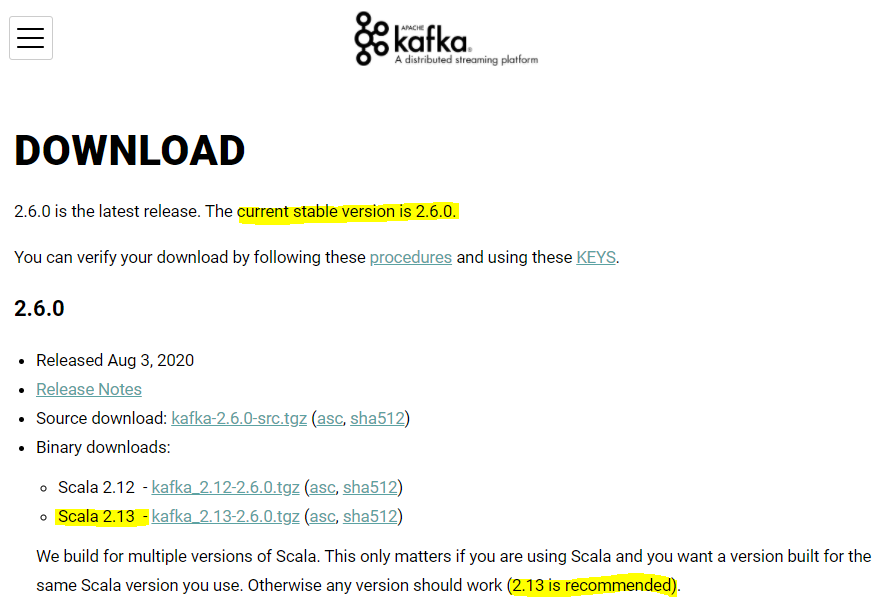
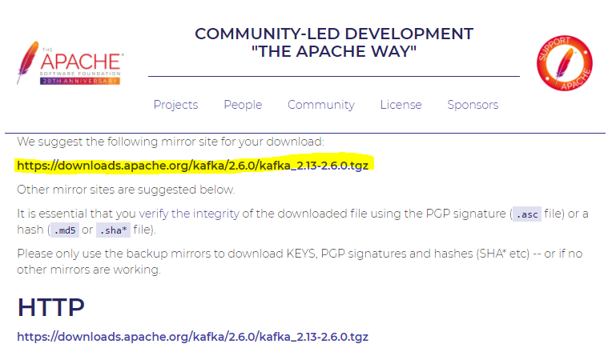
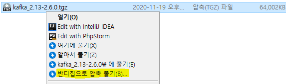

# Kafka 설치하고 실행해보기

---

실습 환경

- 💡 Java10 (Java 8이상 필수)
- 💡 Windows 10
- 💡 Git Bash

---

## **1. Kafka 다운로드**

[*Kafka 공식 홈페이지*](https://kafka.apache.org/downloads)에서 Kafka를 다운로드

- 글 쓰는 시점(2020년11월)에 최신버전은 2020년 18월 Release된 2.6.0 이다.



- Binary downloads의 **Scala 2.13** 버전의 Kafka 압축파일을 다운로드
- Scala를 사용 중이 아니라면 공식홈페이지에서 추천하는 2.13버전을 다운로드하자.

> *설명을 읽어보면 내가 현재 Scala를 사용할 경우 Kafka와 Scala 버전을 일치시키려면 해당 버전을 다운로드 받으면 된다고 한다.*

- Kafka는 Scala로 개발되었기 때문에 **Java8+ 버전이 설치**되어있어야 구동할 수 있다.
- 필자는 [OpenJDK 10](https://openjdk.java.net/projects/jdk/10/) 버전으로 테스트했다.

> JAVA PATH 설정은 생략 → 첫 설치라면 PATH 설정해주기!



다운로드 받은 파일은 압축을 풀면 된다.

압축을 푸는 여러가지 방법 중 편한 방법으로 압축을 풀자.



다만, 압축을 푸는 경로를 잘 지정해 줄 필요가 있다.

- windows는 경로명이 길어지면 실행이 안되는 오류가 발생한다.

필자는 `C:\dev\kafka_2.13-2.6.0` 경로로 지정해주었다.

## 2. Zookeeper 실행

현재는 Kafka를 실행하기 위해 Zookeeper가 먼저 실행되어야 한다. 

> Zookeeper는 kafka 클러스터의 최신 설정 정보 관리, Kafka 서버 동기화, Leader 선택 등 클러스터 내부의 서버들이 서로 공유하는 데이터를 관리해준다!

그런데 [Apache Kafka QUICKSTART 문서](https://kafka.apache.org/quickstart)에 보면 다음과 같이 곧 Zookeeper 설치가 필요하지 않아진다고 한다.

 ~~버전이 더 올라가면 Kafka에 Zookeeper 기능을 내장시킬 것 같다.~~

```bash
# Start the ZooKeeper service
# Note: Soon, ZooKeeper will no longer be required by Apache Kafka.
```

아래 명령어를 입력해 Zookeeper 서비스를 실행하자.

```bash
# yj_park@yjpark MINGW64 /c/dev/kafka_2.13-2.6.0
$ ./bin/windows/zookeeper-server-start.bat ./config/zookeeper.properties
```

> Gitbash로 실행해본 결과  
> bin/windows/zookeeper-server-start.bat config/zookeeper.properties  
> 명령어도 똑같이 잘 실행된다.

**각 OS 실행 파일 위치**

Windows10 → /bin/windows/ `bat 파일`
Linux → /bin `sh 파일`

**실행결과**

```bash
[2020-11-19 17:13:31,112] INFO clientPortAddress is 0.0.0.0:2181 (org.apache.zookeeper.server.quorum.QuorumPeerConfig)
[2020-11-19 17:13:31,112] INFO secureClientPort is not set (org.apache.zookeeper.server.quorum.QuorumPeerConfig)
[2020-11-19 17:13:31,112] INFO Starting server (org.apache.zookeeper.server.ZooKeeperServerMain)
[2020-11-19 17:13:31,112] INFO zookeeper.snapshot.trust.empty : false (org.apache.zookeeper.server.persistence.FileTxnSnapLog)
[2020-11-19 17:13:31,112] INFO Server environment:zookeeper.version=3.5.8-f439ca583e70862c3068a1f2a7d4d068eec33315, built on 05/04/2020 15:53 GMT (org.apache.zookeeper.server.ZooKeeperServer)
[2020-11-19 17:13:31,112] INFO Server environment:host.name=host.docker.internal (org.apache.zookeeper.server.ZooKeeperServer)
[2020-11-19 17:13:31,112] INFO Server environment:java.version=10 (org.apache.zookeeper.server.ZooKeeperServer)
[2020-11-19 17:13:31,127] INFO Server environment:java.vendor=Oracle Corporation (org.apache.zookeeper.server.ZooKeeperServer)
[2020-11-19 17:13:31,127] INFO Server environment:java.home=C:\source\Java\jdk-10 (org.apache.zookeeper.server.ZooKeeperServer)
# ... 생략
[2020-11-19 17:13:31,127] INFO Created server with tickTime 3000 minSessionTimeout 6000 maxSessionTimeout\version-2 snapdir \tmp\zookeeper\version-2 (org.apache.zookeeper.server.ZooKeeperServer)
[2020-11-19 17:13:31,174] INFO Using or
g.apache.zookeeper.server.NIOServerCnxnFactory as server connectioer.server.Se  rverCnxnFactory)
[2020-11-19 17:13:31,190] INFO Configuring NIO connection handler with 10s sessionless connection timeoutrker threads, and 64 kB direct buffers. (org.apache.zookeeper.server.NIOServerCnxnFactory)
[2020-11-19 17:13:31,237] INFO binding to port 0.0.0.0/0.0.0.0:2181 (org.apache.zookeeper.server.NIOServerCnxnFactory)
[2020-11-19 17:13:31,308] INFO zookeeper.snapshotSizeFactor = 0.33 (org.apache.zookeeper.server.ZKDatabase)
[2020-11-19 17:13:31,312] INFO Snapshotting: 0x0 to \tmp\zookeeper\version-2\snapshot.0 (org.apache.zookexnSnapLog)
[2020-11-19 17:13:31,321] INFO Snapshotting: 0x0 to \tmp\zookeeper\version-2\snapshot.0 (org.apache.zookexnSnapLog)
[2020-11-19 17:13:31,340] INFO Using checkIntervalMs=60000 maxPerMinute=10000 (org.apache.zookeeper.serve.ContainerManager)[2020-11-19 17:14:47,878] INFO Creating new log file: log.1 (org.apache.zookeeper.server.persistence.FileTxnLog)
# ... 생략
```

잘 실행되는 것을 확인할 수 있다.

- **zookeeper-server-start.bat**
    - 윈도우에서 zookeeper 서버를 실행하는 파일
- **zookeeper.properties**
    - zookeeper 서버 설정 파일
    - 포트 바인딩 등 설정 가능 (default = 2181포트)
    - 추가적인 설정은 **[공식문서](https://zookeeper.apache.org/doc/r3.1.2/zookeeperAdmin.html#sc_configuration)**를 확인

## 3. Kafka 실행

새로운 터미널을 열어서 Kafka를 실행해주자.

마찬가지로 kafka 압축을 푼 base 폴더로 이동한 후 다음 명령어를 입력하면 된다.

```bash
# yj_park@yjpark MINGW64 /c/dev/kafka_2.13-2.6.0
$ bin/windows/kafka-server-start.bat config/server.properties
```

**실행결과**

```bash
[2020-11-23 13:46:51,229] INFO Registered kafka:type=kafka.Log4jController MBean (kafka.utils.Log4jControllerRegistration$)
[2020-11-23 13:46:51,618] INFO Setting -D jdk.tls.rejectClientInitiatedRenegotiation=true to disable client-initiated TLS renegotiation (org.apache.zookeeper.common.X509Util)
[2020-11-23 13:46:51,699] INFO starting (kafka.server.KafkaServer)
[2020-11-23 13:46:51,700] INFO Connecting to zookeeper on localhost:2181 (kafka.server.KafkaServer)
[2020-11-23 13:46:51,718] INFO [ZooKeeperClient Kafka server] Initializing a new session to localhost:2181. (kafka.zookeeper.ZooKeeperClient)
# ... 생략
[2020-11-23 13:46:53,517] INFO [SocketServer brokerId=0] Started socket server acceptors and processors (kafka.network.SocketServer)
[2020-11-23 13:46:53,527] INFO Kafka version: 2.6.0 (org.apache.kafka.common.utils.AppInfoParser)
[2020-11-23 13:46:53,527] INFO Kafka commitId: 62abe01bee039651 (org.apache.kafka.common.utils.AppInfoParser)
[2020-11-23 13:46:53,527] INFO Kafka startTimeMs: 1606106813517 (org.apache.kafka.common.utils.AppInfoParser)
[2020-11-23 13:46:53,529] INFO [KafkaServer id=0] started (kafka.server.KafkaServer)
```

잘 실행됐다.

- **kafka-server-start.bat**
    - 윈도우 OS에서 kafka 서버 실행 파일
- **server.properties**
    - Kafka 관련 설정 파일
    - 다음 포스팅에서 설정 파일 내부를 간단히 살펴보겠다.
    - 자세한 내용은 [**공식문서**](https://kafka.apache.org/documentation/#configuration)를 확인

## 4. 실행 확인

### 1️⃣ zookeeper server 확인

```bash
[2020-11-23 13:45:18,432] INFO clientPortAddress is 0.0.0.0:2181 (org.apache.zookeeper.server.quorum.QuorumPeerConfig)
```

- 기본 port인 2181로 Client가 바인딩된다.

### 2️⃣ kafka server 확인

```bash
[2020-11-23 13:46:51,699] INFO starting (kafka.server.KafkaServer)
[2020-11-23 13:46:51,700] INFO Connecting to zookeeper on localhost:2181 (kafka.server.KafkaServer)
[2020-11-23 13:46:51,718] INFO [ZooKeeperClient Kafka server] Initializing a new session to localhost:2181. (kafka.zookeeper.ZooKeeperClient)
```

- kafka server가 실행되고 zookeeper에 연결된다 (마찬가지로 2181 port)

### 3️⃣ kafka 실행 확인

```bash
[2020-11-23 13:46:53,527] INFO Kafka version: 2.6.0 (org.apache.kafka.common.utils.AppInfoParser)
[2020-11-23 13:46:53,527] INFO Kafka commitId: 62abe01bee039651 (org.apache.kafka.common.utils.AppInfoParser)
[2020-11-23 13:46:53,527] INFO Kafka startTimeMs: 1606106813517 (org.apache.kafka.common.utils.AppInfoParser)
[2020-11-23 13:46:53,529] INFO [KafkaServer id=0] started (kafka.server.KafkaServer)
```

- Kafka 실행이 정상적으로 됐다.

실행은 잘됐는데 테스트 하기 앞서 다음 포스팅으로 properties 설정 파일이 어떤 구조로 되어있는지 먼저 파악해보려고 한다.

**Reference**

- [https://kafka.apache.org/quickstart](https://kafka.apache.org/quickstart)
- [https://heodolf.tistory.com/8?category=887831](https://heodolf.tistory.com/8?category=887831)