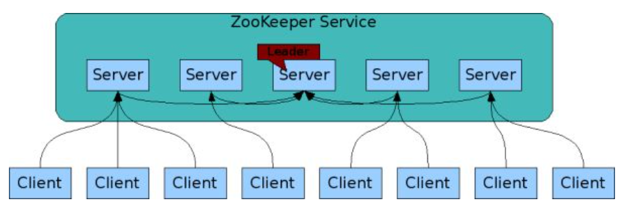
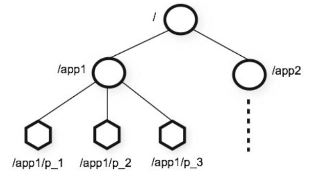

# ZooKeeper 설정

---

실습 환경

- 💡 Java10 (Java 8이상 필수)
- 💡 Windows 10
- 💡 Git Bash

---

이전 포스팅에서 Kafka를 설치하고 Zookeeper를 실행했는데 Zookeeper가 왜 필요한지, 어떻게 설정하면 되는지 알아보자.

## **1. Zookeeper란**

1-1. zookeeper는 Apache의 오픈 소스 프로젝트 중 하나이며, 공개 분산형 구성 서비스, 동기 서비스 및 대용량 분산 시스템을 위한 네임 스페이스 레지스트리를 제공함.

1-2. znode(주키퍼 노드)는 네임 스페이스 안에 데이터를 저장하며, 클라이언트는 znode를 통해 데이터를 읽거나 씀.

1-3. 리더 노드가 존재하며, 리더를 제외한 노드들은 리더로부터 데이터를 동기화함.

1-4. 리더가 장애가 발생하게되면 다른 노드가 리더의 역할을 맡아 안정성이 뛰어남.

1-5. 일반적인 파일 시스템과 달리 zookeeper 데이터는 메모리에 보관되므로 높은 처리량과 낮은 대기 시간을 갖음.



Zookeeper 구조: https://zookeeper.apache.org/doc/current/zookeeperOver.html#sc_designGoals



Zookeeper의 네임스페이스 구조: https://zookeeper.apache.org/doc/current/zookeeperOver.html#sc_designGoals

## 2. [zookeeper.properties](http://zookeeper.properties) 파일 살펴보기

```bash
# Licensed to the Apache Software Foundation (ASF) under one or more
# contributor license agreements.  See the NOTICE file distributed with
# this work for additional information regarding copyright ownership.
# The ASF licenses this file to You under the Apache License, Version 2.0
# (the "License"); you may not use this file except in compliance with
# the License.  You may obtain a copy of the License at
# 
#    http://www.apache.org/licenses/LICENSE-2.0
# 
# Unless required by applicable law or agreed to in writing, software
# distributed under the License is distributed on an "AS IS" BASIS,
# WITHOUT WARRANTIES OR CONDITIONS OF ANY KIND, either express or implied.
# See the License for the specific language governing permissions and
# limitations under the License.
# the directory where the snapshot is stored.
dataDir=/tmp/zookeeper
# the port at which the clients will connect
clientPort=2181
# disable the per-ip limit on the number of connections since this is a non-production config
maxClientCnxns=0
# Disable the adminserver by default to avoid port conflicts.
# Set the port to something non-conflicting if choosing to enable this
admin.enableServer=false
# admin.serverPort=8080
```

처음 파일을 열어보면 이렇게 되어있다. 위 14 line 까지는 라이선스 관련 내용이다!

그 아래부터 하나씩 살펴보자.

```bash
# snapshot 데이터를 저장할 경로를 지정
dataDir=C:/dev/kafka_2.13-2.6.0/data/zookeeper
# 클라이언트가 connect할 port 번호 지정
clientPort=2181
# 하나의 클라이언트에서 동시 접속하는 개수 제한, 기본값은 60이며, 0은 무제한
maxClientCnxns=0
# port 충돌을 방지하려면 admin server 비활성화(false)
admin.enableServer=false
# admin.serverPort=8080
```

멀티 서버 설정을 하려면 다음 코드를 추가하면 된다.

```bash
# 멀티 서버 설정
# server.id=host:port:port
server.1=localhost:2888:3888
# server.2=server_host_1:2888:3888
# server.3=server_host_2:2888:3888
 
# 멀티 서버 설정시 각 서버의 dataDir 밑에 myid 파일이 있어야함.
# echo 1 > myid
 
# 리더 서버에 연결해서 동기화하는 시간, [멀티서버옵션]
#initLimit=5
 
# 리더 서버를 제외한 노드 서버가 리더와 동기화하는 시간, [멀티서버옵션]
#syncLimit=2
```

- 필요한 설정은 [공식문서](https://zookeeper.apache.org/doc/r3.3.3/zookeeperAdmin.html)에서 확인하자.

## 3. zookeeper 실행하기

```bash
# yj_park@yjpark MINGW64 /c/dev/kafka_2.13-2.6.0
$ ./bin/windows/zookeeper-server-start.bat ./config/zookeeper.properties
```

- `zookeeper-server-start.bat` 파일은 인자 값으로 `[zookeeper.properties](http://zookeeper.properties)`를 넘겨주어야 한다.

zookeeper를 실행하면 위에서 설정한 **dataDir** 경로에 log, snapshot 데이터가 저장되는 것을 확인할 수 있다.

필자는 `dev` 폴더에서 관리하고 싶어 경로를 수정했다.

zookeeper는 필요한 설정이 있을 경우 공식문서를 참고해 properties를 추가하는 방식으로 사용하면 될 것 같아 간단히 보고 넘어간다!

이제 kafka server설정을 해보자.

---

**Reference**

- [https://zookeeper.apache.org/doc/r3.3.3/zookeeperAdmin.html](https://zookeeper.apache.org/doc/r3.3.3/zookeeperAdmin.html)
- [https://heodolf.tistory.com/10?category=887831](https://heodolf.tistory.com/10?category=887831)