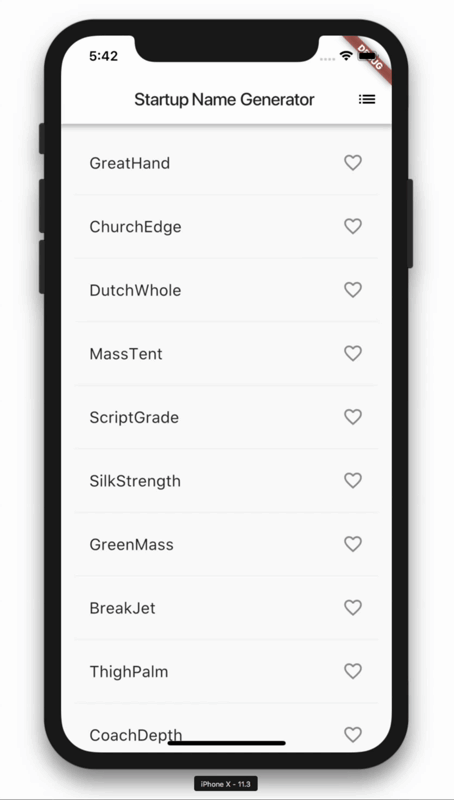
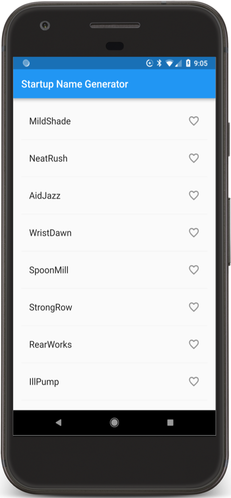
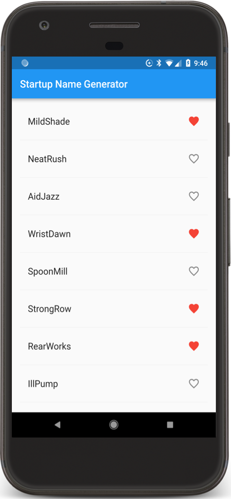
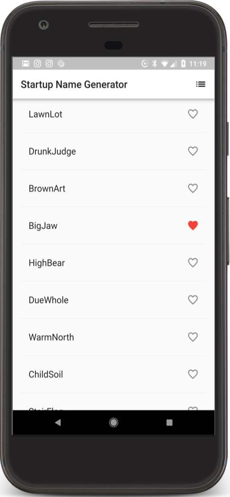

# <p align="center">[Flutter] 1. 첫번째 앱 만들어보기, part 2</p>
    
> flutter 공식 문서인 https://flutter.dev/docs/get-started/codelab 내용을     
> 바탕으로 재구성하였습니다. 

## 1. 소개
Flutter는 iOS 및 Android에서 고품질의 기본 인터페이스를 제작할 수있는 Google 모바일 SDK입니다. Flutter는 기존 코드와 함께 작동하며 전 세계 개발자 및 조직에서 사용되며 무료이며 오픈 소스입니다.

이 코드 랩에서는 대화 형 기능을 포함하도록 기본 Flutter 앱을 확장합니다. 
또한 사용자가 탐색 할 수 있는 두 번째 페이지(called a _route_)를 만듭니다. 마지막으로 앱 테마(color)를 수정합니다.
이 코드 랩은 Part 1 , _Create a Lazily Loaded List_를 확장 하지만 Part 2로 시작하려는 경우 
시작 코드를 제공합니다.

### Part 2에서 배울 내용
* iOS와 Android 모두에서 자연스럽게 보이는 Flutter 앱을 작성하는 방법
* 더 빠른 개발주기를 위해 핫 리로드 사용.
* 상태 저장 위젯에 대화 형 기능을 추가하는 방법
* 두 번째 화면을 만들고 탐색하는 방법
* 테마를 사용하여 앱의 모양을 변경하는 방법


### Part 2에서 만들 내용
시작 회사에 대한 제안 된 이름의 끝없는 목록을 생성하는 간단한 모바일 앱으로 시작합니다.
이 코드 랩이 끝나면 사용자는 이름을 선택하거나 선택 해제하여 최상의 이름을 저장할 수 있습니다. 
앱 바의 오른쪽 상단에있는 목록 아이콘을 누르면 즐겨 찾기 이름 만 나열 하는 새 페이지(_route_)로 
이동 합니다.

애니메이션 GIF는 완성 된 앱의 작동 방식을 보여줍니다.    
     
(The app from part2)

## 2. Flutter 환경 설정
Part 1을 완료하지 않은 경우 Flutter 개발을 위한 환경을 설정하려면 첫 번째 Flutter 앱 작성(Part 1)에서 
Flutter 환경 설정을 참조 하십시오.

## 3. 시작 앱 받기
이 코드 랩의 Part 1에서 작업 한 경우 이미 시작 앱 startup_namer이 있습니다. 
그렇다면 다음 단계로 진행할 수 있습니다.

당신이 startup_namer가 없는 경우 아래와 같이 따라하시면 됩니다.

* Part 1 첫 번째 Flutter 앱 시작하기의 지침에 따라 간단한 템플릿 Flutter 앱을 만듭니다. 
myapp 대신 프로젝트 startup_namer의 이름을 지정하십시오.

* lib/main.dart 에서 모든 코드를 Part 1의 코드로 변경하세요.

* pubspec.yaml아래와 같이 영어 단어 패키지를 추가하여 업데이트 하십시오.

``` dart
dependencies:
  flutter:
    sdk: flutter

  cupertino_icons: ^0.1.2
  english_words: ^3.1.0    // Add this line.
```

영어 단어 패키지는 잠재적인 시작 이름으로 사용되는 임의의 단어 쌍을 생성합니다.

* Android Studio의 편집기보기에서 pubspec을 보면서 오른쪽 상단의 패키지 가져 오기를 클릭하십시오.
패키지를 프로젝트로 가져옵니다. 콘솔에 다음이 표시되어야합니다.
``` dart
flutter packages get
Running "flutter packages get" in startup_namer...
Process finished with exit code 0
```
앱을 실행하십시오. 제안 된 시작 이름을 지속적으로 제공하여 원하는만큼 스크롤하십시오.


## 4. 목록에 아이콘 추가    

이 단계에서는 각 행에 하트 아이콘을 추가합니다. 
다음 단계에서는 탭 가능하고 즐겨 찾기를 저장합니다.

* _savedRandomWordsState에 세트를 추가하십시오 . 
이 세트는 사용자가 선호하는 단어 쌍을 저장합니다. 
올바르게 구현 된 Set은 중복 항목을 허용하지 않으므로 Set은 List보다 선호됩니다.

``` dart
class RandomWordsState extends State<RandomWords> {
  final List<WordPair> _suggestions = <WordPair>[];
  final Set<WordPair> _saved = Set<WordPair>();   // Add this line.
  final TextStyle _biggerFont = TextStyle(fontSize: 18.0);
  ...
}
```

* 이 _buildRow기능에서 alreadySaved단어 페어링이 즐겨 찾기에 아직 추가되지 않았는지 확인하십시오.

``` dart
Widget _buildRow(WordPair pair) {
  final bool alreadySaved = _saved.contains(pair);  // Add this line.
  ...
}
```

또한 _buildRow()마음에 드는 아이콘을 ListTile 객체에 추가하여 선호도를 높일 수 있습니다.
다음 단계에서는 심장 아이콘과 상호 작용하는 기능을 추가합니다.

* 아래와 같이 아이콘을 추가하십시오.

``` dart
Widget _buildRow(WordPair pair) {
  final bool alreadySaved = _saved.contains(pair);
  return ListTile(
    title: Text(
      pair.asPascalCase,
      style: _biggerFont,
    ),
    trailing: Icon(   // Add the lines from here... 
      alreadySaved ? Icons.favorite : Icons.favorite_border,
      color: alreadySaved ? Colors.red : null,
    ),                // ... to here.
  );
}
```

* 앱을 핫 리로드하십시오. 이제 각 행에 열린 마음이 표시되지만 아직 대화 형이 아닙니다.    

     
(Android & iOS)    


## 5. 대화 형 기능 추가 (interactivity)
이 단계에서는 heart 아이콘을 탭할수 있게 합니다. 
사용자가 목록에서 항목을 누르면 "favorited"상태로 전환되고 해당 단어 쌍이 저장된 
즐겨 찾기 세트에서 추가되거나 제거됩니다.

이를 위해 _buildRow기능을 수정합니다. 단어 항목이 이미 즐겨 찾기에 추가 된 경우 
단어 항목을 다시 누르면 즐겨 찾기에서 제거됩니다. 
타일을 탭하면 함수 setState()가 상태가 변경되었음을 프레임워크에 알리기 위해 호출합니다.

* onTap 아래와 같이를 추가하십시오.

``` dart
Widget _buildRow(WordPair pair) {
  final alreadySaved = _saved.contains(pair);
  return ListTile(
    title: Text(
      pair.asPascalCase,
      style: _biggerFont,
    ),
    trailing: Icon(
      alreadySaved ? Icons.favorite : Icons.favorite_border,
      color: alreadySaved ? Colors.red : null,
    ),
    onTap: () {      // Add 9 lines from here...
      setState(() {
        if (alreadySaved) {
          _saved.remove(pair);
        } else { 
          _saved.add(pair); 
        } 
      });
    },               // ... to here.
  );
}
```

``` bash
Tip: Flutter의 반응 스타일 프레임 워크에서 호출 하면 State 객체 setState()의 build () 메서드에    
대한 호출이 트리거 되어 UI가 업데이트됩니다.
```

앱을 핫 리로드하십시오. 항목을 즐겨 찾기 또는 즐겨 찾기로 타일을 탭할 수 있어야합니다. 
타일을 두드리면 탭 포인트에서 나오는 암묵적 잉크 얼룩 애니메이션이 생성됩니다.    

     
(Android & iOS)    


## 6. 새로운 화면으로 이동
이 단계에서는 즐겨찾기를 표시하는 새 페이지(Fluter 의 경로)를 추가합니다. 
홈 경로와 새 경로 사이를 탐색하는 방법을 배웁니다.

Flutter에서 Navigator는 앱의 경로가 포함 된 스택을 관리합니다. 
경로를 네비게이터 스택으로 푸시하면 디스플레이가 해당 경로로 업데이트됩니다. 
네비게이터의 스택에서 경로를 찾아 내면 디스플레이가 이전 경로로 돌아갑니다.

다음으로 RandomWordsState의 빌드 메소드에서 AppBar에 목록 아이콘을 추가합니다. 
사용자가 목록 아이콘을 클릭하면 저장된 즐겨 찾기가 포함 된 새 경로가 네비게이터로 
푸시되어 아이콘이 표시됩니다.

* 아이콘과 해당 조치를 build메소드에 추가하십시오.

``` dart
class RandomWordsState extends State<RandomWords> {
  ...
  @override
  Widget build(BuildContext context) {
    return Scaffold(
      appBar: AppBar(
        title: Text('Startup Name Generator'),
        actions: <Widget>[      // Add 3 lines from here...
          IconButton(icon: Icon(Icons.list), onPressed: _pushSaved),
        ],                      // ... to here.
      ),
      body: _buildSuggestions(),
    );
  }
  ...
}
```

``` bash
팁 : 일부 위젯 특성은 단일 위젯(child)을 취하고 조치와 같은 다른 특성 children은 대괄호 ([])로     
표시된대로 위젯 배열( )을 취합니다 .
```

* _pushSaved()RandomWordsState 클래스에 함수를 추가하십시오 .

``` dart
  void _pushSaved() {
  }
```

* 앱을 핫 리로드하십시오. 앱 아이콘에 목록 아이콘 ( )이 나타납니다. _pushSaved함수가 비어 있으므로 아무 것도 누르지 않습니다 .

다음으로 경로를 만들고 네비게이터의 스택으로 푸시합니다. 이 조치는 화면을 변경하여 
새 경로를 표시합니다. 새 페이지의 내용 builder은 익명 함수 로 MaterialPageRoute의 
속성에 내장되어 있습니다.

* Navigator.push아래와 같이을 호출 하면 경로가 네비게이터의 스택으로 푸시됩니다. 
IDE는 유효하지 않은 코드에 대해 불평하지만 다음 섹션에서 수정합니다.

``` dart
void _pushSaved() {
  Navigator.of(context).push(
  );
}
```

다음으로 MaterialPageRoute와 해당 빌더를 추가합니다. 
지금은 ListTile 행을 생성하는 코드를 추가하십시오. 
divideTiles()ListTile 의 메소드는 각 ListTile 사이에 수평 간격을 추가합니다. 
divided변수, toList() 편의 기능 목록으로 변환 된 최종 행을 보유하고 있습니다.

아래와 같이 코드를 추가하십시오.

``` dart
void _pushSaved() {
  Navigator.of(context).push(
    MaterialPageRoute<void>(   // Add 20 lines from here...
      builder: (BuildContext context) {
        final Iterable<ListTile> tiles = _saved.map(
          (WordPair pair) {
            return ListTile(
              title: Text(
                pair.asPascalCase,
                style: _biggerFont,
              ),
            );
          },
        );
        final List<Widget> divided = ListTile
          .divideTiles(
            context: context,
            tiles: tiles,
          )
          .toList();
      },
    ),                       // ... to here.
  );
}
```

빌더 특성은 "저장된 제안"이라는 새 경로의 앱 표시 줄이 포함 된 스캐 폴드를 리턴합니다.
새 경로의 본문은 ListTiles 행을 포함하는 ListView로 구성됩니다. 각 행은 분배기로 구분됩니다.

* 아래와 같이 가로 구분선을 추가하십시오.

``` dart
void _pushSaved() {
  Navigator.of(context).push(
    MaterialPageRoute<void>(
      builder: (BuildContext context) {
        final Iterable<ListTile> tiles = _saved.map(
          (WordPair pair) {
            return ListTile(
              title: Text(
                pair.asPascalCase,
                style: _biggerFont,
              ),
            );
          },
        );
        final List<Widget> divided = ListTile
          .divideTiles(
            context: context,
            tiles: tiles,
          )
              .toList();

        return Scaffold(         // Add 6 lines from here...
          appBar: AppBar(
            title: Text('Saved Suggestions'),
          ),
          body: ListView(children: divided),
        );                       // ... to here.
      },
    ),
  );
}
```

* 앱을 핫 리로드하십시오. 선택한 항목 중 일부를 즐겨 찾기하고 앱 바에서 목록 아이콘을 누릅니다.
즐겨 찾기가 포함 된 새 경로가 나타납니다. 네비게이터는 "뒤로"버튼을 앱 표시 줄에 추가합니다.  
Navigator.pop을 명시 적으로 구현할 필요는 없습니다. 홈 버튼으로 돌아가려면 뒤로 버튼을 탭하십시오.    

     
(Android & iOS)    


## 7. 테마를 사용하여 UI 변경

이 단계에서는 앱 테마를 수정합니다. 주제는 앱의 모양과 느낌을 제어합니다. 
실제 장치 또는 에뮬레이터에 종속 된 기본 테마를 사용하거나 브랜딩을 반영하도록 
테마를 사용자 정의 할 수 있습니다.

ThemeData 클래스 를 구성하여 앱 테마를 쉽게 변경할 수 있습니다.
이 앱은 현재 기본 테마를 사용하지만 앱의 기본 색상을 흰색으로 변경합니다.

* MyApp 클래스에서 색상을 변경하십시오.

``` dart
class MyApp extends StatelessWidget {
  @override
  Widget build(BuildContext context) {
    return MaterialApp(
      title: 'Startup Name Generator',
      theme: ThemeData(          // Add the 3 lines from here... 
        primaryColor: Colors.white,
      ),                         // ... to here.
      home: RandomWords(),
    );
  }
}
```
* 앱을 핫 리로드하십시오. 이제 전체 배경이 흰색으로 바뀌고 심지어 앱 바도 있습니다.

독자를위한 연습으로 ThemeData를 사용하여 UI의 다른 측면을 변경하십시오.
Material 라이브러리 의 Colors 클래스는 재생할 수있는 많은 색상 상수를 제공하며 
핫 리로드는 UI를 빠르고 쉽게 실험 할 수 있습니다.    


     
(Android & iOS)    

## 8. Well done!
iOS와 Android에서 모두 실행되는 대화식 Flutter 앱을 작성했습니다. 
이 코드 랩에서는 다음을 수행했습니다.

* 다트 코드 작성
* 더 빠른 개발주기를 위해 핫 리로드를 사용했습니다.
* 앱에 대화 형 기능을 추가하여 상태 저장 위젯을 구현했습니다.
* 홈 경로와 새 경로 사이를 이동하기위한 경로를 만들고 논리를 추가했습니다.
* 테마를 사용하여 앱 UI의 모양을 변경하는 방법에 대해 배웠습니다.

9. Next steps

Flutter SDK에 대해 자세히 알아보십시오.

* Flutter 튜토리얼 에서 레이아웃 작성 https://flutter.dev/docs/development/ui/layout
* 대화 형 자습서 추가 https://flutter.dev/docs/development/ui/interactive
* 위젯 소개 https://flutter.dev/docs/development/ui/widgets-intro
* 안드로이드 개발자를위한 Flutter https://flutter.dev/docs/get-started/flutter-for/android-devs
* React Native 개발자를위한 Flutter https://flutter.dev/docs/get-started/flutter-for/react-native-devs
* 웹 개발자를위한 플러터 https://flutter.dev/docs/get-started/flutter-for/web-devs
* Flutter의 유튜브 채널 https://www.youtube.com/flutterdev

다른 자료들 :

* Flutter (무료 Udacity 코스)로 네이티브 모바일 앱 구축 https://www.udacity.com/course/build-native-mobile-apps-with-flutter--ud905
* 플러터 요리 책 https://flutter.dev/docs/cookbook/
* 자바에서 다트 코드 랩으로 https://codelabs.developers.google.com/codelabs/from-java-to-dart/#0
* 다트에 부트 스트랩 : 언어에 대해 더 알아보기 https://flutter.dev/docs/resources/bootstrap-into-dart
