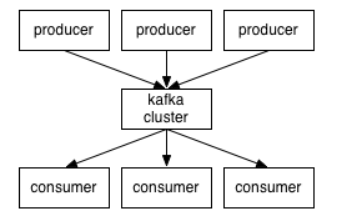
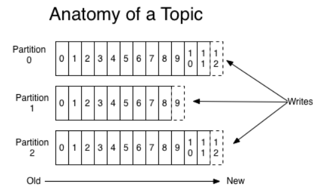
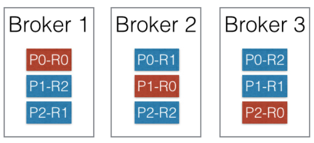
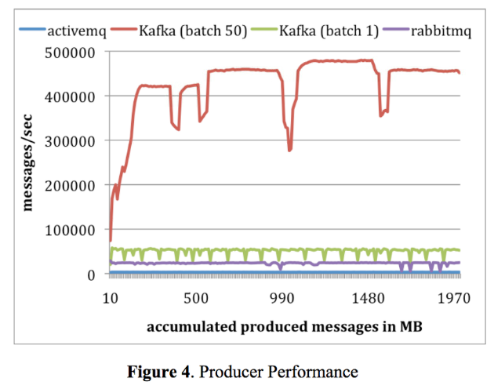
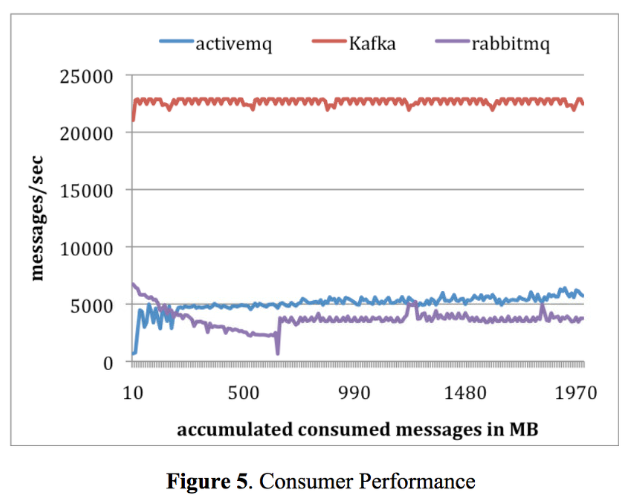

# Kafka 공부

## 도입 이유

기존의 엔터프라이즈 메시징 시스템들의 한계

- 배달 보장(delivery guarantee)을 위한 기능들은 로그 처리를 위한 시스템 입장에서는 불필요
- 처리 속도(throughput)를 디자인 제약으로 고혀하지 않음.
- 분산에 대한 고려가 부족
- 메시지가 즉시 소비되는 것을 전제로 하기 때문에 메시지가 쌓일 경우 성능이 하락
- 로그 데이터를 오프라인으로 처리하는 것을 위해 만들어진 시스템
- 대부분은 push 모델

## 기존 메시징 시스템과의 차이점

(기존 메시징 시스템 : ActiveMQ, RabbitMQ 등)

### 1️⃣ 분산 시스템 & 실시간 로그 처리

- 대용량의 실시간 로그 처리에 특화 되어 설계된 메시징 시스템으로써 기존 범용 메시징 시스템 대비 TPS가 매우 우수하다.

    → 단, 특화된 시스템이기 때문에 범용 메시징 시스템에서 제공하는 다양한 기능들은 제공되지 않음 `어떤 기능을  제공하지 않는지?`

- 분산 시스템을 기본으로 설계되었기 때문에, 기존 메시징 시스템에 비해 분산 및 복제 구성을 쉽게 할 수 있다.

### 2️⃣ TCP 기반 프로토콜 & 메시지 전달 방식 개선

- AMQP 프로토콜이나 JMS API를 사용하지 않고 단순한 메시지 헤더를 지닌 TCP 기반의 프로토콜을 사용하여 프로토콜에 의한 오버헤드를 감소시켰다.
- Producer가 Broker에게 다수의 메시지를 전송할 때 각 메시지를 개별적으로 전송해야하는 기존의 메시징 시스템과 달리, 다수의 메시지를 batch 형태로 broker에게 한 번에 전달할 수 있어 TCP/IP 라운드트립 횟수를 줄일 수 있다.

### 3️⃣ 메시지 파일 시스템 저장 방식

- 메시지를 기본적으로 메모리에 저장하는 기존 메시징 시스템과는 달리 메시지를 파일 시스템에 저장한다.
    - 파일 시스템에 메시지를 저장하기 때문에 별도의 설정을 하지 않아도 데이터의 영속성(durabillity)이 보장된다.
    - 기존 메시징 시스템에서는 처리되지 않고 남아있는 메시지의 수가 많을수록 시스템의 성능이 크게 감소하였으나, Kafka에서는 메시지를 파일 시스템에 저장하기 때문에 메시지를 많이 쌓아두어도 성능이 크게 감소하지 않는다.

        → 또한 많은 메시지를 쌓아둘 수 있기 때문에, 실시간 처리뿐만 아니라 주기적인 batch 작업에 사용할 데이터를 쌓아두는 용도로도 사용할 수 있다.

    - Consumer에 의해 처리된 메시지(Acknowledged Message)를 곧바로 삭제하는 기존 메시징 시스템과는 달리, 처리된 메시지를 삭제하지 않고 파일 시스템에 그대로 두었다가 설정된 수명이 지나면 삭제한다. → 처리된 메시지를 일정 기간동안 삭제하지 않기 때문에 메시지 처리 도중 문제가 발생하였나 처리 로직이 변경되었을 경우 consumer가 메시지를 처음부터 다시 처리(rewind)하도록 할 수 있다.

### 4️⃣ 메시지 Pull 방식

- 기존의 메시징 시스템에서는 broker가 consumer에게 메시지를 push해 주는 방식인데 반해, Kafka는 consumer가 broker로부터 직접 메시지를 가지고 가는 pull 방식으로 동작한다.

    → 따라서 consumer는 자신의 처리능력 만큼의 메시지만 broker로부터 가져오기 때문에 최적의 성능을 낼 수 있다.

- 기존의 Push 방식의 메시징 시스템에서는 broker가 직접 각 consumer가 어떤 메시지를 처리해야 하는지 계산하고 어떤 메시지를 처리중인지 트래킹하였는데, Kafka에서는 consumer가 직접 필요한 메시지를 broker로부터 pull 하므로 broker의 consumer와 메시지 관리에 대한 부담이 줄었다.
- 메시지를 pull 방식으로 가져오므로, 메시지를 쌓아두었다가 주기적으로 처리하는 batch consumer의 구현이 가능하다.

## 소개 Introduce

- Apache Kafka는 LinkeIn에서 개발된 분산 메시징 시스템으로 2011년에 오픈소스로 공개
- 대용량의 실시간 로그 처리에 특화된 아키텍쳐 설계를 통해 기존 메시징 시스템보다 우수한 TPS 보장

Kafka는 기존의 메시징 시스템에서 당연하다고 가정하고 있었지만, 로그 처리 시스템에서는 필요없는 보장들을 과감하게 버리고, 성능 위주의 설계를 함으로써, 실제로 링크 속도에 육박하는 성능을 보여주고 있고, 상당히 단순한 아키텍쳐를 유지하고 있음

데이터 처리에 있어서 Error 등으로  흔히 발생하는 재처리가 Pull 기반의 소비 모델을 도입함으로써 매우 쉽게 가능함

## 주요 용어

- Topic : 메시지 저장소
- Producer : 토픽에 메시지를 발행(저장)하는 프로세스
- Consumer : 토픽을 구독하고 발행된 메시지를 소비하는 프로세스
- Broker : 클러스터를 구성하는 서버

    → Kafka는 하나 혹은 다수의 서버로 구성된 클러스터로 동작함

Kafka는 발행-구독(Publish-Subscribe) 모델을 기반으로 동작하며 크게 producer, consumer, broker로 구성된다.

 

Producer는 네트워크를 통해서 Kafak 클러스터에 메시지를 전달한다. 

Kafka 클러스터는 다시 메시지를 Consumer에 다음과 같이 전달한다.

### 1️⃣ Topic & Partition

- 토픽은 발행된 메세지의 카테고리명 혹은 피드명
- 각 토픽에 Kafka 클러스터는 분할된 로글르 다음과 같이 저장

Kafka의 topic은 partition이라는 단위로 쪼개어져 클러스터의 각 서버들에 분산되어 저장되고, 고가용성을 위해 복제(replication) 설정을 할 경우 이 또한 partition 단위로 각 서버들에 분산되어 복제되고 장애가 발생하면 partition 단위로 fail over가 수행된다.

- 각 partition은 순차적이며 불변의 메시지를 저장하는 연속체(시퀀스)로 지속적으로 커밋 로그가 추가된다.
- 이 partition의 메시지에는 개별적으로 순차적으로 증가하는 id(숫자)가 할당 됨
- id는 "offset"이라고 하며 partition에서 각 메시지를 유일하게 식별 함

### 2️⃣ Partition Replication

- 클러스터된 Broker에 partition들을 복제하여 분산처리를 지원

3대의 Broker에 3개의 partition을 가지며, 각 partition들은 3개의 Replica를 가진다.

### 3️⃣ Consumer & Consumer Group

메시징 모델은 크게 큐(Queue) 모델과 발행-구독(publish-subscribe) 모델로 나뉨

1. Queue 모델
    - 메시지가 쌓여있는 Queue로부터 메시지를 가져와서 consumer pool에 있는 consumer 중 하나에 메시지를 할당하는 방식
2. Pub-Sub 모델
    - topic을 구독하는 모든 consumer에게 메시지를 브로드캐시팅하는 방식

Kafka에서는 **consumer group**이라는 개념을 도입해 두가지 모델을 발행-구독 모델로 일반화 함

Kafka의 partition은 consumer group당 오로지 하나의 consumer의 접근만을 허용하며, 해당 consumer를 partition owner라고 부름.

따라서 동일한 consumer group에 속하는 consumer끼리는 동일한 partition에 접근할 수 없음

Consumer 추가/제거 시

- 추가/제거된 consumer가 속한 consumer group 내의 consumer들의 partition 재분배(rebalancing)가 발생

broker 추가/제거 시

- 전체 consumer group에서 partition 재분배 발생

### 4️⃣ Zookeeper

분산된 어플리케이션을 분산 조율, 조정하는 서비스

(Kafka는 zookeeper를 기반으로 분산 작업을 조정함)

> 새로운 Topic이 생성되었을 때, Topic의 생성과 소비에 대한 상태를 저장하기 위해 사용

- 분산 조정을 위해 Zookeeper 사용
- Kafka가 ZooKeeper를 사용하는 작업 list
    1. broker, consumer의 추가/제거 탐지
    2. broker, consumer 추가/제거 시 각 consumer에게 재분배(rebalancing) 프로세스를 트리거
    3. 소비 관계를 유지하고, 각 partition의 소비된 offset 추적
        - broker나 consumer가  시작하면 zookeeper의 broker 또는 consumer 레지스트리에 그 정보를 저장
        - broker 레지스트리는 broker의 host 이름, port, topic과 partition의 집합을 포함
        - 각 consumer group은 소유권 레지스트리와 offset 레지스트리와 연관 됨
        - 소유권 레지스트리는 모든 구독된 partition에 대해 하나의 ZooKeeper 경로를 가지며, 그 값은 현재 그 파티션을 소비하고 있는 consumer의 ID
        - Offset 레지스트리는 각각의 구독된 partition 내에서 마지막으로 소비된 offset을 저장
    4. broker 레지스트리에 consumer 레지스트리, 소유권 레지스트리에 대한 ZooKeeper 경로들은 ephemeral 경로?.
    5. Offset 레지스트리에 대해서는 persistent 경로?,
    6. broker가 실패하면 그 위의 모든 partition은 자동적으로 broker 레지스트리에서 삭제 됨.
    7. consumer 실패는 consumer 레지스트리에서 consumer에 해당하는 항목과 소유권 레지스트리에서 그것이 가진 모든 partition을 삭제
- 각 consumer는 broker와 consumer 레지스트리에 대해 ZooKeeper Watcher를 등록하고 broker나 consumer group에서 변화가 일어나면 통지 받음
- consumer의 시작이나 consumer가 broker/consumer 변화에 대해 통지를 받으면, consumer는 소비할 partition의 부분집합을 정하기 위해 rebalancing 프로세스를 시작
    1. broker와 consumer 레지스트리를 읽어서 각 구독된 topic에 대해 사용가능한 partition의 집합과 그 topic을 구독하고 있는 Consumer의 집합을 계산
    2. partition 집합을 범위로 파티셔닝(range-partition)해서 consumer의 수 만큼의 Chunk로 나누고 소유할 Chunk를 고름
    3. consumer가 고른 각 partition으로부터 데이터를 당겨오는 Thread를 시작
    4. consumer는 주기적으로 offset 레지스트리에 마지막으로 소비한 offset을 업데이트

- 그룹 내에 여러 consumer가 있을 때 각각은 broker/consumer에 대해 통지를 받지만, 그 통지가 consumer마다 살짝 다르게 올 수 있음.
    1. 하나의 consumer가 다른 consumer에 의해 아직 소유된 partition에 대한 소유권을 가지려고 하는 것이 가능
    2. 이 경우, 첫번째 consumer는 단순히 모든 partition을 릴리즈하고 조금 기다린 후 rebalancing 프로세스를 재시도
    3. rebalancing 프로세스는 단 몇번의 재시도 만에 안정화된다.

- 새로운 consumer group이 만들어졌을 때는 Offset 레지스트리에는 Offset이 없지만, API를 사용해서 최소 또는 최대의 Offtset부터 시작할 수 있다.

## Performance

### 1️⃣ Producer

### 2️⃣ Consumer

## Reference

- [Apache Kafka] 1. 소개및 아키텍처 정리: [http://epicdevs.com/17](https://epicdevs.com/17)
- 왜 하필 ZooKeeper인가? : [https://brunch.co.kr/@timevoyage/77](https://brunch.co.kr/@timevoyage/77)