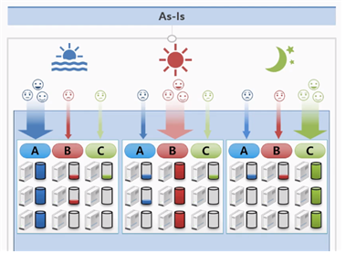
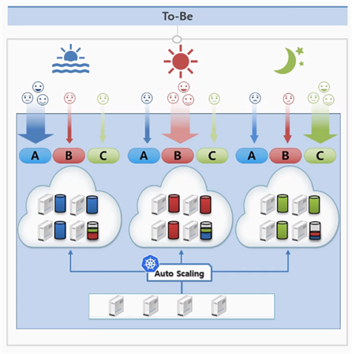
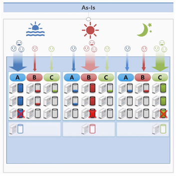
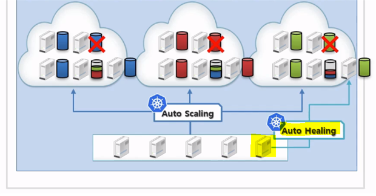
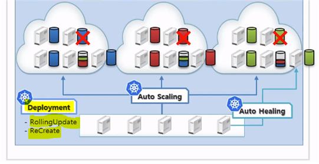

# Why Kubernetes?

운영환경이 편리해지고 서비스 효율이 증가하게 됨
서비스 효율로 인해 서버가 적어지면 그만큼 유지보수 비용이 적어지게 됨!

> 1. Kubernetes가 서비스 운영에 있어서 어떤 자동화 기능을 제공할까?  
> 2. Auto Scailing 기능  
> 3. Auto Healing 기능  
> 4. Deployment Object를 통한 업데이트 적용 자동화  

## 1. Kubernetes가 서비스 운영에 있어 어떤 자동화 기능을 제공할까?

> 어떤 서비스를 제공할 때 원활하게 유지되려면 충분한 서버 자원이 필요함  
> (ex, 신규게임 서버폭파)  

기업은 트래픽 예측이 어렵고 많은 자원 준비는 많은 비용 발생하는 딜레마

아래 기업들과 같이 하나의 서비스만 운영하는 것이 아닌 여러 서비스를 제공하면 더 큰 문제 발생  


```bash
한 서버에 한 시스템을 올려서 사용했을 때 문제점은?
쿠버네티스는 어떻게 이 문제를 해결했을까?
```

다음 기능들을 통해 어떤 자동화 서비스를 제공하는지 알아보자

---

## 2. Auto Scaling

#### *서버 자원 할당 문제*

**[시나리오1]**  
회사에서 A, B, C 3개의 서비스를 Open했다.
각각 아침 점심 저녁에 접속 트래픽이 많아 모두 정상적인 서비스를 제공하기 위해 어쩔 수 없이 3대의 서버를 할당해야 함  
이 사나리오에서는 총 9대의 서버가 필요함   
   

:star2:***Kubernetes는***  
가상화 기술을 적용!  
같은 시간에 4대의 서버 자원이면 충분하기 때문에  
`Auto Scaling` 기능을 적용해 각 시간대 별 트래픽에 따른 서비스 자원 할당이 가능함  
→ **서버 자원 절약**   
 

### 3. Auto Healing

#### *백업 서버 자원 할당 문제*
기존 시스템의 경우 서버 장애 상황에 대비한 여분의 서버가 각 서비스 별로 하나씩 필요함
총 3대의 백업 서버를 더 두어야 서버 운영에 문제가 없음   
  
  
:star2:***Kubernetes는***   

Auto Healing 기능을 제공해 여분의 서버 한 대만 있으면 백업 가능
> Auto Healing 이란?  
> 장애가 난 서버 위에있는 서비스들이 다른 서버로 자동으로 옮겨주는 기능   
  

### 4. Deployment Object를 통한 업데이트 적용 자동화

#### *서비스 버전 업데이트 적용 문제*

기존 서비스-서버 모델의 **서비스 버전 업데이트**가 필요한 경우  
#### 1. 서비스의 중단이 허용되는 경우  
> 모든 서비스를 내렸다가 업데이트 이후 다시 올리는 방식으로 적용   

#### 2. 무중단 서비스가 운영되어야 하는 경우  
> 한 서버씩 내렸다가 업데이트 작업 이후 하나씩 서비스를 올리는 방식     

    

:star2:***Kubernetes는***   
Deployment Object를 통해 업데이트 방식에 대해 자동으로 처리되도록 지원    

    

**이 외에도 Kubernetes는 여러 기능들에 대해 운영 자동화를 지원한다.**    


## :pushpin: 정리

### 운영환경이 편리 → 서비스 효율 증가 → 서버 자원 최소화 → 유지보수 비용 절감
