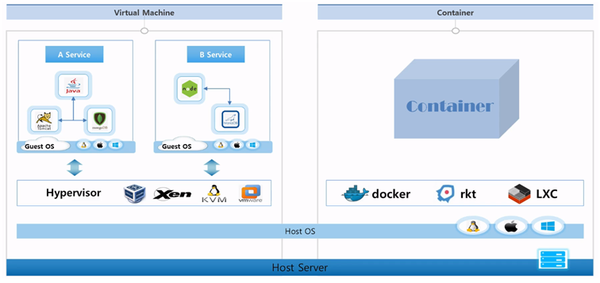
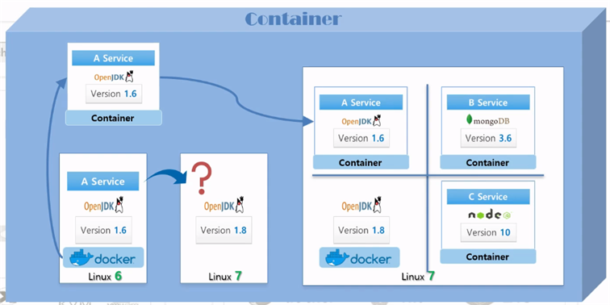
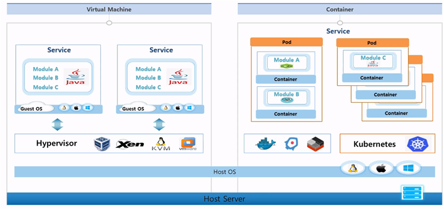

# VM vs Container

## 1. VM 과 Container의 차이

### 시스템 구조에서 오는 차이점?

- 공통적으로 `하나의 서버`가 있음
- 한 서버에는 기본적으로 어떤 운영체제가 됐건 `Host OS`가 올라감

#### VM의 경우

- `Host OS`위에 VM을 가상화 시켜주기 위해 여러 `Hypervisor`가 존재
- 이런 것들을 사용해서 원하는 운영체제로 `Guest OS`를 올려 여러 `VM`을 만들 수 있음
- 이 Guest OS도 Host OS와 마찬가지로 **하나의 OS를 독립적으로 가지고 있는 것처럼 사용**할 수 있음
- 원하는 Application을 설치해 각각의 서비스를 만들 수 있음

#### Container의 경우

- `Host OS` 설치까지 동일하고
- 이 OS위에 `Container 가상화`를 시켜주는 여러 가지 **SW**들이 있음
- 현재는 `Docker`를 가장 많이 사용하고 있는 추세
- **Docker가 Container를 만들어줌!**



## 2. Container란?

- 예를 들어 리눅스는 버전이 있는데 버전에 따라 기본적으로 설치되는 라이브러리가 다름
- Linux 6버전으로 개발을 진행할 경우 Linux 6버전에 설치되어있는 OpenJDK 라이브러리를 사용해서 개발함
- 만약 리눅스 7버전에서 사용하면 버전 차이에 따른 문제가 생길 것임

> 그래서 우린 docker를 설치해 Container 이미지를 만들면 이 이미지에는 서비스와 서비스에 필요한 라이브러리를 같이 묶어서 가지고 있음

```bash
Docker만 설치되어있으면 다른 버전의 Linux에서도 안정적인 Container로 시스템을 구동시킬 수 있다는 의미
```



### 도커의 다른 기능

- 여러 Container간에 호스트 자원을 분리해서 사용하게 해줌
- 이게 리눅스 고유 기술인 `namespace`와 `cgroups`을 사용해서 격리하는 기술


- `namespace`는 커널에 관련된 영역을 분리
- `cgroups`는 자원에 관련된 영역을 분리

정리하면 `Docker`와 같은 `Container 가상화 솔루션`은 OS에서 제공하는 **자원 격리 기술**을 이용해 `Container`라는 단위로 서비스를 분리할 수 있게 만들어 줌

이를 통해 `Container 가상화`가 설치된 OS에서는 **개발 환경에 대한 걱정 없이 배포**가 가능하게 됨

---

## 3. 보안과 효율성 측면

### 효율성 측면

- `VM 가상화` - OS를 매번 띄워야 함
- `Container 가상화` - 하나의 OS를 공유

```bash
Container가 빠를 수 밖에 없음
```

> 💡 단점은 없을까?  
> VM은 내가 window를 사용하더라도 `새로운 Guest OS`로 Linux를 사용할 수 있는데
Container는 그렇게 사용할 수 없음

### 보안 측면

- `VM 가상화` - 게스트 OS가 뚫려도 다른 게스트 OS나 호스트OS와 완벽하게 분리되어 각각 VM끼리 피해 X
- `Container 가상화` - 한 Container가 뚫려 OS영역에 접근하면 다른 Container도 위험에 노출하지만 이런 점은 계속해서 보완하는 중임

---

## 4. 시스템 개발 측면



위 예시를 통해 살펴보자.

### VM 가상화

일반적으로 우리는 한 `서비스`를 만들 때 한가지 언어를 사용해 여러 모듈이 한 서비스로 돌아감

만약 A와 B모듈이 괜찮은데 C모듈의 부하가 많이 가는 상황이면 VM을 하나 더 생성해 띄우게 됨

자원 사용과 성능 입장에서 Guest OS가 2개가 올라가게 됨

#### A와 B는 필요없지만 한 패키지기 때문에 따라 올라가는 비효율 발생

### Container 가상화

Container의 경우 한 서비스를 만들 때 모듈별로 쪼개서 각각의 컨테이너에 담는 것(`마이크로 서비스`)을 권하고 있고 각 모듈에 맞는 `최적화된 언어를 사용`하는 것을 권장

여기서 쿠버네티스는 여러 컨테이너들을 하나의 `Pod`라는 개념으로 묶을 수 있고 하나의 `Container`를 `pod`로 묶을 수 있어서 **하나의 pod는 하나의 배포 단위**가 됨

쿠버네티스는 이 기능을 쉽게 제공하기 때문에 이렇게 만들어 놓으면 내가 필요한 pod만 확장을 할 수 있음

#### 시스템을 모듈별로 쪼개서 개발할 때 큰 장점이 있음
