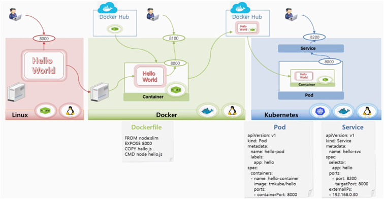
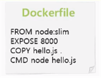
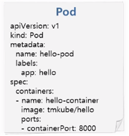
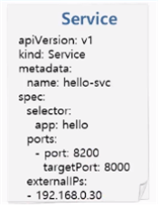

# 4.Kubernetes 시작하기

## 1. Kubernetes 환경 구축하기

### ⏹ 기존 리눅스 서버

도커환경과 kubernetes환경에서 실제 앱을 돌려보는 실습을 해보자

- 최초의 리눅스 서버에서 `Hellow World NodeJS` 앱을 만들어서 띄워볼 예정
- 리눅스에는 `NodeJS`를 실행할 수 있는 package가 깔려있어서 앱이 구동 됨
- 도커가 깔려있는 다른 서버로 가서 `Hello World` 앱을 그대로 가져오면 이 서버에는 nodeJS가 깔려있지 않기 때문에 실행이 안 됨

---

### ⏹ Docker 이미지 컨테이너 만들기

도커를 이용해 `컨테이너`를 만들어보자

- [Docker Hub](https://hub.docker.com/) : 여러 컨테이너 이미지를 공개적으로 올릴 수 있는 곳
- Docker Hub에서 `NodeJS`를 실행할 수 있는 컨테이너 이미지를 가져오자
- 여기 아까 복사해놓은 `HelloWorld` 앱을 합쳐서 하나의 컨테이너로 만들 수 있다.

컨테이너로 만들기 전에 Docker 파일 내용을 살펴보면

> 1) FROM에 nodejs의 슬림버젼을 가져와서  
> 2) 포트는 8000번으로 Open 시켜놓고  
> 3) hello.js를 copy해 올 것이고  
> 4) Container를 구동시킬 때 실행 명령오로 `hello.js`를 nodejs로 실행시킨다는 내용  

#### Docker 파일 기반으로 컨테이너가 만들어지면

- Docker로 컨테이너를 구동시킨다 → 외부에서 서비스할 수 있도록 OPEN
- Kubernetes를 활용해 App을 띄워보자

### ⏹ Kubernetes Pod 만들기

- 만들어 놓은 컨테이너 이미지를 Dokcer Hub에 올린다.
- `Pod` && `Pod 내부 컨테이너`를 만들 때 위 이미지로 **Pod를 구동**

이 때 pod를 만들 Yaml 파일을 확인해보면

> 버전과, pod를 만들 것이라는 것과  
> 이름은 hello-pod이고 컨테이너의 이름은 hello-container  
> 이미지를 어떤 것을 가져올지 명시하고 그 포트는 8000번이라는 것도 명시  

> 1) 버전과, Pod를 만들 것이라는 종류 명시  
> 2) 이름은 hello-pod이고 컨테이너의 이름은 hello-container  
> 3) 이미지를 어떤 것을 가져올지 명시하고 그 포트는 8000번  

---

### ⏹ 외부에서 접근할 수 있는 Service 만들기

Service 내용을 확인해보면

> 1) 버전 = v1  
> 2) Serviece라는 종류의 yaml 파일  
> 3) 그 서비스의 이름은 hello-svc  
> 4) 컨테이너 포트는 8000번이지만  
> 5) 타겟포트(외부에서 오픈할 때) 8200번으로 Open하겠다고 설정  
> 6) 외부에서 이 아이피를 통해 접근할 수 있다고 명시  

이 시나리오에 대해 실제 실습을 진행해보자.