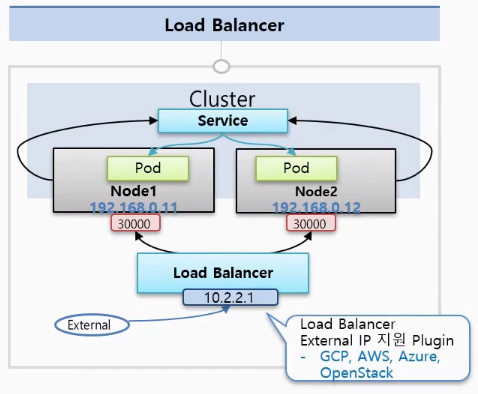

# 8.기본 Object - Service

Service는 기본적으로 자신의 Cluster IP를 가지고 있다.

이 Service를 Pod에 연결시켜 놓으면 Service의 IP를 통해서 Pod에 접근할 수 있게 된다.

그런데 이전에 배운 Pod에도 Cluster내에서 접근할 수 있는 IP가 있는데 왜 Service로 접근할까?

> 그 이유는 Pod의 특성으로 시스템 장애 or 성능 장애로 인해 언제든지 죽을 수 있다.  
> 죽으면 재생성 되도록 설계되었기 때문에 휘발성임!  

그래서 Pod IP는 신뢰성이 떨어진다.

하지만 **Service는 사용자가 직접 지우지 않는한 삭제되거나 재생성되지 않음**.

따라서 Service로 접근하면 항상 연결되어있는 Pod에 접속 가능하다는 장점이 있다.

---

Service는 Pod에 접근을 도와주는 방식에 따라 몇가지 종류로 나뉜다.

## 1.ClusterIP

▲ Service - ClusterIP 방식

가장 기본적인 방식으로 이 IP는 쿠버네티스 Cluster 내에서만 접근이 가능하다.

Pod에 있는 IP와 특징이 똑같다!

따라서 Cluster내의 모든 Object는 접근할 수 있지만 외부(External)에서는 접근할 수 없다.

Pod를 여러개 연결할 수 있고 Service는 트래픽을 분산해서 Pod에 전달해준다.

yaml 내용을 확인해보자.

▲ ClusterIP의 yaml 파일

- Service와 Pod가 연결되기 위한 selector와 label이 그대로 사용된다.
- type: ClusterIP 는 생략할 수 있음 (기본값이 ClusterIP임!)
- port: 9000 는 9000번 포트로 들어올 경우 target의 8080포트로 연결된다는 내용

---

## 2.NodePort

NodePort 타입으로 만들어도 Service에는 기본적으로 ClusterIP가 할당이 되어서 같은 기능이 포함되어 있다.

▲ Service - NodePort 타입

### ⏹NodePort의 큰 특징

> Kubernetes Cluster에 연결되어 있는 모든 Node에게 똑같은 Port가 할당이 되어서 외부로부터 어느 Node던 간에 그 IP의 포트로 접속을 하면 해당 Service에 연결이 된다!  
> 이 Service는 자신에 연결되어있는 Pod에 트래픽을 전달해준다.

### 주의할점!

- pod가 있는 node에만 포트가 할당되는 것이 아니고 모든 node에 Port가 만들어진다.

yaml 파일을 확인해보자.

▲ NodePort yaml파일

- type: NodePort → NodePort 타입으로 설정
- nodePort: port번호 → Port번호를 설정
  - 30000~32767값으로 설정이 가능하고 적지 않는다면 알아서 범위내로 설정된다.

### 추가적인 속성

> 만약 각 Node에 Pod가 하나씩 올라가있다고 가정하면 Node1로 접근하더라도 이 Service는 Node2에 있는 Pod에 트래픽 전달 가능  
> Service입장에서는 어떤 Node에서 온 트래픽인지 상관없이 자신에게 연결된 Node의 Pod에게 전달할 수 있다.

그런데 yaml파일에 `externalTrafficPolicy: Local`로 설정할 경우

특정 Node 포트에 IP로 접근하는 트래픽은 Service가 해당 Node 위에 올려져있는 Pod에만 트래픽을 전달할 수 있음!

---

## 3.Load Balancer

Load Balancer 타입의 Service는 앞에서 다룬 **NodePort의 성격을 그대로** 가지고있다.

### ⏹추가적인 기능

- 각각의 Node에 트래픽을 분산시켜주는 역할을 함

### ⏹주의할 점

- Load Balancer에 접근하기 위한 외부 접속 IP주소는 개별적으로 Kubernetes를 설치했을때 생기지 않음
- 별도로 외부 접속 IP를 할당해줘야함(플러그인이 설치되어있어야 함)
- 만약 GCP, AWS, Azure, OpenStack의 Kubernetes 플랫폼을 사용하면 자체적으로 플러그인이 설치되어있음
  - 따라서 Load Balancer 타입으로 Service를 만들면 알아서 외부에서 접속할 수 있는 IP를 만들어줌!

▲ Service - Load Balancer 타입

yaml 파일을 확인해보면

▲ Load Balancer 타입 yaml 파일

크게 다른점이 없이 타입을 `type: LoadBalancer`로 설정하면 된다.

Service는 이외에도 여러가지 용도로 사용된다.

## 4.언제 어떤 Service를 사용할까?

Service 사용법은 알았는데 각각의 Service 타입을 어느 상황에 사용해야 될까?

### ⏹1. ClusterIP

- ClusterIP는 외부에서 접근할 수 없음
- Cluster 내부에서만 사용하는 IP
- 그렇기 때문에 IP에 접근할 수 있는 대상은 Cluster 인가된 사용자 (운영자)

#### 주된 작업 : Kubernetes 내부 대쉬보드 관리

각 Pod의 서비스상태 디버깅

---

### ⏹2. NodePort

- 물리적인 Host에 IP를 통해 Pod에 접근할 수 있음!
- 대부분의 Host IP는 보안적으로 내부망에서만 접근할 수 있게 네트워크를 구성
- 따라서 Node Port는 클러스터 밖에 있지만 내부망 안에서 접근해야할 때 쓰임
- 일시적인 외부 연동용으로도 사용할 수 있음

내부환경에서 개발을 하다가 외부에 간단한 데모를 보여줄 때 종종 네트워크 중계기에 포트포워딩을 해서
**외부에서 내부에 연결**해서 NodePort를 **잠깐** 뚫어놓고 사용할 수 있음

---

### ⏹3. Load Balancer

#### 실질적으로 외부 시스템에 노출할 때 사용한다.

내부 IP가 노출되지 않고 외부 IP에 안정적으로 서비스를 노출시킬 수 있음
