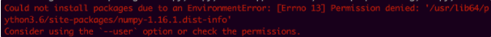
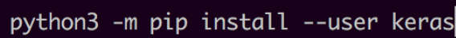
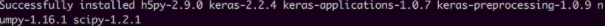

# [Linux] pip install Error : Permission Denied

## Error 원인

AWS EC2 linux 서버에서 pip3 install 중 다음과 같은 에러가 발생
  
```bash
"Could not install packages due to an EnvironmentError: [Errno 13] Permission denied: '/usr/lib64/python3.6/site-packages/numpy-1.16.1.dist-info'

Consider using the `--user` option or check the permissions." 
```

## 해결방법



permission 관련 Error로 아래 명령어를 통해 해결

```bash
python3 -m pip install -user "package name"
```



설치가 완료됐다.



### Reference

- [https://potensj.tist ory.com/73](https://potensj.tistory.com/73)
- [https://github.com/googlesamples/assistant-sdk-python/issues/236](https://github.com/googlesamples/assistant-sdk-python/issues/236)