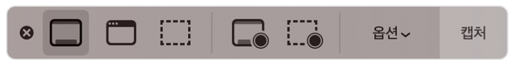

# Mac OS에서 스크린샷 찍기

## 스크린샷 단축키

- shift : ⇧ 
- command : ⌘

### 1️⃣ ⇧ + ⌘ + 3

현재 선택된 모니터의 **전체 화면을 캡쳐**하여 데스크탑에 png 파일로 저장

### 2️⃣ ⇧ + ⌘ + 4

포인터가 십자 모양으로 변하여 **선택한 부분을 캡쳐**

### 3️⃣ ⇧ + ⌘ + 5

> macOS Mojave 버전 이후 부터 더욱 다양한 캡쳐를 할 수 있는 기능이 제공된다.

`⇧ + ⌘ + 5` 를 누르면 아래와 같은 그림이 뜹니다.

 

- 간단한 캡쳐(전체 화면, 윈도우, 선택 영역)부터, 전체 혹은 부분 화면을 **영상(mp4)으로 녹화**하는 것도 가능
- **옵션**을 누르면 **저장 위치**와 **타이머**를 설정하여 다양한 상황에서 캡쳐가 가능하다.

### Reference

- [https://musma.github.io/2020/01/29/mac-capture.html](https://musma.github.io/2020/01/29/mac-capture.html)