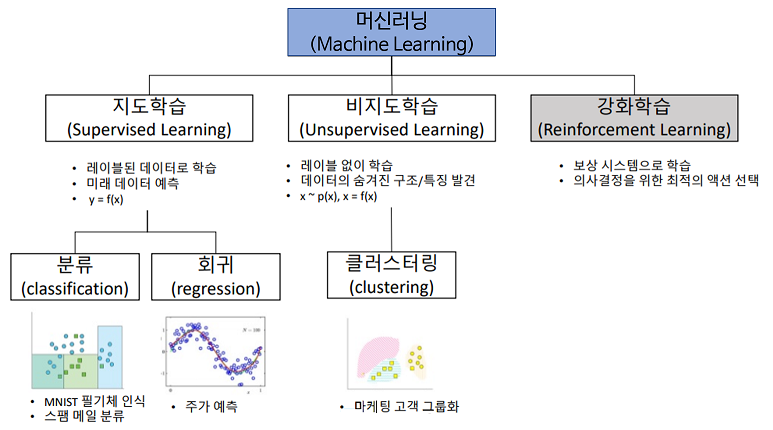
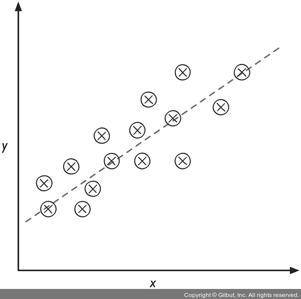
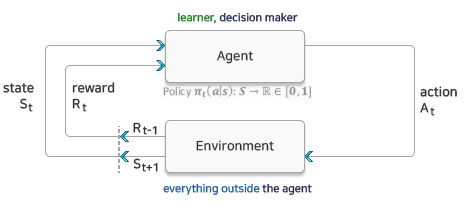
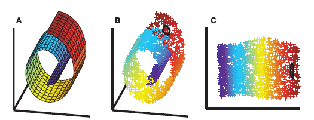
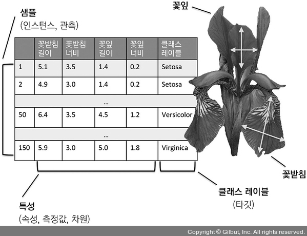

# 1장 컴퓨터는 데이터에서 배운다

<details><summary>머신러닝 교과서 with 파이썬, 사이킷런, 텐서플로</summary>
세바스찬 라스카, 바히드 미자리리 지음, 박해선 옮김
</details>
책을 읽고 정리한 내용입니다.

  

<br><br>

## 목차

**[1.1 데이터를 지식으로 바꾸는 지능적인 시스템 구축](#11-데이터를-지식으로-바꾸는-지능적인-시스템-구축)**  
**[1.2 머신 러닝의 세 가지 종류](#12-머신-러닝의-세-가지-종류)**  
**[1.3 기본 용어와 표기법 소개](#13-기본-용어와-표기법-소개)**   
**[1.4 머신 러닝 시스템 구축 로드맵](#14-머신-러닝-시스템-구축-로드맵)**   
**[1.5 머신 러닝을 위한 파이썬](#15-머신-러닝을-위한-파이썬)**   
**[1.6 요약](#16-요약)**   

---

머신 러닝(machine learning)은 데이터를 이해하는 알고리즘의 과학이자 애플리케이션입니다. 
스스로 학습할 수 있는 머신 러닝 알고리즘을 사용하면 데이터를 지식으로 바꿀 수 있습니다. 

> 말이 좀 어려운 것 같습니다. 쉽게 말해 영어 단어를 그대로 직역하면 ‘기계학습’입니다.  
> 인간이 하나부터 열까지 직접 가르치는 기계를 의미하는 것이 아니라,  
> 학습할 거리를 일단 던져놓으면 이걸 가지고 스스로 학습하는 기계를 의미합니다.  
> ex) 나무 사진(데이터)을 계속 학습하면 기계가 나무인 것을 알아차리는(지식) 것  

먼저 머신 러닝의 주요 개념과 종류를 배웁니다! 관련 용어를 소개하고, 
머신 러닝 기술을 실제 문제 해결에 성공적으로 적용할 수 있는 초석을 다집니다.

- 머신 러닝의 일반적 개념 이해하기
- 세 종류의 학습과 기본 용어 알아보기
- 성공적인 머신 러닝 시스템을 설계하는 필수 요소 알아보기
- 데이터 분석과 머신 러닝을 위한 파이썬을 설치하고 설정하기

## 1.1 데이터를 지식으로 바꾸는 지능적인 시스템 구축

20세기 후반에 **데이터에서 지식을 추출하여 예측**하는 자기 학습(self-learning) 알고리즘과 관련된 
인공 지능(Artificial Intelligence, AI)의 하위 분야로 머신러닝이 출현했습니다.

사람이 수동으로 대량의 데이터를 분석하여 규칙을 유도하고 **모델을 만드는 대신**,
**머신 러닝**이 데이터에서 더 효율적으로 지식을 추출하여 예측 모델과 데이터 기반의 의사 결정 성능을
점진적으로 향상시킬 수 있습니다.
> 견고한 이메일 스팸 필터, 편리한 텍스트와 음성 인식 소프트웨어, 믿을 수 있는 웹 검색 엔진, 체스 대결 프로그램 등  

<br><br>
## 1.2 머신 러닝의 세 가지 종류

  

- 지도 학습(Supervised Learning)  
- 비지도 학습(Unsupervised Learning)  
- 강화 학습(Reinforcement Learning)  

### 1.2.1 지도 학습으로 미래 예측
지도 학습의 주요 목적은 레이블(label)된 훈련 데이터에서 모델을 학습하여 본 적 없는 미래 데이터에 대한 예측을 만드는 것입니다.  
`여기서 지도(Supervised)는 희망하는 출력 신로(레이블)가 있는 일련의 샘플을 의미`

> 레이블(label) = 머신 러닝에서 특정 샘플에 할당된 클래스(class)  
> 레이블의 범주(category) = 클래스  
> 혼동을 피하기 위해 category가 레이블 범주를 의미하지 않을 때는 '카테고리'로 작성  

  

#### ex) 스팸 이메일
> 레이블된 이메일 데이터셋에서 지도 학습 머신 러닝 알고리즘을 사용하여 모델을 훈련할 수 있음!  
이 **데이터셋**은 스팸 또는 스팸이 아닌 이메일로 정확하게 표시되어 있습니다.  
훈련된 모델은 새로운 이메일이 **두 개의 범주(category)** 중 어디에 속하는지 예측합니다.  
이 처럼 개별 클래스 레이블이 있는 지도 학습이 분류(classification)입니다.  

### 분류: 클래스 레이블 예측
과거의 관측을 기반으로 새로운 샘플의 범주형 클래스 레이블을 예측하는 것이 목적  
클래스 레이블을 이산적(discreate)이고 순서가 없어 샘플이 속한 그룹으로 이해할 수 있습니다.  
> 이진 분류(binary classification): 스팸 이메일 감지  
> 다중 분류(multiclass classification): 손으로 쓴 글자 인식

  

지도 학습 알고리즘을 사용하여 두 클래스를 구분할 수 있는 규칙을 학습합니다. 
이 규칙은 점선으로 나타난 결정 경계(decision boundary)입니다. 
새로운 데이터의 x_1, x_2 값이 주어지면 두 개의 범주 중 하나로 분류합니다.

### 회귀: 연속적인 출력 값 예측

두 번째 지도 학습의 종류는 연속적인 출력 값을 예측하는 회귀 분석입니다.  

회귀는 **예측 변수**(predictor variable)(또는 입력(input))와 연속적인 **반응 변수**(response variable)(또는 출력(outcome))가 
주어졌을 때 **출력 값을 예측하는 두 변수 사이의 관계**를 찾습니다.

  

입력 x와 타깃 y가 주어지면 샘플과 직선 사이 거리가 최소가 되는 직선을 그을 수 있습니다. 
일반적으로 평균 제곱 거리를 사용합니다. 이렇게 데이터에서 학습한 직선의 기울기와 절편(intercept)을 사용하여 
새로운 데이터의 출력 값을 예측합니다.

### 1.2.2 강화 학습으로 반응형 문제 해결
**강화 학습**은 환경과 상호 작용하여 시스템(agent) 성능을 향상하는 것이 목적입니다. 
환경의 현재 상태 정보는 **보상(reward) 신호를 포함**하기 때문에 강화 학습을 지도 학습과 관련된 분야로 생각할 수 있습니다. 
강화 학습의 피드백은 정답(ground truth) 레이블이나 값이 아닙니다. 보상 함수로 얼마나 행동이 좋은지를 측정한 값입니다. 
에이전트는 환경과 상호 작용하여 보상이 최대화되는 일련의 행동을 강화 학습으로 학습합니다.
탐험적인 시행착오(trial and error) 방식이나 신중하게 세운 계획을 사용합니다.

> **설명이 어려워서 추가 조사**  
> 강화 학습(Reinforcement Learning)은 기계 학습이 다루는 문제들 중 하나로   
> 어떤 환경 안에서 정의된 에이전트가 현재의 상태를 인식하여,  
> 선택 가능한 행동들 중 보상을 최대화하는 행동 혹은 행동 순서를 선택하는 방법  

  

- 에이전트(Agent) : 상태를 관찰, 행동을 선택, 목표지향
- 환경(Environment) : 에이전트를 제외한 나머지 (물리적으로 정의하기 힘듦)
- 상태(State) : 현재 상황을 나타내는 정보
- 행동(Action) : 현재 상황에서 에이전트가 하는 것
- 보상(Reward) : 행동의 좋고 나쁨을 알려주는 정보

강화 학습의 대표적인 예는 체스 게임입니다. 에이전트는 체스판의 상태(환경)에 따라 기물의 이동을 결정합니다. 
보상은 게임을 종료했을 때 승리하거나 패배하는 것으로 정의할 수 있습니다.

`강화 학습 애플리케이션은 책 범위를 넘어선다. 추가로 공부해도 좋을 것 같다`

### 1.2.3 비지도 학습으로 숨겨진 구조 발견

**비지도 학습**에서는 *레이블되지 않거나 구조를 알 수 없는 데이터* 를 다룹니다. 비지도 학습 기법을 사용하면 알려진 출력 값이나 보상 함수의 도움을 받지 않고 의미 있는 정보를 추출하기 위해 데이터 구조를 탐색할 수 있습니다.  


#### 군집: 서브그룹 찾기  

군집(clustering)은 사전 정보 없이 쌓여 있는 그룹 정보를 의미 있는 서브그룹(subgroup) 또는 **클러스터(cluster)** 로 조직하는 탐색적 데이터 분석 기법입니다. 분석 과정에서 만든 각 클러스터는 어느 정도 유사성을 공유하고 다른 클러스터와는 비슷하지 않은 샘플 그룹을 형성합니다. 이따금 군집을 비지도 분류(unsupervised classification)라고 하는 이유가 여기 있습니다.  

> ex) 마케터가 관심사를 기반으로 고객을 그룹으로 나누어 각각에 맞는 마케팅 프로그램을 개발할 수 있습니다.

  

위 그림은 군집이 어떻게 레이블되지 않는 데이터를 특성 x1과 x2의 유사도를 기반으로 세 개의 개별적인 그룹으로 조직화하는지 보여 줍니다.

#### 차원 축소: 데이터 압축
비지도 학습의 또 다른 하위 분야는 차원 축소(dimensionality reduction)입니다.  
> 고차원의 데이터를 다루어야 하는 경우는 흔합니다.  
> 즉, 하나의 관측 샘플에 많은 측정 지표가 있습니다.  
> 이로 인해 머신 러닝 알고리즘의 계산 성능과 저장 공간의 한계에 맞닥뜨릴 수 있습니다.  

비지도 차원 축소는 잡음(noise) 데이터를 제거하기 위해 특성 전처리 단계에서 종종 적용하는 방법입니다. 이런 잡음 데이터는 특정 알고리즘의 예측 성능을 감소시킬 수 있습니다. 차원 축소는 관련 있는 정보를 대부분 유지하면서 더 작은 차원의 부분 공간(subspace)으로 데이터를 압축합니다.  

이따금 차원 축소는 데이터 시각화에도 유용합니다. 예를 들어 고차원 특성을 1차원 또는 2차원, 3차원 특성 공간으로 투영하여 3D와 2D 산점도(scatterplot)나 히스토그램(histogram)으로 시각화합니다. 아래 그림은 비선형(nonlinear) 차원 축소를 적용하여 3D 스위스롤(Swiss Roll) 모양의 데이터를 새로운 2D 특성의 부분 공간으로 압축하는 예를 보여 줍니다.

  


## 1.3 기본 용어와 표기법 소개

붓꽃 예시를 통해 책에서 사용할 기본 용어를 알아보겠습니다.  
- 아래의 표는 붓꽃(Iris) 데이터셋 일부를 보임  
- 붓꽃 데이터셋은 Setosa, Versicolor, Virginica 세 종류 150개의 붓꽃 샘플을 포함  
- 각 붓꽃 샘플은 데이터셋에서 하나의 행(row)으로 표현  
- cm단위의 측정값은 열(column)에 저장 = 데이터셋의 특성(feature)이라고도 함

 

> 간단하고 효율적으로 표기하고 코드를 구현할 수 있도록 기초적인 **선형대수학(linear algebra)** 을 사용하겠습니다. 다음 장부터는 **행렬(matrix)과 벡터(vector)** 표기로 데이터를 표현합니다. 일반적인 관례에 따라서 샘플은 특성 행렬 X에 있는 행으로 나타내고, 특성은 열을 따라 저장합니다.  

<br>

> 위 첨자 i는 i번째 훈련 샘플  
> 아래 첨자 j는 훈련 데이터셋의 j번째 차원(측정값, 속성)  
> 굵은 소문자는 벡터   
> 굵은 대문자는 행렬  

<br><br>

## 1.4 머신 러닝 시스템 구축 로드맵


### 1.4.1 전처리: 데이터 형태 갖추기

- 주어진 원본 데이터의 형태가 학습 알고리즘이 최적의 성능을 내기에 적합한 경우는 거의 없음!  
- 데이터 전처리는 모든 머신 러닝 애플리케이션에서 가장 중요한 단계 중 하나  
- 많은 머신 러닝 알고리즘에서 최적의 성능을 내려면 선택된 특성이 같은 스케일을 가져야 함  
- 표준 정규 분포(standard normal distribution)로 변환하는 경우가 많음

`표준 정규 분포: 특성을 [0, 1] 범위로 변환하거나 평균이 0이고 단위 분산을 가짐-다음장에서 공부`  

> 붓꽃 데이터셋을 생각해 보면 원본 데이터는 일련의 꽃 이미지들이고,  
> 여기서 의미 있는 특성을 추출해야 합니다. 
> 유용한 특성은 꽃의 색깔, 색조, 채도가 될 수 있습니다. 

**선택된 특성이 중복된 정보를 가진 경우**
일부 선택된 특성은 매우 상관관계가 높아 어느 정도 중복된 정보를 가질 수 있습니다.  
- `차원 축소 기법`을 사용하여 특성을 저차원 부분 공간으로 압축
  - 특성 공간의 차원을 축소하면 저장 공간이 덜 필요하고 
  - 학습 알고리즘을 더 빨리 실행할 수 있습니다. 
  - `어떤 경우`에는 차원 축소가 모델의 예측 성능을 높이기도 합니다. 
    - 데이터셋에 관련 없는 특성(또는 잡음)이 매우 많을 경우
    - 즉 신호 대 잡음비(Signal-to-Noise Ratio, SNR)가 낮은 경우입니다.

**머신 러닝 알로리즘이 잘 작동하는지?**
머신 러닝 알고리즘이 훈련 데이터셋에서 잘 작동하고 새로운 데이터에서도 잘 일반화되는지 확인하려면 
- 데이터셋을 랜덤하게 훈련 세트와 테스트 세트 나눔   
- **훈련 세트**에서 머신 러닝 모델을 훈련하고 최적화 
- **테스트 세트**는 별도로 보관하고 최종 모델을 평가하는 맨 마지막에 사용

### 1.4.2 예측 모델 훈련과 선택

> 여러 머신 러닝 알고리즘은 각기 다른 문제를 해결하기 위해 개발 됨  
 
- 현실에서는 가장 좋은 모델을 훈련하고 선택하기 위해 최소한 몇 가지 알고리즘을 비교해야 함  
- 여러 모델을 비교하기 전에 먼저 성능을 측정할 지표를 결정  
- 분류에서 널리 사용되는 지표는 **정확도(accuracy)**  
- 정확도는 *정확히 분류된 샘플 비율*  

모델 선택에 테스트 세트를 사용하지 않고 최종 모델을 평가하려고 따로 보관한다면  
**테스트 세트와 실제 데이터에서 어떤 모델이 잘 동작할지를 어떻게 알까?**
두 가지 기법을 통해 이 이슈를 해결합니다.

#### 교차 검증 기법  
모델의 일반화 성능을 예측하기 위해 훈련 데이터를 훈련 세트와 검증 세트로 더 나눕니다. 

#### 하이퍼파라미터 최적화 기법 
또 머신 러닝 라이브러리들에서 제공하는 알고리즘의 기본 `하이퍼파라미터`가 현재 작업에 최적이라고 기대할 수 없습니다. 
이어지는 장에서 모델 성능을 상세하게 조정하기 위해 하이퍼파라미터 최적화 기법을 많이 사용할 것입니다. 
*하이퍼파라미터(hyperparameter)는 데이터에서 학습하는 파라미터가 아니라 모델 성능을 향상하기 위해 사용하는 다이얼*   
> 이어지는 장에서 실제 예제를 보면 명확하게 이해할 수 있을 것입니다.  

### 1.4.3 모델을 평가하고 본 적 없는 샘플로 예측

훈련 세트에서 최적의 모델을 선택한 후 테스트 세트를 사용하여 이전에 본 적이 없는 데이터에서 얼마나 성능을 내는지 예측하여 일반화 오차를 예상합니다. 
> 이 성능에 만족한다면 이 모델을 사용하여 미래의 새로운 데이터를 예측할 수 있습니다.  


> 이전에 언급한 특성 스케일 조정과 차원 축소 같은 단계에서 사용한 파라미터는 훈련 세트만 사용하여 얻은 것임을 주목해야 합니다. 나중에 동일한 파라미터를 테스트 세트는 물론 새로운 모든 샘플을 변환하는 데 사용합니다. 그렇지 않으면 테스트 세트에서 측정한 성능은 과도하게 낙관적인 결과가 됩니다

<br><br>
## 1.5 머신 러닝을 위한 파이썬

- 파이썬은 데이터 과학 분야에서 가장 인기 있는 프로그래밍 언어
- 훌륭한 개발자와 오픈 소스 공동체가 개발한 유용한 라이브러리가 많음

**계산량이 많을 때 성능 저하는?**
계산량이 많은 작업에서는 파이썬 같은 인터프리터 언어의 성능이 저수준 프로그래밍 언어보다 낮습니다. 포트란(Fortran)과 C 언어로 만든 저수준 모듈 위에 구축된 넘파이(NumPy)와 사이파이(SciPy) 같은 라이브러리 덕택에 다차원 배열에서 벡터화된 연산을 빠르게 수행할 수 있습니다.

> 현재 가장 인기 있고 사용하기 쉬운 오픈 소스 머신 러닝 라이브러리 중 하나인 
**사이킷런**(Scikit-learn) 라이브러리로 머신 러닝 프로그래밍 작업을 진행   

### 1.5.1 파이썬과 PIP에서 패키지 설치  
파이썬은 세 개의 주요 운영 체제에서 사용 가능  
- 마이크로소프트 윈도(Microsoft Windows)  
- macOS  
- 리눅스(Linux)  
파이썬 공식 웹 사이트(https://www.python.org)에서 문서와 설치 파일을 내려받을 수 있습니다.

> 모든 예제는 3.7.2 버전 이상으로 진행(최신 버전 사용 권장)  
> 파이썬 2.7 버전을 사용한다면 차이점 참고  
> 파이썬 위키(https://wiki.python.org/moin/Python2orPython3)

파이썬을 설치한 후 터미널(Termianl)에서 pip 명령으로 필요한 파이썬 패키지 설치 가능!

```bash
> pip install 패키지 이름
```

패키지 업데이트는 --upgrade 옵션을 사용
```bash
> pip install --upgrade 패키지 이름
```

### 1.5.2 아나콘다 파이썬 배포판과 패키지 관리자 사용

- 과학 컴퓨팅을 위해서는 아나콘다(Anaconda) 파이썬 배포판을 권장  
- 아나콘다는 무료로 사용할 수 있고 기업이 사용하기 충분한 수준의 파이썬 배포판
- 데이터 과학, 수학, 공학용 파이썬 필수 패키지들을 모두 포함하고 있음
- 주요 운영 체제를 모두 지원  
> 아나콘다 설치 파일 https://www.anaconda.com/download/  
> 아나콘다 공식 문서 https://docs.anaconda.com/anaconda/user-guide/getting-started/

아나콘다를 설치한 후 다음 명령으로 필요한 파이썬 패키지를 설치할 수 있습니다.
```bash
> conda install 패키지 이름
```

설치한 패키지를 업데이트할 때는 다음 명령을 사용합니다.
```bash
> conda update 패키지 이름
```

### 1.5.3 과학 컴퓨팅, 데이터 과학, 머신 러닝을 위한 패키지

- 예제에서 데이터를 저장하고 조작하는 데 **넘파이 다차원 배열**을 주로 사용
- 판다스(Pandas)도 사용!
  - 판다스는 넘파이 위에 구축된 라이브러리
  - 테이블 형태의 데이터를 아주 쉽게 다룰 수 있는 고수준 도구를 제공
  - 종종 정량적인 데이터를 시각화하면 직관적으로 이해하는 데 매우 유용
  - 이를 위해 많은 옵션을 제공하는 맷플롯립(Matplotlib) 라이브러리를 사용
  
예제의 주요 파이썬 패키지 버전은 다음과 같습니다. 여러분 컴퓨터에 설치된 패키지와 버전이 동일하거나 더 높은지 확인하세요. 예제 코드를 정상적으로 실행하려면 버전을 맞추는 것이 좋습니다.

> - NumPy 1.16.1  
> - SciPy 1.2.1  
> - Scikit-learn 0.20.2  
> - Matplotlib 3.0.2  
> - Pandas 0.24.1  
> - TensorFlow 2.0.0-alpha0  

## 1.6 요약

- 지도 학습의 주요 하위 분야 두 개는 **분류**와 **회귀**
  - 분류 모델은 샘플을 알려진 클래스로 분류
  - 회귀 분석은 타깃 변수의 연속된 출력을 예측
- 비지도 학습은 레이블되지 않은 데이터에서 구조를 찾는 유용한 기법
  - 전처리 단계에서 데이터 압축에도 유용하게 사용
- 머신 러닝을 적용하는 전형적인 로드맵 공부
  - 이어지는 장에서 좀 더 깊은 주제와 실전 예제를 다룰 예정! 
- 파이썬 환경과 필수 패키지를 설치하고 업데이트해서 머신 러닝을 작업할 준비 완료

뒷 챕터에서 머신 러닝 이외에도 데이터셋을 전처리하는 여러 기법을 소개합니다. 머신 러닝 알고리즘의 성능을 최대로 끌어내는 데 도움이 될 것입니다. 분류 알고리즘을 폭넓게 다루겠지만 회귀 분석과 군집 알고리즘도 살펴볼 것입니다.
