# 7장 다양한 모델을 결합한 앙상블 학습

> 포스팅은 '머신러닝 교과서 with 파이썬, 사이킷런, 텐서플로' 교재로 공부하고 정리하여 작성하였습니다.

> 다양한 분류 모델을 평가 & 튜닝하는 기술을 토대로 분류기 집합을 구성하는 여러가지 방법을 살펴보자.

-   다수결 투표를 기반으로 예측 만들기
-   중복을 허용하여 랜덤하게 훈련 샘플을 뽑는 배깅(bagging)을 사용해서 과대적합 감소하기
-   앞선 모델의 오차를 학습하는 약한 학습기(weak learner)로 구성된 부스팅(boosting)으로 강력한 모델 구축하기

## 7.1 앙상블 학습

**앙상블 학습(ensemble learning)의 목표**

여러 분류기를 **하나의 메타 분류기로 연결**하여 개별 분류기보다 더 좋은 일반화 성능을 달성하는 것

> 앙상블의 작동 원리와 높은 일반화 성능을 내는 이유에 대해 알아보자.

과반수 투표(majority voting) - 분류기의 과반수가 예측한 클래스 레이블을 선택하는 단순한 방법 (이진 클래스 분류)

다수결 투표(plurality voting) - 가장 많은 투푤르 받은 클래스 레이블을 선택 (다중 클래스 일반화)  
  

  

이 앙상블은 열개의 분류기로 구성 - 각각의 심볼(삼각형, 사각형, 원)은 고유한 클래스 레이블을 나타낸다.

먼저 훈련 세트를 사용하여 m개의 다른 분류기(C₁ ~ Cm)를 훈련시킨다.

> 앙상블 방법에 따라 결정트리, 서포트 벡터머신, 로지스틱 회귀 분류기와 같은 여러가지 알고리즘으로 구축 가능  
> 또는 같은 분류 알고리즘을 사용하고 훈련 세트의 부분 집합(subset)을 달리하여 학습 가능

유명한 앙상블 방법 중 하나는 서로 다른 결정 트리를 연결한 랜덤 포레스트(random forest)이다.

  

그림 7-2는 과반수 투표를 사용한 일반적인 앙상블 방법이다.

**과반수 투표나 다수결 투표로 클래스 레이블을 예측하려면** 개별 분류기 Cj의 예측 레이블을 모아 가장 많은 표를 받은 레이블을 선택한다.

  

예를 들어 class1 = -1이고 class2 = +1인 이진 분류 작업에서 과반수 투표 예측은 다음과 같다.

  

**앙상블 방법이 개별 분류기보다 성능이 뛰어난 이유?**

간단한 조합 이론을 적용해 이해해 보자.

이진 분류 작업

-   동일한 에러율(error rate)을 가진 n개의 분류기
-   모든 분류기는 독립적, 발생하는 오차는 서로 상관관계 없음

이 분류기의 앙상블이 만드는 오차 확률을 이항 분포(binomial distribution)의 확률 질량 함수(probability mass function)로 표현할 수 있다.

   

여기서 ( n k )는 이항 계수(binomial coefficient)로 n개 원소에서 k개를 뽑는 조합의 가짓수

▼ 이항 계수?

크기가 n인 집합에서 순서를 고려하지 않고 k개의 부분 집합을 선택할 수 있는 방법을 나타낸다.

순서에 상관없기 때문에 조합 또는 조합의 가짓수로 표현하기도 함

이 식은 앙상블의 예측이 틀릴 확률을 계산한다. 

예를 들어 에러율이 0.25인 분류기 11개로 구성된 앙상블의 에러율은 다음과 같다.

   

앙상블의 에러율(0.034)은 개별 분류기의 에러율(0.25)보다 훨씬 낮다.

이상적인 앙상블 분류기와 다양한 범위의 분류기를 가진 경우와 비교하기 위해 파이썬으로 확률 질량 함수를 구현해보았다.

   

분류기 에러가 0.0 에서 1.0까지 걸쳐 있을 때 앙상블의 에러율을 계산하고 그래프로 시각화하였다.

실선이 Ensemble error이고 점선이 Base Error이다.

개별 분류기가 무작위 추측(e < 0.5)보다 성능이 좋을 때 앙상블의 에러 확률이 개별 분류기보다 좋은 것을 알 수 있다.

## 7.2 다수결 투표를 사용한 분류 앙상블

> **파이썬으로 간단한 다수결 투표 앙상블 분류기 구현하기!**

### 7.2.1 간단한 다수결 투표 분류기 구현

> 이 절에서 구현할 알고리즘은 여러 가지 분류 모델의 신뢰도에 가중치를 부여하여 연결할 수 있다.  
> 특정 데이터셋에서 개별 분류기의 약점을 보완하는 강력한 메타 분류기를 구축하는 것이 목표!

수학적으로 표현하면 가중치가 적용된 다수결 투표는 다음과 같다.

   

wj = Cj에 연관된 가중치

y = 앙상블이 예측한 클래스 레이블

Xa = 특성 함수(characteristic function)

A = 고유한 클래스 레이블 집합

가중치가 동일하면 이 식을 다음과 같이 간단히 쓸 수 있다.

   

> 통계학에서 최빈값은 집합에서 가장 자주 발생하는 이벤트나 결과!  
> 예를 들어 mode{1, 2, 1, 1, 2, 4, 5, 4} = 1

▼ 가중치 개념

**세 개의 분류기 Cj ( j ∈{0,1} )가 있고 샘플 x의 클래스 레이블을 예측**

세 개의 분류기 중 두 개가 클래스 0을 예측하고 C₃ 하나가 샘플을 클래스 1로 예측하고 가중치가 동일하다면  
다수결 투표는 이 샘플이 클래스 0에 속한다고 예측할 것이다.

   

 이제 C₃ 에 가중치 0.6을 할당 하고 나머지에 0.2를 부여해 보면  

   

직관적으로 생각했을 때 3 x 0.2 = 0.6 이기 때문에 C₃의 예측이 나머지 두 개보다 예측보다 3배 더 가중된다.  
즉 다음과 같이 쓸 수 있다.  

   

파이썬 코드로 이를 구현해보자.

   

argmax와 bincount 함수를 사용하면 가중치가 적용된 다수결 투표를 구현할 수 있다.

3장에서 로지스틱 회귀에 대해 언급했던 것처럼 사이킷런의 일부 분류기는 predict\_proba 메서드에서 예측 클래스 레이블의 확률을 반환할 수 있다.

앙상블의 분류기가 잘 보정(calibration)되어 있다면 다수결 투표에서 클래스 레이블 대신 예측 클래스 확률을 사용하는 것이 좋다.

확률을 사용하여 클래스 레이블을 예측하는 다수결 투표 버전은 다음과 같이 쓸 수 있다.

   

**Pij** = 클래스 레이블 i에 대한 j번째 분류기의 예측 확률

앞선 예제에 이어서 클래스 레이블 i ∈ { 0, 1 }인 이진 분류 문제에서 세 개의 분류기로 구성된

앙상블 Cj( j ∈ { 1, 2, 3 }을 가정하면 어떤 샘플 x에 대한 분류기 Cj는 다음과 같은 클래스 소속 확률을 반환한다.

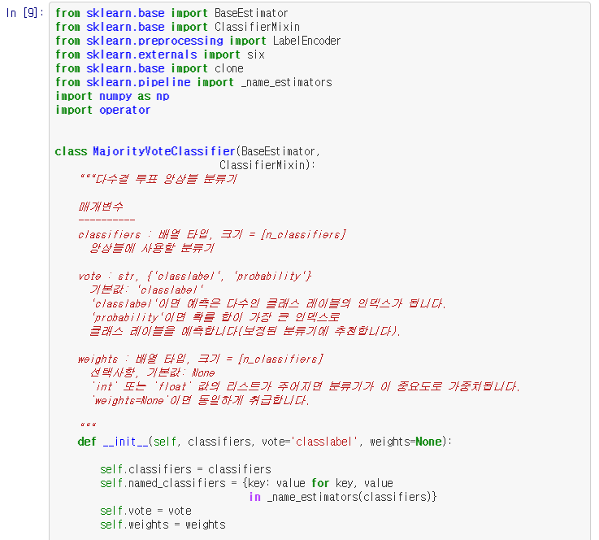   

그다음 각 클래스 확률을 다음과 같이 계산할 수 있다.

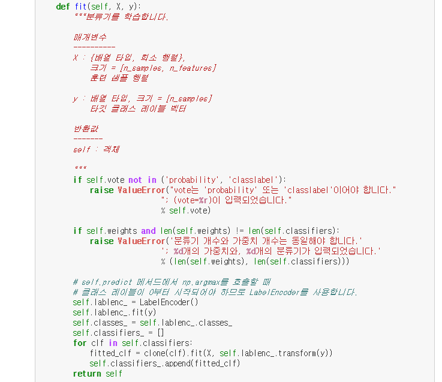   

넘파이의 average와 argmax 함수를 사용하여 클래스 확률 기반으로 가중치가 적용된 다수결 투표를 구현할 수 있다.

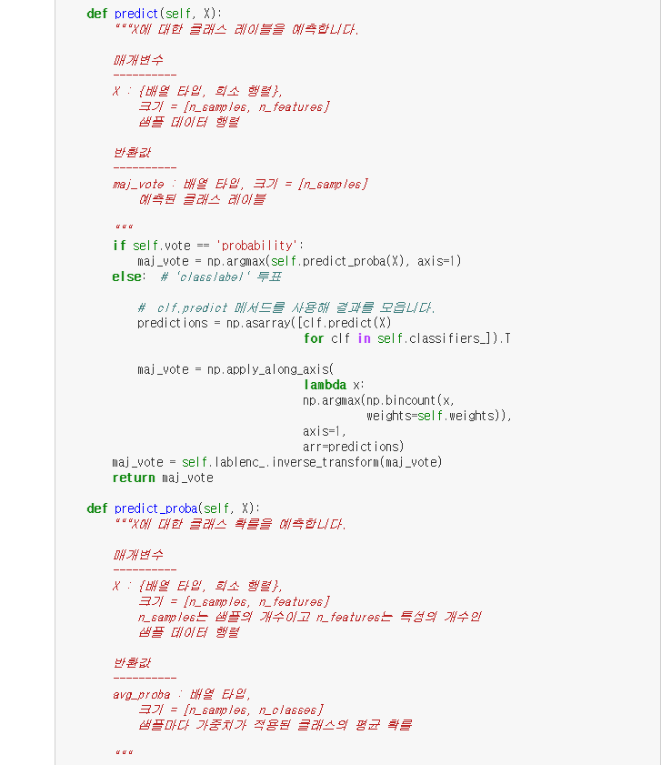   

모두 결합하여 MajorityVoteClassifier 파이썬 클래스를 구현하면

   
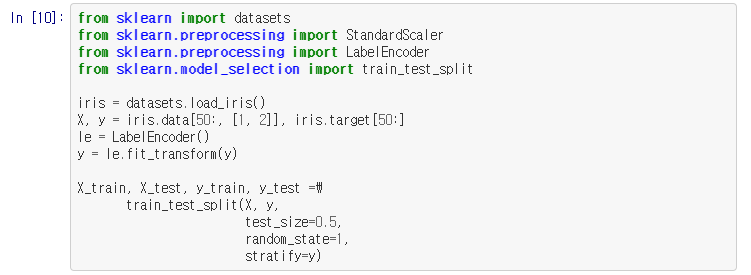  

BaseEstimator와 ClassifierMixin 클래스를 상속하여 기본적인 기능들도 상속받는다.

get\_params와 set\_params 메소드가 있고 예측 정확도를 계산하는 score 메소드가 포함된다.

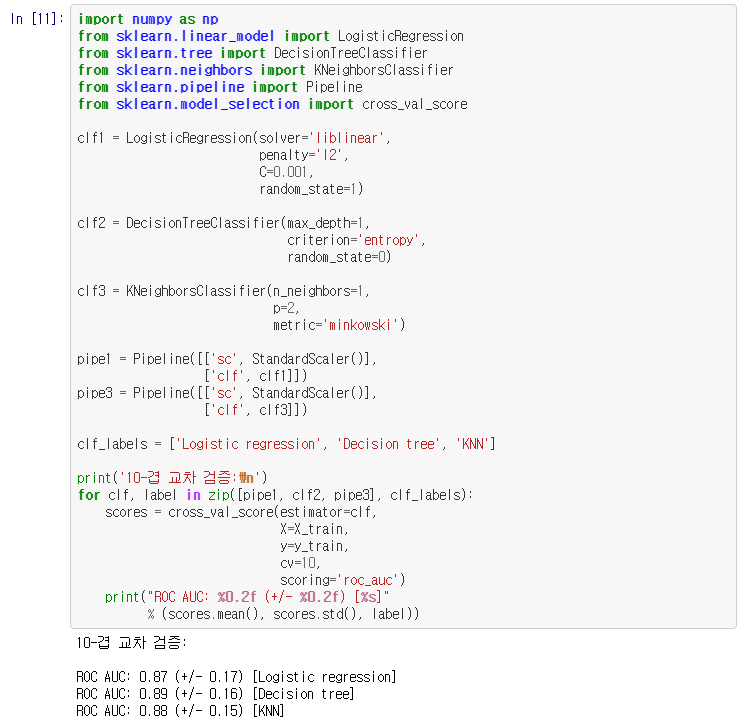   
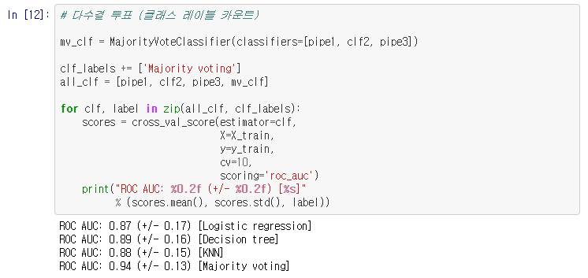   

**predict 메소드**

-   vote = 'classlael' 객체 - 클래스 레이블에 기반을 둔 다수결 투표를 사용하여 클래스 레이블을 예측한다.
-   vote = 'probability' 객체 - 클래스 소속 확률을 기반으로 클래스 레이블을 예측

**predict\_proba 메소드**

-   ROC AUC를 계산하기 위해 평균 확률을 반환

앙상블에 있는 각 분류기의 매개변수에 접근하기 위해 \_name\_estimators 함수를 사용했고

따로 get\_params 메소드를 정의했다.

> 그리드서치를 사용하여 하이퍼 파라미터를 튜닝할 때 완전히 이해될 것이다!

### 7.2.2 다수결 투표 방식을 사용하여 예측 만들기

> 이제 이전 절에서 MajorityVoteClassifier 클래스를 사용한다.  
> 먼제 테스트를 위한 데이터셋을 준비한다.

앞서 CSV 파일에서 데이터셋을 읽는 것은 연습했고, 사이킷런의 datasets 모듈을 사용하여 붓꽃 데이터셋을 읽어 보자!

파라미터 : 꽃받침 너비, 꽃잎 길이 두 개의 특성만 사용하여 예제 구성

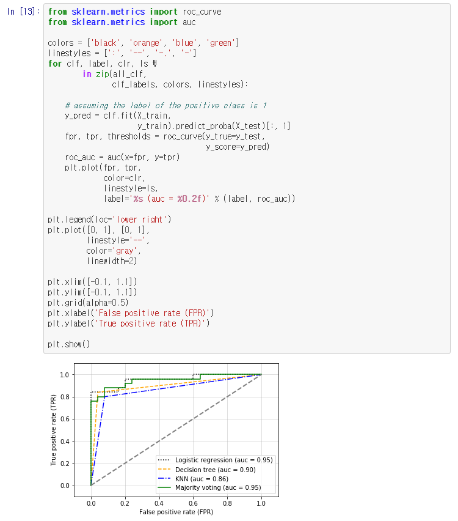   

붓꽃 데이터 샘플을 훈련 데이터와 테스트 데이터 50:50으로 나눈 후

훈련 세트를 사용하여 서로 다른 세 개의 분류기를 훈련한다!

-   로지스틱 회귀 분류기
-   결정 트리 분류기
-   k-최근접 이웃 분류기

각 분류기를 앙상블로 묶기 전에 훈련 세트에서 10-겹 교차 검증으로 성능을 평가한다.

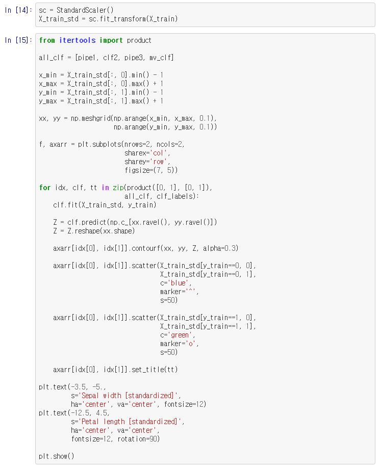   

출력 결과에서 볼 수 있듯이 각 분류기의 예측 성능은 거의 비슷하다.

**이제 MajorityVoteClassifier 클래스로 각 분류기를 하나로 연결하자!**

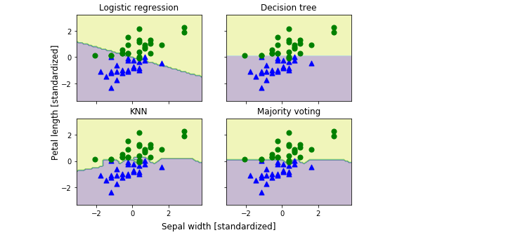   

결과에서 보듯이 10-겹 교차 검증으로 평가했을 때 **MajorityVoteClassifier의 성능이 개별 분류기보다 뛰어나다**.

## 7.3 앙상블 분류기의 평가와 튜닝

본 적 없는 데이터에 대한 MajorityVoteClassifier의 일반화 성능을 확인하기 위해 ROC 곡선을 그려본다.

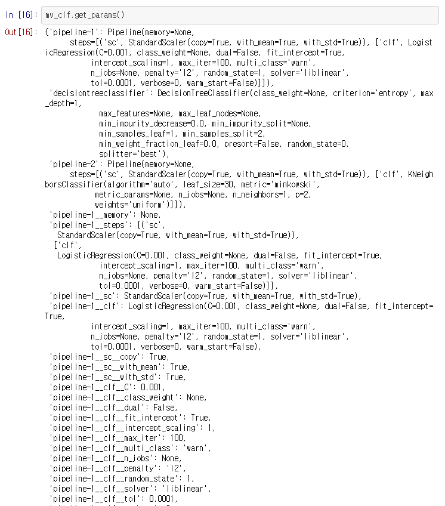   

이 분류 문제에서는 두 개의 특성만 선택했기 때문에 앙상블의 결정 경계가 어떤 모습인지 확인이 가능하다.

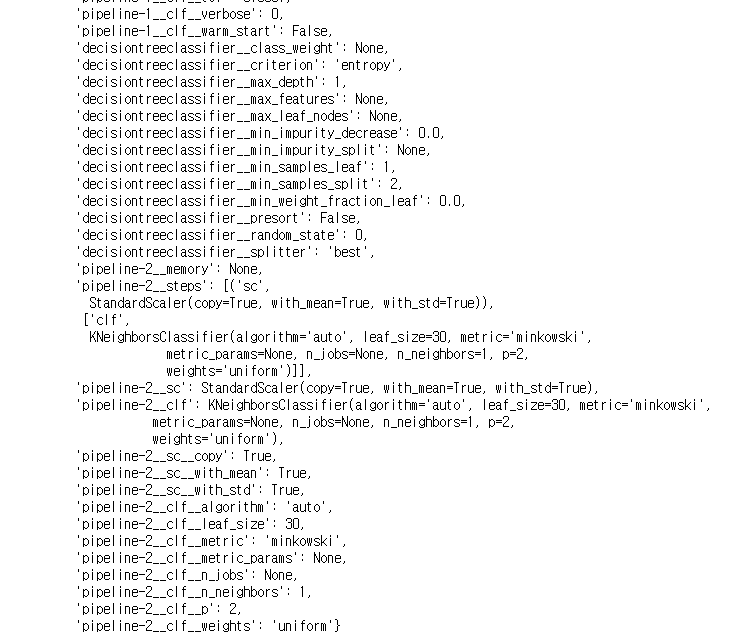   
   

앙상블 분류기의 결정 경계는 개별 분류기의 결정 경계를 혼합한 것처럼 보인다!

앙상블을 위해 개별 분류기의 매개변수를 튜닝하기 전에 GridSearchCV 객체 안에 있는 매개변수에 어떻게 접근할 수 있는지 get\_params 메소드를 호출해서 알아보면

  
   

메소드에서 반환되는 값을 살펴보면 개별 분류기의 속성에 접근하는 방법을 알 수 있다.

   

여기서 볼 수 있듯이 규제 강도가 가장 낮을 때 최상의 교차 검증 결과를 얻는다!

## 7.3 배깅 : 부트스트랩 샘플링을 통한 분류 앙상블

### 7.3.1 배깅 알고리즘의 작동 방식

 배깅 분류기의 부트스트랩 샘플링의 작동 방식을 확실히 이해하기 위해 그림 7-7에 나오는 예를 생각해보자.

일곱 개의 훈련 샘플에서 배깅 단계마다 중복을 허용하여 랜덤하게 샘플링한다. 

각각의 부트스트랩 샘플을 사용하여 분류기 Cj를 학습한다.

일반적으로 배깅 샘플 학습은 가지치기하지 않는 결정 트리를 분류기로 사용한다.
각 분류기는 훈련 세트에서 추출한 랜덤한 부분 집합을 사용하고,

중복을 허용한 샘플링을 하기 때문에 각 부분 집합에는 일부가 중복되어 있고

원본 샘플 중 일부는 포함되어 있지 않는다.

개별 분류기가 부트스트랩 샘플에 학습되고 나면 다수결 투표를 사용하여 예측을 모은다.

배깅은 3장에서 소개한 랜덤 포레스트 분류기와도 관련이 있다.
사실 랜덤포레스트는 개별 결정 트리를 학습할 때 랜덤하게 특성의 부분 집합을 선택하는
배깅의 특별한 경우이다.
7.3.2 배깅으로 Wine 데이터셋의 샘플 분류
배깅을 적용하기 위해 4장에서 소개한 Wine 데이터셋으로 좀 더 복잡한 분류 문제를 만들어보자.

여기서는 와인 클래스 2와 클래스 3만 사용하고 두개의 특성 'Alcohol'과 'OD280/OD315 of dilutes wines'만 사용한다.

그다음 클래스 레이블을 이진 형태로 인코딩하고 80%는 훈련 세트로 20%는 테스트 세트로 분리한다.

사이킷런에는 BaggingClassifier 분류기가 이미 구현되어 있다!

이 클래스는 ensemble 모듈에서 임포트할 수 있다. 여기서는 훈련 세트로부터 추출한 부트스트랩 샘플에서 가지치기가 없는 500개의 결정 트리를 학습하여 앙상블을 만들겠다.

그다음 배깅 분류기와 가지치기가 없는 단일 결정 트리에서 훈련 세트와 테스트 세트의 예측 정확도를

계산하여 성능을 비교한다.

출력된 정확도 값을 보면 가지치기가 없는 결정 트리는 모든 훈련 샘플을 정확하게 예측했다.

테스트 정확도는 확실히 낮기 때문에 모델의 분산이 높다는 것(과대적합)을 나타낸다. 

결정 트리와 배깅 분류기의 훈련 정확도가 훈련 세트에서 비슷하지만 테스트 세트의 정확도로 미루어 보아 배깅 분류기가 일반화 성능이 더 나을 것 같다. 

결정트리와 배깅 분류기의 결정 경계를 비교해 보자.

결과 그래프에서 보듯이 결정 트리의 선형 결정 경계가 배깅 앙상블에서 더 부드러워졌다!

더 복잡한 분류 문제에서 단일 결정 트리가 쉽게 과대적합될 수 있다.

이런 경우에 배깅 알고리즘이 더 강력하게 적용될 것이다!

하지만 배깅 알고리즘은 모델의 분산을 감소하는 효과적인 방법이지만 모델의 편향을 낮추는 데는 효과적이지 않다.

모델이 너무 단순해서 데이터에 있는 경향을 잘 잡아내지 못한다.

이것이 배깅을 수행할 때 편향이 낮은 모델, 예를 들어 가지치기하지 않은 결정 트리를 분류기로 사용하여 앙상블을 만드는 이유다.

   

## 7.4 약한 학습기를 이용한 에이다부스트

부스팅(boosting) 중 에이다부스트는 오차로부터 점진적으로 학습하는 약한 학습기를 기반으로 하는 알고리즘

랜덤 추측보다 조금 성능이 좋을 뿐이다.

   

## 7.5 요약

> **앙상블 학습의 기법 3가지**

이 장에서 가장 인기 있고 널리 사용되는 앙상블 학습의 기법을 살펴보았다.

앙상블 방법은 개별 분류기의 약점을 보완하기 위해 다양한 모델을 결합한다.

머신 러닝 경연 대회는 물론 현업 애플리케이션을 위해서도 안정적이고 성능이 높은 모델을 만들 수 있어 매력적이다!

MajorityVoteClassifier 파이썬 클래스를 구현 : 다양한 분류 알고리즘을 결합할 수 있음

배깅 : 훈련 세트에서 랜덤한 부트스트랩 샘플을 추출하고 다수결 투표를 통해 훈련된 개별 분류기를 결합함으로써

모델의 분산을 감소시키는 기법

에이다부스트 : 오차로부터 점진적으로 학습하는 약한 학습기를 기반으로 하는 알고리즘