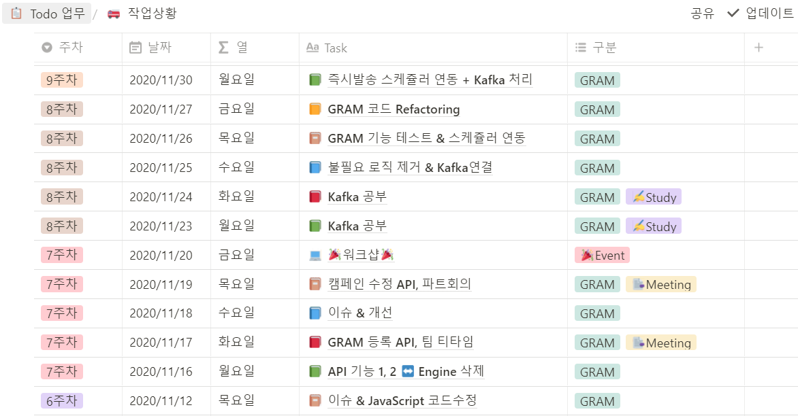
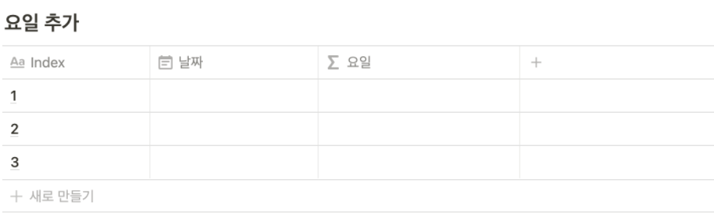
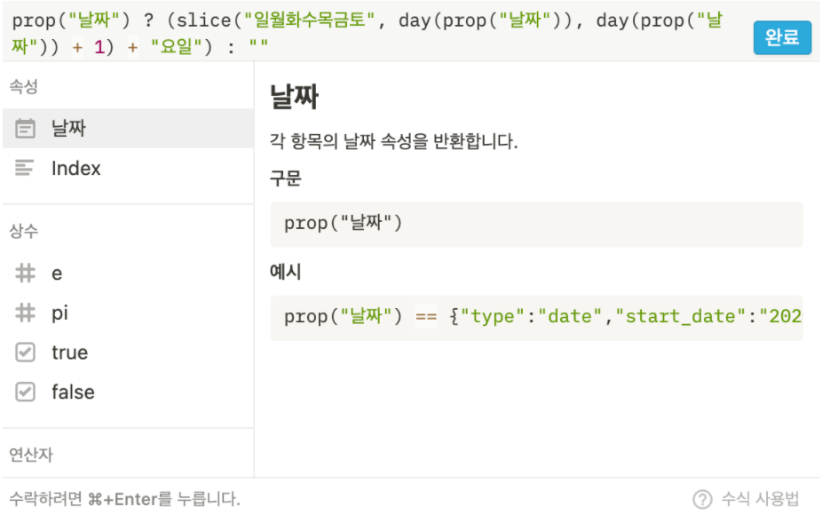
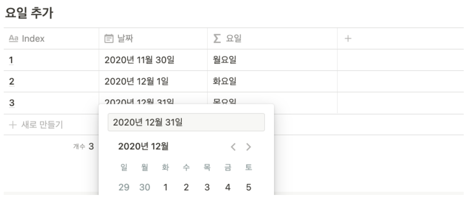

# 노션 - 테이블에서 자동으로 요일 생성하기

최종적으로 만들고 싶은 테이블은 다음과 같았다.



Todo 리스트를 매일매일 페이지로 생성해주고 싶었는데 날짜를 캘린더에서 선택해도 요일이 자동으로 생성되지 않아 불편함이 있었다.

아래 블로그를 참고해서 적용했다.

- https://tamcode.tistory.com/40

## 1. 테이블 만들기

기본적인 테이블을 만들고 속성을 선택해준다.

- 테이블 생성은 **/table** 또는 **/테이블** 을 입력하면 된다.
- 속성 선택은 테이블 가장 상단의 행을 클릭해주면 된다.



## 2. 속성 선택하기

속성 타입은 **날짜**와, **고급-수식**으로 변경한다.

수식을 통해 요일을 자동으로 생성할 수 있다.



## 3. 수식 입력하기

요일의 빈 부분을 클릭하면 위와 같은 팝업이 뜨고 가장 상단에 **수식 입력**을 찾을 수 있다.

그 부분에 아래 코드를 삽입하면 된다.

```javascript
prop("날짜") ? (slice("일월화수목금토", day(prop("날짜")), day(prop("날짜")) + 1) + "요일") : ""
```

정상적으로 수식이 적용되었다면 아래와 같이 날짜를 선택하면 자동으로 요일이 생성된다!


