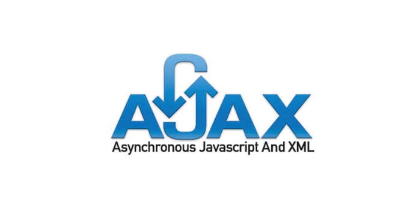

# Ajax란?

- JavaScript의 라이브러리 중 하나
- Asynchronous Javascript And Xml(비동기식 자바스크립트와 xml)
- 브라우저가 가지고있는 XMLHttpRequest 객체를 이용해서 전체 페이지를 새로 고치지 않고도 페이지의 일부만을 위한 데이터를 로드하는 기법

> JavaScript를 사용한 비동기 통신, 클라이언트와 서버간에 XML 데이터를 주고받는 기술

## 비동기(async)방식이란?

- 웹페이지를 Reload하지 않고 데이터를 불러오는 방식

Page Reload의 경우 전체 리소스를 다시 불러와야 하는데 이미지, 스크립트 , 기타 코드 등을 모두 재요청할 경우 불필요한 리소스 낭비가 발생하게 되지만 **비동기식 방식을 이용할 경우** 필요한 부분만 불러와 사용할 수 있으므로 효과적이다.

## 왜 사용할까

기본적으로 HTTP프로토콜은 클라이언트쪽에서 Request를 보내고 Server쪽에서 Response를 받으면 이어졌던 연결이 끊기게 되어있다. 

그래서 화면의 내용을 갱신하기 위해서는 다시 request를 하고 response를 하면서 페이지 전체를 갱신하게 된다.

 하지만 이렇게 할 경우 페이지의 일부분만 갱신할 경우에도 페이지 전체를 다시 로드해야하는데 엄청난 자원낭비와 시간낭비를 초래한다. 하지만 Ajax는 html 페이지 전체가 아닌 일부분만 갱신할 수 있도록 XML HttpRequest객체를 통해 서버에 request를 한다.

 이 경우 Json이나 xml형태로 필요한 데이터만 받아 갱신하기 때문에 그만큼의 자원과 시간을 아낄 수 있다. 

## Ajax의 장단점

### Ajax의 장점

1. 웹페이지의 속도 향상
2. 서버의 처리가 완료될 때까지 기다리지 않고 처리 가능
3. 서버에서 Data만 전송하면 되므로 전체적인 코딩의 양이 줄어든다.
4. 기존 웹에서는 불가능했던 다양한 UI를 가능하게 해준다.

### Ajax 의 단점

1. 히스토리 관리가 안 된다. (보안에 좀 더 신경을 써야한다.)
2. 연속으로 데이터를 요청하면 서버 부하가 증가할 수 있다.
3. XMLHttpRequest를 통해 통신을 하는 경우 사용자에게 아무런 진행 정보가 주어지지 않는다. 그래서 아직 요청이 완료되지 않았는데 사용자가 페이지를 떠나거나 오작동할 우려가 발생하게 된다.