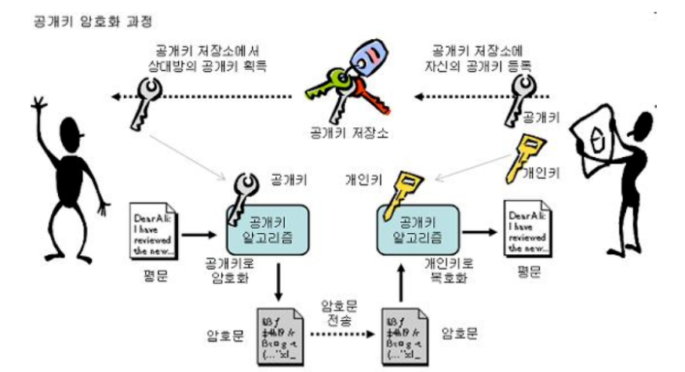
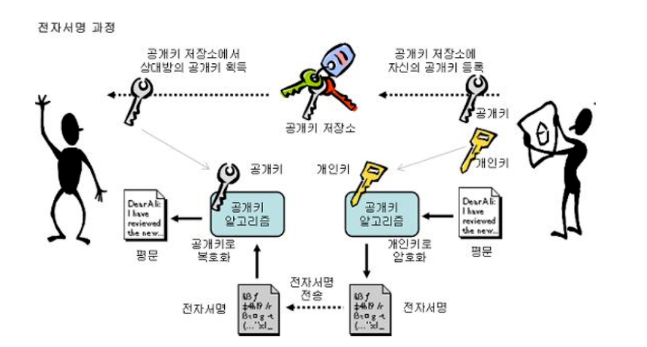

# Http vs Https

## HTTPS (feat. http)

HTTPS에 대해 알아보기 전에 HTTP를 간단하게 설명할 수 있으면 좋다.

**HTTP**는 HyperText Tranfer Protocol로 WWW상에서 정보를 주고 받는 프로토콜이다.

클라이언트인 웹브라우저가 서버에 HTTP를 통해 웹페이지나 이미지 정보를 요청하면 서버는 이 요청에 응답하여 요구하는 정보를 제공하게 된다.

결국, **HTTP 는** **웹브라우저(Client)와 서버(Server)간의 웹페이지같은 자원을 주고 받을 때 쓰는 통신 규약**이다.

http는 텍스트 교환이다. html페이지도 텍스트다. 바이너리 데이터로 되어있는 것도 아니고 단순 텍스트를 주고 받기 때문에 누군가 네트워크에서 신호를 가로채어 본다면 내용이 노출된다.

이런 보안상의 문제를 해결해주는 프로토콜이 HTTPS다.

**HTTPS는 인터넷 상에서 정보를 암호화하는 SSL(Secure Socket Layer)프로토콜을 이용하여 웹브라우저(클라이언트)와 서버가 데이터를 주고 받는 통신 규약**이다.

HTTPS는 http 메세지(text)를 암호화하는 것이다.

HTTPS의 S가 Secure Socket, 보안 통신망을 말한다.

HTTPS의 암호화 원리를 간단히 알아보면 핵심은 **공개키 암호화 방식**이다.

▲ 출처 : http://cryptocat.tistory.com/3

암호학을 공부하는게 아니니 공개키 알고리즘을 간단하게만 소개하겠다.

암호화, 복호화시킬 수 있는 서로 다른 키 2개가 존재하는데 이 두 개의 키는 서로 1번 키로 암호화하면 반드시 2번키로만 복호화할 수 있고 2번 키로 암호화하면 반드시 1번키로만 복호화할 수 있는 룰이 있는 것이다.

그 중에서 하나 키는 모두에게 공개하는 공개키(1번 키)로 만들어서 공개키 저장소에 등록해놓는다.

서버는 서버만 알 수 있는 개인키(2번 키)를 소유하고 있으면 된다.

그러면 1번키로 암호화된 http 요청, 즉 HTTPS 프로토콜을 사용한 요청이 온다면 서버는 개인키(2번 키)를 이용하여 1번키로 암호화된 문장을 해독하게 된다.

서버는 요청이 무엇인지 알게되고 요청에 맞는 응답을 다시 개인키(2번 키)로 암호화해서 요청한 클라이언트에게 보내주게 된다.

그리고 응답을 받은 클라이언트는 공개키(1번 키)를 이용해서 개인키(2번 키) 암호화된 HTTPS 응답을 해독하고 사용하는 시나리오다. **(* 공개키 암호화 방식에 대한 이해를 위한 설명일 뿐 더 정확한 HTTPS 연결 과정은 아래에 따로 정리 했습니다.)**

HTTPS를 지원하는 서버에 요청(Request)을 하려면 공개키가 필요하다는 것을 알 수 있다.

그러면 그 공개키는 공개키 저장소에 있다는 것은 알겠는데 어떻게 공개키 저장소에서 가져올까?

추가적으로 공개키는 누구나 얻을 수 있고 공개키를 알면 서버가 주는 데이터(Response)는 알 수 있는데 보안상에 의미가 있을까?

보안상의 의미는 없다.

대신 얻을 수 있는 이점은 **해당 서버로부터 온 응답임을 확신**할 수 있다. 왜? 공개키로 해독이 가능했으니까 반드시 해당 서버의 개인키로 암호화했다는 것을 보장하기 때문이다.

## 조금 더 자세한 HTTPS 통신 흐름

아까 의문을 가졌던 것을 다시 생각해보자.

공개키가 공개키 저장소에 있는데 어떻게 가져올 수 있을까?

HTTPS 통신 흐름에 대해서 자세히 들여다보면 알 수 있다.

일단 공개키 저장소라고 부르던 곳이 원래 명칭은 CA(Certificate Authority)다.

CA는 민간기업이지만 아무나 운영할 수 없고 신뢰성이 검증된 기업만 CA를 운영할 수 있다.

1. 먼저 애플리케이션 서버(A)를 만드는 기업은 HTTPS를 적용하기 위해서 공개키와 개인키를 만듭니다.

2. 그 다음에 신뢰할 수 있는 CA 기업을 선택하고 그 기업에 내 공개키를 관리해달라고 계약하고 돈을 지불합니다.

3. 계약을 완료한 CA 기업은 또 CA 기업만의 공개키와 개인키가 있습니다.

CA 기업은 CA기업의 이름과 A서버의 공개키, 공개키의 암호화 방법 등의 정보를 담은 인증서를 만들고, 해당 인증서를 CA 기업의 개인키로 **암호화해서** A서버에게 제공합니다.

4. A서버는 암호화된 인증서를 갖게 되었습니다. 이제 A서버는 A서버의 공개키로 암호화된 HTTPS 요청이 아닌 요청(Request)이 오면 이 암호화된 인증서를 클라이언트에게 줍니다.

5. 이제 클라이언트 입장에서, 예를 들어 A서버로 index.html 파일을 달라고 요청했습니다. 그러면 HTTPS 요청이 아니기 때문에 **CA기업이 A서버의 정보를 CA 기업의 개인키로 암호화한 인증서**를 받게되겠지요.

6. 여기서 중요합니다. **세계적으로 신뢰할 수 있는 CA 기업의 공개키는 브라우저가 이미 알고 있습니다!**

7. 브라우저가 CA 기업 리스트를 쭉 탐색하면서 인증서에 적혀있는 CA기업 이름이 같으면 해당 CA기업의 공개키를 이미 알고 있는 브라우저는 해독할 수 있겠죠? 그러면 해독해서 A서버의 공개키를 얻었습니다.

8. 그러면 A서버와 통신할 때는 A서버의 공개키로 암호화해서 Request를 날리게 되겠죠.

이런 구성입니다만,

HTTPS를 지원한다고 해서 무조건 안전한 것은 아닙니다.

왜냐하면 신뢰할 수 있는 CA 기업이 아니라 자체적으로 인증서를 발급할 수도 있고, 신뢰할 수 없는 CA 기업을 통해서 인증서를 발급받을 수도 있기 때문입니다.

그렇게 되면 브라우저에서는 https지만 "주의 요함", "안전하지 않은 사이트"등의 알림을 주게됩니다.

### Reference

- [http://cryptocat.tistory.com/3](http://cryptocat.tistory.com/3)
- [https://jeong-pro.tistory.com/89](https://jeong-pro.tistory.com/89)

### Todo 참고해서 글 추가하기

[HTTP vs HTTPS 차이, 알면 사이트의 레벨이 보인다.](http://blog.wishket.com/http-vs-https-%EC%B0%A8%EC%9D%B4-%EC%95%8C%EB%A9%B4-%EC%82%AC%EC%9D%B4%ED%8A%B8%EC%9D%98-%EB%A0%88%EB%B2%A8%EC%9D%B4-%EB%B3%B4%EC%9D%B8%EB%8B%A4/)

[인터넷 프로토콜 http와 https의 차이는 뭘까? 보안과 마케팅 측면에서 살펴보기](https://post.naver.com/viewer/postView.nhn?volumeNo=16561296&memberNo=1834)

[HTTP와 HTTPS의 차이점](https://dany-it.tistory.com/96)

[HTTP와 HTTPS의 5가지 차이점 정리](https://whatismarketing.tistory.com/61)