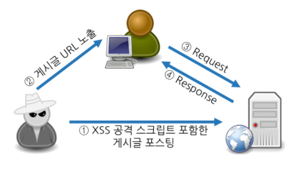
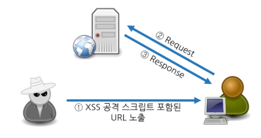
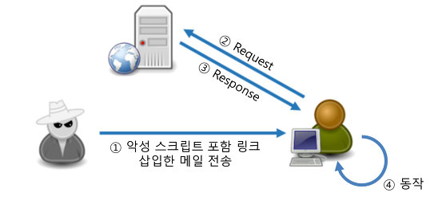

# XSS(Cross Site Script)란

웹 어플리케이션에서 **사용자 입력 값에 대한 필터링이 제대로 이루어지지 않을 경우**, 공격자가 입력이 가능한 폼에 **악의적인 스크립트를 삽입하여 해당 스크립트가 희생자 측에서 동작하도록 하여 악의적인 행위를 수행하는 취약점**이다. 공격자는 취약점을 이용하여 사용자의 개인정보 및 쿠키정보 탈취, 악성코드 감염, 웹 페이지 변조 등의 공격을 수행한다.

## XSS 공격 종류

### 1️⃣Stored XSS (저장형 XSS)

- 공격자가 취약한 웹서버에 악성 스크립트를 저장하면 희생자가 해당 자료를 요청할 떄 해당 악성 스크립트가 삽입된 응답 페이지가 전달되어 클라이언트 측에서 동작하는 방식이다.

### 2️⃣Reflected XSS (반사형 XSS)

- 외부에 있는 악성 스크립트가 희생자 액션에 의해 취약한 웹서버로 전달되고, 웹서버의 응답 페이지에 해당 악성 스크립트가 삽입되어 희생자 측에서 동작하는 방식이다.

### 3️⃣DOM based XSS (DOM 기반 XSS)

- 희생자의 웹 브라우저에서 응답 페이지에 포함된 정상적인 스크립트가 동작하면서 DOM 객체를 실행할 때 URL 등에 포함된 악성 스크립트가 동작하는 방식이다. 응답 페이지에 관계없이 웹 브라우저에서 발생한다.

## 대응방안

- 사용자 입력값 검증을 반드시 **서버단**에서 한다.
- 사용자 입력 문자열에서 HTML 코드로 인식될 수 있는 **특수문자를 일반문자로 치환하여 처리**한다.

| HTML 특수문자 | HTML Entity |
|:---:|:---:|
| `<, >` | `&lt;, &gt;` |
| `(. )` | `&#x28;, &#x29;` |
| `&` | `&amp;` |
| `/` | `&#x2F;` |
| `"` | `&quot;` |
| `'` | `&#x27;` |
| `#` | `&#x23;` |

- 게시판 등에서 HTML 태그를 허용해야하는 경우, HTML 태그 **화이트리스트**를 선정 후, 해당 태그만 허용하는 방식을 적용한다.

---

Reference

- https://stupidsecurity.tistory.com/17