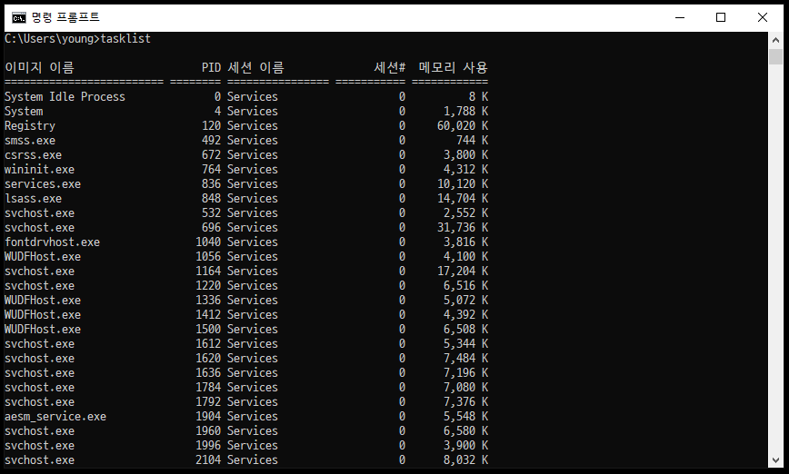
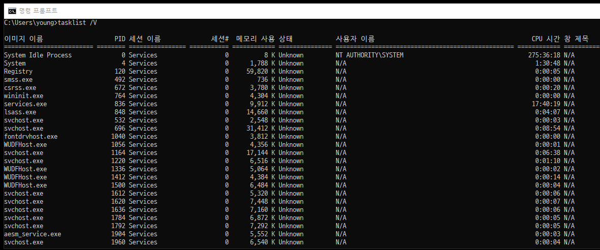
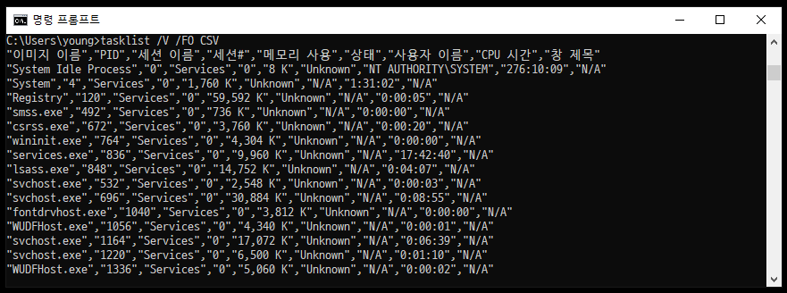

# [CMD] Windows 동작중인 프로세스 확인

windows로 개발을 하다보면 서버를 실행하거나 클라이언트를 붙일 때 프로세스를 확인할 일이 생긴다.

현재 실행 중인 프로세스를 확인하는 명령어를 살펴보자.

## tasklist란?

tasklist는 서비스를 포함하여 현재 실행 중인 모든 작업을 표시해준다.

### 1.tasklist

cmd를 열어서 tasklist를 실행시키면 된다.

다음과 같은 정보를 가지고 있다.

1. 이미지 이름(프로세스 이름)
2. PID(프로세스 아이디)
3. 세션 이름(서비스/콘솔)
4. 세션#(비활성화(0), 활성화(1))
5. 메모리 사용(메모리 사용량)

### 2.tasklist /V

1. 이미지 이름(프로세스 이름)
2. PID(프로세스 아이디)
3. 세션 이름(서비스/콘솔)
4. 세션#(비활성화(0), 활성화(1))
5. 메모리 사용(메모리 사용량)
6. **상태(?, 실행 중)**
7. **사용자 이름**
8. **CPU 시간(프로세스 활성화된 시간)**
9. **창 제목**

### 3.tasklist /V /FO {Value}

/FO는 출력 형식을 지정해주기 때문에 뒤에 {Value}로 파라미터를 선택할 수 있다.

| 출력 가능한 값 : "TABLE", "LIST", "CSV"

#### 3-1. tasklist /V /FO CSV

#### 3-2. tasklist /V /FO LIST

기본적인 기능은 살펴보았고, 더 자세히 알고 싶다면

이 블로그를 참고하면 좋을 것 같다.

- https://asiatica-aramid.tistory.com/30
