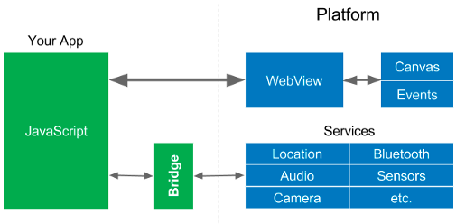
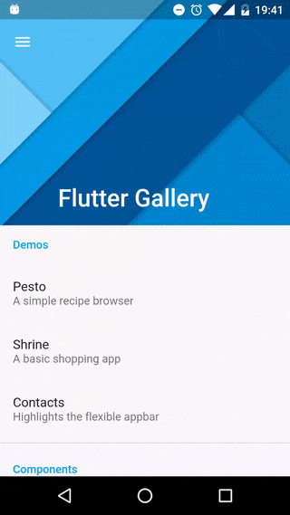
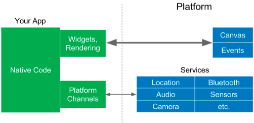
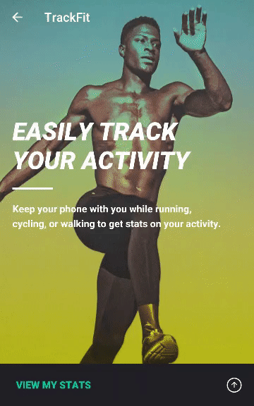

# Flutter

## What is Flutter?

Mobile World Congress 2018에서 Flutter의 최초 베타 릴리스를 발표하였고 
Google에서 새롭게 선보이는 모바일 UI 프레임워크이며, 
개발자가 iOS와 Android 모두를 위한 고품질 기본 인터페이스를 제작하는 데 도움을 주는 크로스 플랫폼 프레임워크 입니다.

[v] IOS  
[v] Android  
[v] Any Web App  

Dart 언어로 모두 구현 가능

## Why Flutter?

Flutter공부에 앞서 궁금한 점이 생겼습니다.  
Flutter는 어떤 새롭고 흥미로운 점이 있을까요?

먼저 이전 모바일 앱 개발의 간략한 역사를 알아보았습니다.

### 모바일 앱 개발의 간략한 역사

모바일 앱 개발 분야는 상대적으로 최신 분야라고 할 수 있습니다. 개발자들이 모바일 앱을 개발한지 미처 10년이 되지 않았고, 
이를 생각해보면 개발 도구들이 여전히 발전하고 있다는 것은 그다지 놀라운 사실은 아닙니다.  
<br>
#### OEM SDKs  

애플은 iOS SDK를 2008년에 릴리즈했고, 구글은 Android SDK를 2009년에 릴리즈 했습니다. 
이 두 SDK들은 각기 다른 언어를 기반으로 하고 있죠: **Objetive-C, JAVA**  

  

여기서 앱은 위젯을 만들고 카메라와 같은 서비스에 접근하기 위해 플랫폼과 직접 대화를 합니다. 
위젯들은 스크린 캔버스에 렌더가 되고, 화면에서 발생된 이벤트들은 다시 해당 위젯으로 보내지게 됩니다. 
매우 간단한 구조이죠. 하지만, 각 플랫폼마다 위젯은 다르고 언어 또한 다르기 때문에, 
위의 구조에서는 각 플랫폼마다 독립적인 앱을 만들어야합니다.
<br>
#### WebViews  

하나의 코드로 여러개의 환경에서 동작하는 크로스 플랫폼 프레임워크를 향한 첫번째 시도는 
JavaScript와 WebView를 기반으로 만들어졌습니다. 
PhoneGap, Apache Cordova, Ionic 등등이 여기에 속합니다. 
iOS SDK를 릴리즈하기 전, 애플이 아이폰 개발자들에게 웹앱을 만들라고 권장한 사실을 생각해보면, 
Web 기술을 이용한 크로스 플랫폼의 등장은 어쩌면 당연한 절차였는지 모르겠습니다.

  

WebView 기반의 앱은 HTML을 만들고 이를 플랫폼 내부의 WebView를 통해 사용자에게 보여주는 방식입니다. 
하지만, JavaScript와 같은 언어가 직접적으로 네이티브 코드(위의 서비스와 같은)와 소통하는것은 그리 쉬운 일이아닙니다. 
이를 위해 JavaScript 영역과 Native 영역 사이에서 문맥 전환을 해주는 **브릿지**를 사용하게 됩니다. 
플랫폼 내부의 서비스들은 일반적으로 자주 불리지는 않기 때문에, 이런 방식의 구현이 엄청난 퍼포먼스 문제로 이어지지는 않았습니다.

<br>
#### 리액티브 뷰
리액티브 프로그래밍 패턴을 이용한 ReactJS와 같은 리액티브 웹 프레임워크는 
이전보다 웹뷰 생성을 매우 쉽게 만들어주었다는 점에서 큰 인기를 얻게 되었습니다. 
2015년에 공개된 React Native는 리액티브 스타일의 뷰들이 가지고 있는 다양한 장점들을 모바일 앱에 적용하기 위해 만들어졌습니다.

  

React Native는 현재 엄청난 인기를 누리고 있지만, JavaScript 영역의 코드가 네이티브 영역에 있는 OEM 위젯에 
접속을 하기위해서 결국 브릿지를 거치게 됩니다. 리액티브 뷰에서는 OEM 위젯에 굉장히 자주 접근하게 되고 
(사용자가 화면에서 스와이프 한번을 했을때 최대 초당 60번까지도 접근), 이는 결국 퍼포먼스 이슈를 야기하게 됩니다. 
React Native에 대한 [한 글](https://medium.com/@talkol/performance-limitations-of-react-native-and-how-to-overcome-them-947630d7f440)에서는 이에 대해 다음과 같이 이야기하고 있습니다.

> React Native의 성능을 이해하는 주된 열쇠가 여기에 있다. 각 영역 그 자체는 엄청나게 빠르다. 
성능의 병목은 주로 하나의 영역에서 다른 영역으로 넘어갈때 발생한다. 
고성능의 React Native 앱을 구축하기 위해서는, 이 브릿지를 건너는 횟수를 최소화해야한다.  

## Flutter
Flutter는 React Native와 마찬가지로 리액티브 스타일 뷰를 제공하고 있습니다. 
하지만, Flutter는 [Dart](https://dart.dev/"Dart 공식 홈페이지")라는 컴파일 프로그래밍 언어를 이용해 이 브릿지로 인해 발생하는 성능 문제를 피하고 있습니다. 
Dart는 Ahead of time (AOT)에 여러 플랫폼에 상응하는 네이티브 코드로 컴파일 됩니다. 

다시말해, Flutter는 문맥 교환을 하는 JavaScript 브릿지를 거치지 않고 플랫폼과 직접적으로 커뮤니케이션하는 것입니다. 
이처럼 네이티브 코드로 컴파일이 되면 앱의 스타트업 시간 또한 빨라지게 됩니다.
Flutter가 JavaScript 브릿지를 필요로 하지 않으면서, 리액티브 뷰를 제공하는 유일한 모바일 SDK라는 사실만으로도 
Flutter는 이미 충분히 흥미롭고 시도해볼만한 가치를 가집니다. 

하지만, 여기에 그치지 않고 Flutter는 훨씬 더 혁신적인 부분들을 제공하고 있습니다.

### 위젯

위젯은 앱의 뷰와 인터페이스를 컨트롤하는 엘리먼트라고 할 수 있습니다. 
위젯은 모바일 앱에서 가장 중요한 요소라고 해도 과언이 아닐 겁니다. 
사실상, 위젯만으로 앱의 성패가 갈릴 수 있습니다.  

  

- 위젯에서 룩앤필은 다른 어떠한 것보다도 중요합니다. 위젯은 다양한 스크린 사이즈에서 보기 좋아야하고 또 자연스러워 보여야 합니다.  
- 위젯은 반드시 빠르게 동작해야합니다: 위젯 트리를 만들때, 위젯들을 인플레이트할때, 화면에 배치시킬때, 렌더링할때, 
(특히) 애니메이션 효과를 줄때 등을 포함해서 말이죠.  
- 요즘 앱에서 위젯은 확장가능해야하며 커스터마이징이 가능해야합니다. 개발자들은 마음에 드는 새로운 위젯들을 추가할 수 있기를 바라고, 
앱의 브랜드와 매칭되도록 이들을 커스터마이징 하기를 바랍니다.  

Flutter는 위에서 언급한 요구사항들 즉, 좋은 룩앤필, 빠른 속도, 커스터마이즈, 확장가능성을 지원하는 위젯을 제공하는 새로운 아키텍쳐를 
가지고 있습니다. 맞습니다! 바로 Flutter가 OEM 위젯들 (또는 DOM 웹뷰)을 사용하지 않고, **자체적인 위젯**을 사용하고 있기 때문입니다.



Flutter는 위젯들과 렌더러들을 플랫폼 영역에서 앱의 영역으로 옮겨왔습니다. 
이것은 이제 위젯들이 커스터마이징 가능해졌고 확장가능해졌다는 것을 의미합니다. 
Flutter가 플랫폼으로부터 요구하는 것은 위젯을 렌더할 수 있는 캔버스뿐 입니다.
이 캔버스를 통해 디바이스 스크린에 위젯을 그리고, 이벤트들(터치, 타이머 등)과 서비스들(위치, 카메라 등)에 접근하게 됩니다.  

Dart 프로그램 (초록색) 영역과 네이티브 플랫폼 코드 (파란색) 사이에는 인코딩과 디코딩을 담당하는 인터페이스가 여전히 존재하고 있습니다.
그러나, JavaScript 브릿지와 비교했을때, 비교할 수 없을 정도로 빠른 성능을 가지고 있습니다.  


위젯들과 렌더러를 앱으로 옮겨온것은 앱 사이즈에도 영향을 미칩니다. 
Flutter 앱의 최소 사이즈는 약 6.7MB이며, 이것은 비슷한 개발 도구들을 이용해서 만든 최소 크기의 앱들과 비교했을 때 비슷한 사이즈입니다. 
Flutter의 장점들이 다른 개발 환경에 비해 가치가 있는지 없는지 판단하는 것은 여러분들의 몫입니다. 
이 글의 남은 부분에서는 Flutter가 가지고 있는 더 많은 장점들에 대해서 다뤄보고자 합니다.  


### 레이아웃
Flutter에서 가장 큰 개선점 중 하나는 레이아웃을 하는 방식에 있습니다.  

> 레이아웃이란 정해진 규칙(혹은 제한들)에 따라서 위젯의 크기와 위치를 정하는 것을 의미  

전통적으로, 레이아웃은 어떠한 위젯에도 적용할 수 있는 규칙들의 거대한 집합을 사용해왔습니다. 
여기서 규칙들은 다양한 레이아웃 함수들을 구현합니다. 가장 잘 알려져있는 CSS 레이아웃을 예로 들어 봅시다. 
CSS는 속성들(규칙들)을 가지고 있고, 이 속성들은 HTML 엘리먼트들 (위젯들)에 적용이 됩니다 (CSS3는 375개의 속성을 정의하고 있습니다).  

CSS는 박스 모델, 플로팅 엘리먼트, 테이블, 텍스트 컬럼, 페이지 미디어 등등을 포함하는 수 많은 레이아웃 모델을 포함하고 있습니다. 
시간이 지나서 개발자들과 디자이너들은 레이아웃에 대해 더 많은 부분을 컨트롤 하고 싶어했고, 
이 필요에 따라서 Flex Box와 Grid Layout 모델들을 추가해야만 했습니다. 
전통적인 레이아웃에서 새로운 모델들을 추가할때, 개발자들이 자체적으로 추가하는 것은 불가능합니다. 
이 때문에, Flex Box와 Grid Layout은 우리가 알고 있듯이 CSS 형태로 추가되어야만했습니다. 
다시 말해 모든 브라우저들은 이에 대한 구현을 다시 해야만 했습니다.  

전통적인 레이아웃이 가지고 있는 또 다른 문제로는 규칙들이 서로 상호작용 할 수 있으며 (혹은 속성들간의 Conflict가 발생), 
보통 하나의 엘리먼트에 수십개의 규칙들이 한꺼번에 적용된다는 것입니다. 이러한 환경은 레이아웃의 시간을 느리게 만듭니다. 
레이아웃 성능은 일반적으로 N 제곱의 복잡도를 따릅니다. 
다시 말해, 엘리먼트의 숫자가 증가함에따라, 레이아웃 속도는 훨씬 더 빠르게 느려지게 됩니다.  

이를 극복하기 위해, 구글 크롬 브라우저 팀 멤버들은 새로운 실험을 시작했습니다. 
그들은 만약 그들이 전통적인 레이아웃 모델을 머릿속에 완전히 지워버린다면, 훨씬 더 빠른 렌더러를 만들 수 있는지 궁금했습니다. 
몇주가 지나고 그들은 눈에 띄눈 성능 향상을 얻을 수 있었습니다.   

이들이 발견한것은:  
- 대부분의 레이아웃은 상대적으로 간단하다는 점. 스크롤 페이지에 있는 텍스트, 
디스플레이 사이즈에 따라 위치와 크기가 변하는 직사각형, 그리고 테이블들, 플로팅 엘리먼트들 정도만 필요하다는 점.  
- 대부분의 레이아웃은 위젯의 서브트리에 속해있으며, 이 서브트리는 보통 하나의 레이아웃 모델만을 사용한다는 점. 
다시 말해, 하나의 특정 위젯을 지원하기 위해 아주 적은 숫자의 규칙들만이 필요하다는 점.  

그들은 관점을 완전히 바꾸면 레이아웃을 훨씬 더 간단하게 만들 수 있다는 것을 깨달았습니다.

- 어떠한 위젯에도 적용될 수 있는 엄청나게 큰 규모의 레이아웃 규칙들 대신, 
각 위젯이 본인만이 가지고 있는 고유의 간단한 레이아웃 모델을 가지면 된다.   
- 이제 각 위젯은 고려해야하는 레이아웃 규칙이 굉장히 작아지기 때문에, 각 위젯을 위한 최적화를 할 수 있게 된다.  
- 모든 것들을 위젯화 시키면, 더욱 간단한 레이아웃을 구조를 만들 수 있다.  


이제 Flutter를 이용해 간단한 위젯 트리를 만드는 코드를 살펴봅시다  

```dart
new Center(
  child: new Column(
    children: [
      new Text('Hello, World!')),
      new Icon(Icons.star, color: Colors.green)
    ]
  )
)
```

이 코드의 구문에 이미 어떤 결과물이 만들어질지 충분한 의미를 가지고 있습니다. 
이 코드를 통해 얻어지는 결과는 아래와 같습니다.

  

이 코드에서 레이아웃을 포함한 **모든 것은 위젯**입니다.  
**Center 위젯**은 위젯의 부모(위의 예제에서는 스크린)의 중앙에 위젯의 자식 위젯들을 위치시킵니다.  
**Column 위젯**은 이 위젯의 자식 위젯들을 수직으로 나열 시킵니다.  
이 Column은 **Text 위젯**과 **Icon 위젯**(색 속성을 가지는)을 가지고 있습니다.  


Flutter에서 가운데 정렬이나 패딩 역시도 위젯입니다. 
심지어 테마들까지도 자식 위젯들에게 적용되는 또다른 위젯이며, 어플리케이션과 네비게이션까지도 위젯입니다.  

Flutter는 Column뿐 아니라 Row, Grid, List 등 꽤나 많은 위젯을 포함하고 있습니다. 
게다가, Flutter는 Silver Layout Model이라고 칭하는 스크롤링을 위해 사용되는 고유한 레이아웃 모델을 가지고 있습니다. 
스크롤링은 반드시 즉각적이면서도 부드럽게 반응해야만 사용자들이 물리적인 화면을 드래그했을 때, 
손끝에 이미지가 붙어있는 듯한 느낌을 줍니다. Flutter의 레이아웃은 굉장히 빨라서 바로 이것을 해낼 수 있습니다.  

스크롤링을 위해 레이아웃을 사용함으로써 Flutter는 아래 이미지와 같은 발전된 형태의 스크롤링을 가능하게 합니다. 
아래 이미지가 GIF 이미지라는 점을 잊지 마세요. Flutter는 이보다 더 부드럽습니다! 
이 글의 마지막에 있는 리소스에서 해당 앱의 코드를 찾아 돌려볼 수 있습니다. 꼭 한번 돌려보세요!

 
 
 

대부분의 경우 Flutter는 한번의 패스로 레이아웃을 구축 할 수 있습니다.  
다시 말해, 리니어 타임안에 끝낼 수 있는거죠. 이 때문에 Flutter는 많은 수의 위젯들을 한꺼번에 다루는 것도 가능합니다. 
여기에 추가로 Flutter는 매번 레이아웃 작업을 하지 않기위해, 캐쉬를 비롯한 다양한 작업들을 수행합니다.  


### 커스텀 디자인
Flutter는 위젯을 앱의 일부로 옮겨왔기 때문에, 새로운 위젯을 추가하는 것 혹은 기존의 위젯들에 
다른 룩앤필을 주거나 회사 브랜드에 맞도록 커스터마이징하는 것이 가능합니다. 
현대의 모바일 디자인 트렌드는 판에 박힌 앱을 만드는 것에서 완전히 멀어져 있으며, 
사용자에게 기쁨을 주는 커스텀 디자인을 향해 점점 더 발전해 나아가고 있습니다.  


Flutter는 풍부하고, 커스터마이즈 가능한 Android, iOS 그리고 Material 디자인을 가지고 있습니다
(사실, Flutter가 가장 높은 수준의 Material 디자인을 제공하고 있다는 이야기가 종종 들립니다).
Flutter는 커스터마이즈 능력을 활용해서 멀티 플랫폼에 있는 네이티브 위젯들의 룩앤필과 매칭되는 위젯들을 지원하고 있습니다. 
앱 개발자들 역시 이 커스터마이즈 능력을 사용해서 자신들의 요구와 필요에 맞도록 
Flutter에서 제공하는 위젯을 변형시키는 것이 가능합니다.
