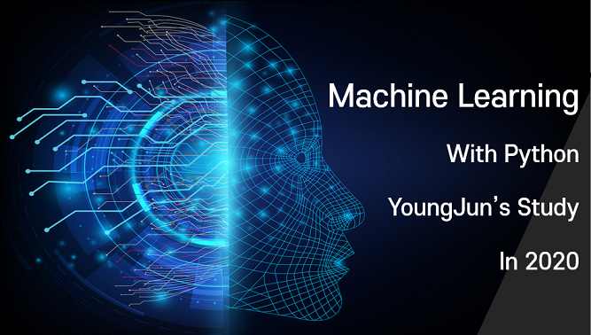
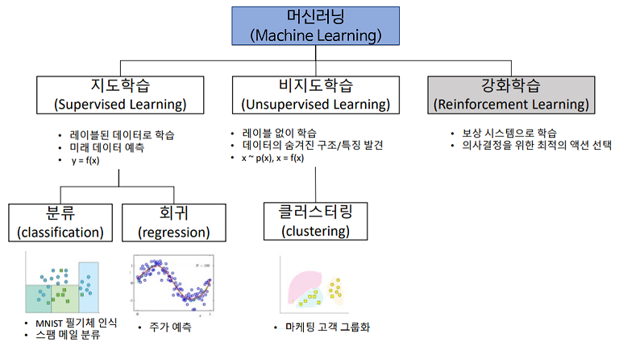
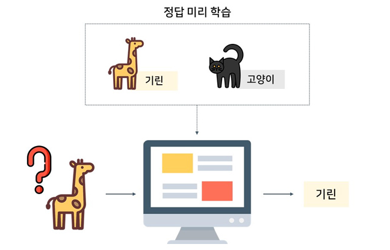
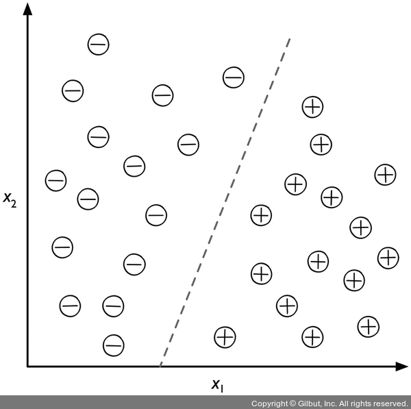
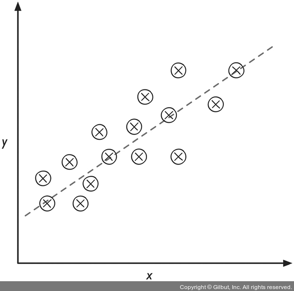
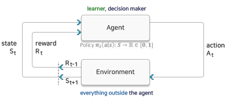

공부할 책 : 머신러닝 교과서 with 파이썬, 사이킷런, 텐서플로

# 1장 컴퓨터는 데이터에서 배운다

  

## 목차
**1.1 데이터를 지식으로 바꾸는 지능적인 시스템 구축**  
**1.2 머신 러닝의 세 가지 종류**  
**1.3 기본 용어와 표기법 소개**  
**1.4 머신 러닝 시스템 구축 로드맵**  
**1.5 머신 러닝을 위한 파이썬**  
**1.6 요약**  

---

머신 러닝(machine learning)은 데이터를 이해하는 알고리즘의 과학이자 애플리케이션입니다. 
스스로 학습할 수 있는 머신 러닝 알고리즘을 사용하면 데이터를 지식으로 바꿀 수 있습니다. 

먼저 머신 러닝의 주요 개념과 종류를 배웁니다! 관련 용어를 소개하고, 
머신 러닝 기술을 실제 문제 해결에 성공적으로 적용할 수 있는 초석을 다집니다.

- 머신 러닝의 일반적 개념 이해하기
- 세 종류의 학습과 기본 용어 알아보기
- 성공적인 머신 러닝 시스템을 설계하는  필수 요소 알아보기
- 데이터 분석과 머신 러닝을 위한 파이썬을 설치하고 설정하기

## 1.1 데이터를 지식으로 바꾸는 지능적인 시스템 구축

20세기 후반에 데이터에서 지식을 추출하여 예측하는 자기 학습(self-learning) 알고리즘과 관련된 
인공 지능(Artificial Intelligence, AI)의 하위 분야로 머신러닝이 출현했습니다.

사람이 수동으로 대량의 데이터를 분석하여 규칙을 유도하고 모델을 만드는 대신,
**머신 러닝**이 데이터에서 더 효율적으로 지식을 추출하여 예측 모델과 데이터 기반의 의사 결정 성능을
점진적으로 향상시킬 수 있습니다.
> 견고한 이메일 스팸 필터, 편리한 텍스트와 음성 인식 소프트웨어, 믿을 수 있는 웹 검색 엔진, 체스 대결 프로그램 등

## 1.2 머신 러닝의 세 가지 종류

  

- 지도 학습(Supervised Learning)  
- 비지도 학습(Unsupervised Learning)  
- 강화 학습(Reinforcement Learning)  

### 1.2.1 지도 학습으로 미래 예측
지도 학습의 주요 목적은 레이블(label)된 훈련 데이터에서 모델을 학습하여 본 적 없는 미래 데이터에 대한 예측을 만드는 것입니다.  
`여기서 지도(Supervised)는 희망하는 출력 신로(레이블)가 있는 일련의 샘플을 의미`

> 레이블(label) = 머신 러닝에서 특정 샘플에 할당된 클래스(class)  
> 레이블의 범주(category) = 클래스  
> 혼동을 피하기 위해 category가 레이블 범주를 의미하지 않을 때는 '카테고리'로 작성  

  

#### ex) 스팸 이메일
> 레이블된 이메일 데이터셋에서 지도 학습 머신 러닝 알고리즘을 사용하여 모델을 훈련할 수 있음!  
이 **데이터셋**은 스팸 또는 스팸이 아닌 이메일로 정확하게 표시되어 있습니다.  
훈련된 모델은 새로운 이메일이 **두 개의 범주(category)** 중 어디에 속하는지 예측합니다.  
이 처럼 개별 클래스 레이블이 있는 지도 학습이 분류(classification)입니다.  

### 분류: 클래스 레이블 예측
과거의 관측을 기반으로 새로운 샘플의 범주형 클래스 레이블을 예측하는 것이 목적  
클래스 레이블을 이산적(discreate)이고 순서가 없어 샘플이 속한 그룹으로 이해할 수 있습니다.  
> 이진 분류(binary classification): 스팸 이메일 감지  
> 다중 분류(multiclass classification): 손으로 쓴 글자 인식

  

지도 학습 알고리즘을 사용하여 두 클래스를 구분할 수 있는 규칙을 학습합니다. 
이 규칙은 점선으로 나타난 결정 경계(decision boundary)입니다. 
새로운 데이터의 x_1, x_2 값이 주어지면 두 개의 범주 중 하나로 분류합니다.

### 회귀: 연속적인 출력 값 예측

두 번째 지도 학습의 종류는 연속적인 출력 값을 예측하는 회귀 분석입니다.  

회귀는 **예측 변수**(predictor variable)(또는 입력(input))와 연속적인 **반응 변수**(response variable)(또는 출력(outcome))가 
주어졌을 때 **출력 값을 예측하는 두 변수 사이의 관계**를 찾습니다.

  

입력 x와 타깃 y가 주어지면 샘플과 직선 사이 거리가 최소가 되는 직선을 그을 수 있습니다. 
일반적으로 평균 제곱 거리를 사용합니다. 이렇게 데이터에서 학습한 직선의 기울기와 절편(intercept)을 사용하여 
새로운 데이터의 출력 값을 예측합니다.

### 1.2.2 강화 학습으로 반응형 문제 해결
**강화 학습**은 환경과 상호 작용하여 시스템(agent) 성능을 향상하는 것이 목적입니다. 
환경의 현재 상태 정보는 **보상(reward) 신호를 포함**하기 때문에 강화 학습을 지도 학습과 관련된 분야로 생각할 수 있습니다. 
강화 학습의 피드백은 정답(ground truth) 레이블이나 값이 아닙니다. 보상 함수로 얼마나 행동이 좋은지를 측정한 값입니다. 
에이전트는 환경과 상호 작용하여 보상이 최대화되는 일련의 행동을 강화 학습으로 학습합니다.
탐험적인 시행착오(trial and error) 방식이나 신중하게 세운 계획을 사용합니다.

> **설명이 어려워서 추가 조사**  
> 강화 학습(Reinforcement Learning)은 기계 학습이 다루는 문제들 중 하나로   
> 어떤 환경 안에서 정의된 에이전트가 현재의 상태를 인식하여,  
> 선택 가능한 행동들 중 보상을 최대화하는 행동 혹은 행동 순서를 선택하는 방법  

  

- 에이전트(Agent) : 상태를 관찰, 행동을 선택, 목표지향
- 환경(Environment) : 에이전트를 제외한 나머지 (물리적으로 정의하기 힘듦)
- 상태(State) : 현재 상황을 나타내는 정보
- 행동(Action) : 현재 상황에서 에이전트가 하는 것
- 보상(Reward) : 행동의 좋고 나쁨을 알려주는 정보

강화 학습의 대표적인 예는 체스 게임입니다. 에이전트는 체스판의 상태(환경)에 따라 기물의 이동을 결정합니다. 
보상은 게임을 종료했을 때 승리하거나 패배하는 것으로 정의할 수 있습니다.

`강화 학습 애플리케이션은 책 범위를 넘어선다. 추가로 공부해도 좋을 것 같다`

